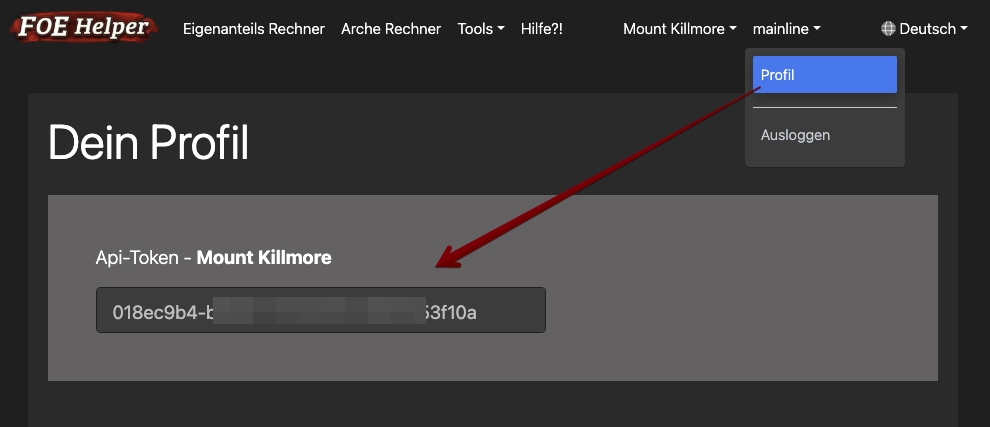
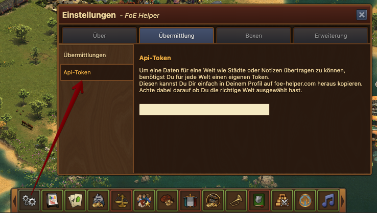

# Api Token

## Token bekommen
Um Daten aus der Extension heraus an foe-helper.com schicken zu können, benötigst Du einen kostenlosen API-Token.
Diesen kannst Du Dir ganz einfach aus Deinem Profil heraus kopieren.

Beachte dabei aber, dass jede Welt seinen eigenen Token benötigt. Also brauchst Du für de1, de5 oder de12 jeweils einen eigenen Token.

## Hinterlegen des Tokens

Den aus dem Profil kopierten Token kannst Du nun einfach in der Extension in der passenden Welt hinterlegen.

Achte auch hier wieder auf die auswahl der richten Welt!

