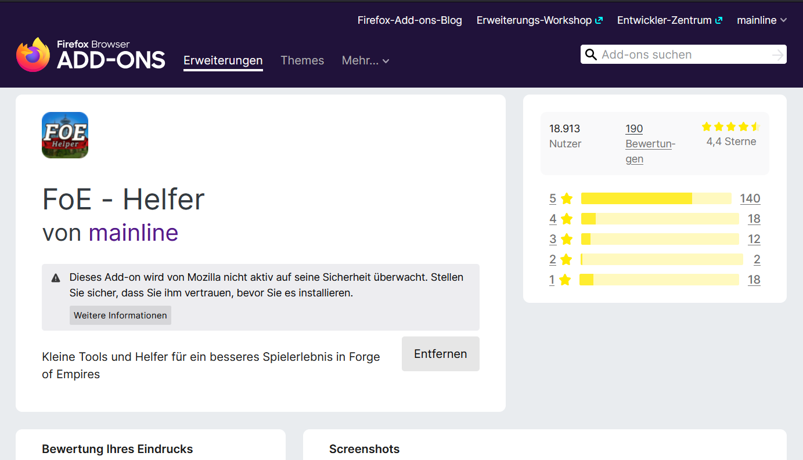

# FoE Helfer Erweiterung

Der FoE Helfer ist eine Browsererweiterung, die sich "über" das Spiel legt und die Daten, die vom Spiel an deinen Browser geschickt werden, auswerten kann.

Da keine Daten manipuliert, keine Aktionen automatisiert oder sonstige Veränderungen vorgenommen werden, ist diese Erweiterung zwar nicht offiziell von InnoGames zugelassen, verstößt aber auch nicht gegen Spielregeln und wird daher geduldet.

Es ist nicht möglich den Helfer auf einem Mobilgerät zu installieren.

## Installation des FoE Helfers

Der FoE Helfer ist für alle Chromium basierenden Browser geeignet.

Das sind die bekanntesten: [Google Chrome](https://www.google.com/chrome/), Microsoft Edge, [Opera](https://www.opera.com/) [(GX)](https://www.opera.com/de/gx), [Vivaldi](https://vivaldi.com/), [Brave](https://brave.com/), [Blisk](https://blisk.io/), [Colibri](https://colibri.opqr.co/), [Epic Browser](https://www.epicbrowser.com/), [Iron- oder SW Browser](https://www.srware.net/iron/), uvm.

Weiterhin wird der Firefox als nicht chromium-Variante ebenfalls unterstützt.

Für Chrome, Microsoft und Firefox gibt es jeweils einen Store Eintrag. Für Opera und ggf andere chromium-based Browsers gibt es einen kleinen Workaround.

## Chrome Installation

Den Chrome-Webstore aufrufen: [Chrome Store](https://chrome.google.com/webstore/detail/foe-helper/bkagcmloachflbbkfmfiggipaelfamdf) und oben rechts den Button "Hinzufügen" anklicken.

Die Extension wird automatisch deinem Browser nach deiner Bestätigung hinzugefügt.

Hast Du das Spiel bereits einem Deiner Tabs geöffnet musst Du das Fenster neu laden!

Nach dem Öffnen des Spiels erscheint unten rechts eine zusätzliche Leiste.

## Microsoft Edge

Die Extension kann nicht mehr aus dem Microsoft Store installiert werden. Stattdessen erfolgt die Installation über den [Chrome Store](https://chrome.google.com/webstore/detail/foe-helper/bkagcmloachflbbkfmfiggipaelfamdf).

## Firefox Browser

Das Firefox-Addon kann direkt aus dem Store heruntergeladen werden: [Firefox-Addon](https://addons.mozilla.org/de/firefox/addon/foe-helper/)

