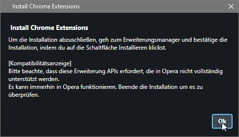

# FoE Helfer Erweiterung

Der FoE Helfer ist eine Browsererweiterung, die sich "über" das Spiel legt und die Daten, die vom Spiel an deinen Browser geschickt werden, auswerten kann.

Da keine Daten manipuliert, keine Aktionen automatisiert oder sonstige Veränderungen vorgenommen werden, ist diese Erweiterung zwar nicht offiziell von InnoGames zugelassen, verstößt aber auch nicht gegen Spielregeln und wird daher geduldet.

## Installation des FoE Helfers

Der FoE Helfer ist für alle Chromium basierenden Browser geeignet.

Das sind die bekanntesten: [Google Chrome](https://www.google.com/chrome/), Microsoft Edge, [Opera](https://www.opera.com/) [(GX)](https://www.opera.com/de/gx), [Vivaldi](https://vivaldi.com/), [Brave](https://brave.com/), [Blisk](https://blisk.io/), [Colibri](https://colibri.opqr.co/), [Epic Browser](https://www.epicbrowser.com/), [Iron- oder SW Browser](https://www.srware.net/iron/), uvm.

Weiterhin wird der Firefox als nicht chromium-Variante ebenfalls unterstützt.

Für Chrome, Microsoft und Firefox gibt es jeweils einen Store Eintrag. Für Opera und ggf andere chromium-based Browsers gibt es einen kleinen Workaround.

## Chrome Installation

Den Chrome-Webstore aufrufen: [Chrome Store](https://chrome.google.com/webstore/detail/foe-helper/bkagcmloachflbbkfmfiggipaelfamdf) und oben rechts den Button "Hinzufügen" anklicken.

Die Extension wird automatisch deinem Browser nach deiner Bestätigung hinzugefügt.

Hast Du das Spiel bereits einem Deiner Tabs geöffnet musst Du das Fenster neu laden!

Nach dem Öffnen des Spiels erscheint unten rechts eine zusätzliche Leiste.

## Microsoft Edge

Ähnlich wie beim Chrome kann hier die Extension einfach aus dem [Microsoft Store](https://microsoftedge.microsoft.com/addons/detail/foe-helfer/cpmacpalonncbafboibpcjcpadloannb) heruntergeladen und installiert werden.

Installation ist ab hier das gleiche wie beim Chrome.

## Opera Browser

Mit einem kleinen Tool kann ganz einfach jede Chrome-Extension in einen Opera Browser installiert werden. Das kann auch für alle anderen chromium basierenden Browser zutreffen. Das ist von Fall zu Fall unterschiedlich.

1. Öffne in deinen Opera Browser (PC) den [Opera Store](https://addons.opera.com/de/extensions/details/install-chrome-extensions/) und installiere sie.
2. Starte deinen Opera neu.
3. Öffne den Chrome Webstore in deinem Opera und füge wie unter dem Punkt "Chrome Installation" durch 
4. Bestätige den Kompatibilitätsmodus: 
5. Im nächsten Step wird dir die Extension zur Installation angeboten. Klicke "Installieren":  Bestätige die Rechte für die App.
6. Browser neu starten und das Spiel mit dem Helfer genießen.

