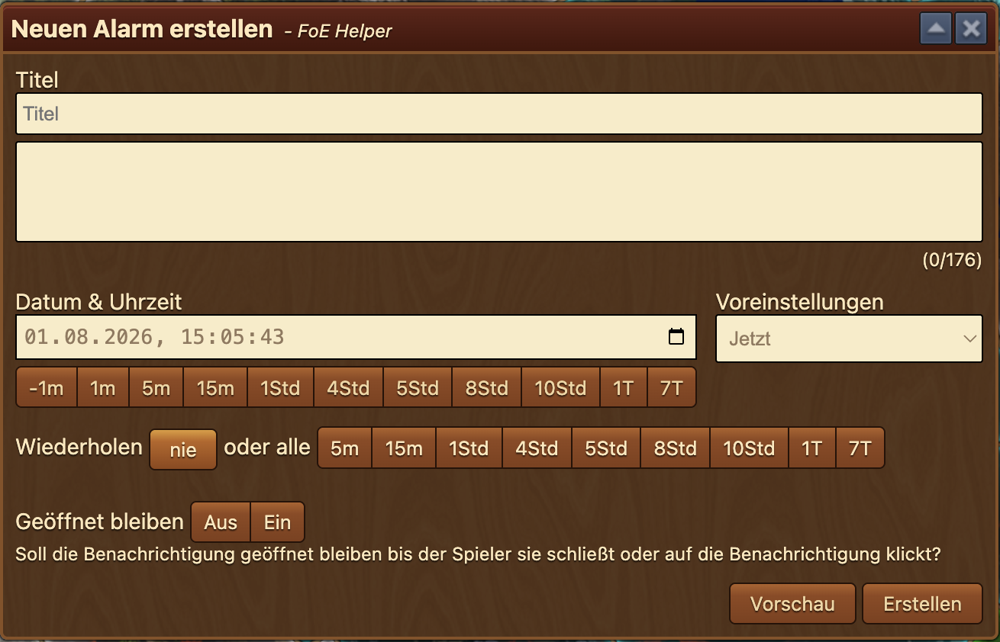
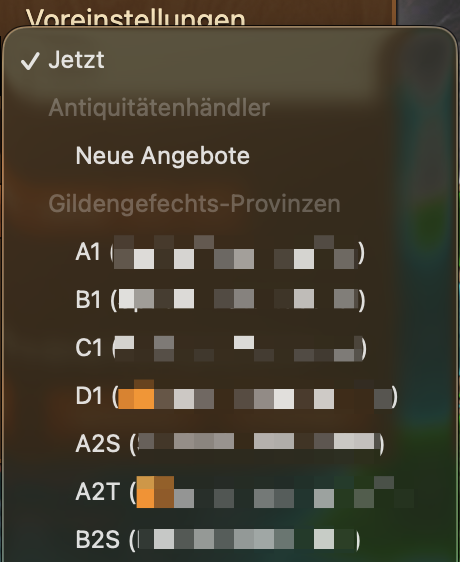

# Alarm

Mit dem Alarm-Modul legst du eigene Erinnerungen an, die zum gewünschten Zeitpunkt als Browser-Benachrichtigung ausgelöst werden – zum Beispiel für auslaufende Auktionen beim Antiquitätenhändler, sich entsperrende Gildengefechts-Sektoren oder beliebige eigene Termine. Alarme können sich in festen Abständen wiederholen und auf Wunsch so lange sichtbar bleiben, bis du sie aktiv wegklickst.

Alle Alarme werden lokal in deinem Browser gespeichert und gelten für die jeweilige Spielwelt. Damit ein Alarm auslösen kann, muss der Browser zum Auslösezeitpunkt laufen.

## Alarm-Liste

Die Box öffnet sich über den Menü-Button **Alarm** und besteht aus zwei Reitern: **Alarme** und **Einstellungen**. Der erste Reiter listet alle aktiven Alarme in einer Tabelle:

- **Bleibt geöffnet**: Eine Checkbox zeigt an, ob der Alarm persistent ist – die Benachrichtigung bleibt dann sichtbar, bis du sie schließt oder anklickst.
- **Titel**: Der von dir vergebene Name des Alarms.
- **Ablaufzeit**: Wann der Alarm auslöst, als relative Angabe (z. B. „in 25 Minuten“). Die Anzeige aktualisiert sich bei geöffneter Box einmal pro Minute.
- **Wiederholen** (Spalte mit Wiederholungs-Symbol): Das eingestellte Wiederholungsintervall (z. B. „15m“) oder „-“ bei einmaligen Alarmen.
- **Vorschau**: Löst sofort eine Test-Benachrichtigung mit den Daten des Alarms aus.
- **Bearbeiten** (Stift-Symbol): Öffnet den Alarm im [Formular](#alarm-erstellen-und-bearbeiten).
- **Löschen** (X-Symbol): Entfernt den Alarm sofort.


Das Löschen erfolgt **ohne Sicherheitsabfrage** – ein Klick auf das Lösch-Symbol entfernt den Alarm unmittelbar.


Unterhalb der Tabelle befinden sich zwei Schaltflächen:

- **Für alle Sektoren erstellen**: Erscheint nur, wenn der Helfer Gildengefechts-Daten kennt (siehe [Zusammenspiel mit den Gildengefechten](#zusammenspiel-mit-den-gildengefechten)). Nach einer Sicherheitsabfrage („Möchtest du wirklich Alarme für jeden Sektor erstellen?“) wird für **jeden aktuell gesperrten Sektor** ein persistenter Alarm angelegt – standardmäßig 30 Sekunden vor der Entsperrung, mit Sektorkürzel und Besitzergilde als Titel (z. B. „A1 (Gildenname)“).
- **Alarm erstellen** (grün): Öffnet das Formular für einen neuen Alarm.

## Alarm erstellen und bearbeiten

Das Formular öffnet sich als eigenes Fenster („Neuen Alarm erstellen“ bzw. „Alarm bearbeiten“) und enthält folgende Elemente:

- **Titel**: Pflichtfeld – der Name des Alarms, der in der Liste und in der Benachrichtigung erscheint. Bleibt er leer, wird das Feld rot markiert und der Alarm nicht gespeichert.
- **Inhalt**: Optionaler Beschreibungstext (maximal 176 Zeichen, ein Zähler unter dem Feld zeigt die aktuelle Länge). Der Text wird in der Benachrichtigung angezeigt.
- **Datum & Uhrzeit**: Der Auslösezeitpunkt, sekundengenau wählbar. Unter dem Feld zeigt ein Hinweis live „Läuft ab in …“ bzw. „Abgelaufen …“. Liegt der Zeitpunkt in der Vergangenheit, wird das Feld rot markiert und der Alarm nicht gespeichert.
- **Zeit-Schnellwahl**: Die Buttonreihe **-1m / 1m / 5m / 15m / 1Std / 4Std / 5Std / 8Std / 10Std / 1T / 7T** addiert (bzw. subtrahiert bei „-1m“) die jeweilige Zeitspanne auf den aktuell eingetragenen Zeitpunkt – mehrere Klicks lassen sich kombinieren.
- **Voreinstellungen**: Ein Dropdown mit fertigen Zeitpunkten (siehe [Voreinstellungen](#voreinstellungen)).
- **Wiederholen**: **nie** (Standard) oder **alle** 5m / 15m / 1Std / 4Std / 5Std / 8Std / 10Std / 1T / 7T. Ein wiederholender Alarm stellt sich nach dem Auslösen automatisch auf den nächsten Termin.
- **Geöffnet bleiben**: **Aus/Ein** – bei „Ein“ bleibt die Benachrichtigung geöffnet, bis du sie schließt oder auf sie klickst.
- **Vorschau**: Zeigt sofort eine Beispiel-Benachrichtigung mit den aktuellen Formulardaten.
- **Erstellen** bzw. **Speichern**: Legt den Alarm an bzw. übernimmt die Änderungen; beim Bearbeiten steht zusätzlich **Verwerfen** zum Abbrechen bereit.

### Voreinstellungen

Das Dropdown **Voreinstellungen** füllt Titel sowie Datum & Uhrzeit automatisch aus. Neben **Jetzt** (aktueller Zeitpunkt als Ausgangsbasis für die Schnellwahl-Buttons) gibt es zwei Gruppen:

- **Antiquitätenhändler**: **Auktion** (Ende der laufenden Auktion), **Auktion beendet** (Ende der Abkühlphase) und **Neue Angebote** (nächster Angebotswechsel) – je nachdem, welche Timer dem Helfer gerade bekannt sind.
- **Gildengefechts-Provinzen**: Ein Eintrag pro aktuell gesperrtem Sektor mit Kürzel und Besitzergilde; als Zeitpunkt wird die Entsperrzeit übernommen.

Die vorgeschlagenen Zeitpunkte liegen standardmäßig **30 Sekunden vor** dem eigentlichen Ereignis, damit du rechtzeitig reagieren kannst.


Die Voreinstellungen erscheinen erst, wenn der Helfer die nötigen Spieldaten empfangen hat: Öffne einmal den **Antiquitätenhändler** bzw. die **Gildengefechts-Karte** im Spiel, danach stehen die jeweiligen Einträge im Dropdown (und der Button „Für alle Sektoren erstellen“) zur Verfügung.


## Reiter Einstellungen

<!-- Bild: Der Reiter „Einstellungen“ der Alarm-Box: die Liste der Optionen (Benachr. um x früher, Antiquitätenhändler Auktion, Gildengefechte überwachen, Countdown im Hauptmenü, Benachrichtigungen im Spiel, Übersicht der abgelaufenen Timer beim Start, Alarm Vorschläge) mit Aktiv/Inaktiv-Schaltern, überlagert von der halbtransparenten Sperre mit dem Text „Demnächst verfügbar...“. -->

Der zweite Reiter zeigt bereits geplante Automatik-Optionen, ist aber aktuell noch mit dem Hinweis **„Demnächst verfügbar...“** überlagert und ohne Funktion. Vorgesehen sind unter anderem:

- **Benachr. um x früher**: Vorlaufzeit automatisch erzeugter Benachrichtigungen in Sekunden (Standard: 30).
- **Antiquitätenhändler Auktion**: Automatisch einen Timer erstellen, sobald du ein Gebot im Antiquitätenhändler abgibst.
- **Gildengefechte überwachen**: Sofortige Benachrichtigung bei hoher Aktivität in den Gildengefechten.
- **Countdown im Hauptmenü**: Den nächsten Countdown als Overlay des Menü-Icons anzeigen.
- **Benachrichtigungen im Spiel**: Benachrichtigungen im Spiel statt als Desktop-Meldung anzeigen, wenn das Spielfenster den Fokus hat.
- **Übersicht der abgelaufenen Timer beim Start**: Beim Start eine Liste der Timer zeigen, die abgelaufen sind, während du offline warst.
- **Alarm Vorschläge**: Timer-Vorschläge bei passenden Aktionen im Spiel anzeigen.

## Zusammenspiel mit den Gildengefechten

Das [Gildengefechte-Modul](../gg/README.md) nutzt das Alarm-Modul für seine **Sektor-Alarme**: Über den Alarm-Button einer Sektorzeile in der Gildengefechte-Box wird ein Alarm angelegt, der vor der Entsperrung des Sektors auslöst (Vorlaufzeit dort einstellbar, Standard 30 Sekunden). Diese Alarme erscheinen ganz normal in der [Alarm-Liste](#alarm-liste) und lassen sich hier bearbeiten oder löschen.

Umgekehrt kannst du über **Für alle Sektoren erstellen** in einem Schritt Alarme für sämtliche gesperrten Sektoren des laufenden Gefechts anlegen.

## FAQ

**F: Warum sehe ich keine Voreinstellungen für den Antiquitätenhändler oder die Gildengefechte?** 
A: Der Helfer kennt die Zeiten erst, nachdem du den Antiquitätenhändler bzw. die Gefechtskarte im Spiel geöffnet hast. Danach erscheinen die Einträge im Dropdown.

**F: Löst ein Alarm auch aus, wenn der Browser geschlossen ist?** 
A: Nein. Die Benachrichtigungen werden von der Erweiterung im Browser ausgelöst – ist der Browser zu diesem Zeitpunkt nicht geöffnet, verfällt der Alarm. Einmalige, abgelaufene Alarme werden automatisch aufgeräumt; wiederholende Alarme stellen sich auf den nächsten zukünftigen Termin.

**F: Ich habe versehentlich auf Löschen geklickt – kann ich das rückgängig machen?** 
A: Nein, das Löschen erfolgt ohne Bestätigung und ist endgültig. Lege den Alarm einfach neu an.

**F: Was bedeutet „Geöffnet bleiben“?** 
A: Eine persistente Benachrichtigung verschwindet nicht von selbst, sondern bleibt sichtbar, bis du sie anklickst oder schließt – ideal für wichtige Termine wie Sektor-Entsperrungen.

**F: Gelten meine Alarme auf allen Spielwelten?** 
A: Nein, Alarme werden je Spielwelt lokal in deinem Browser gespeichert und tauchen nur dort auf, wo du sie angelegt hast.
