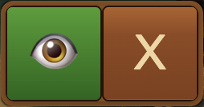
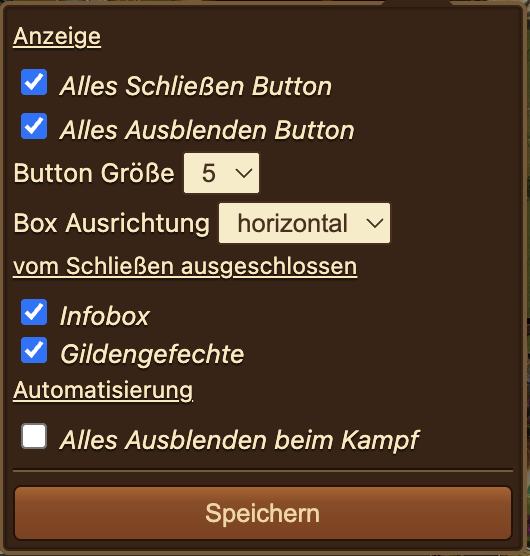

# Alle Fenster schließen

Die „Alle Fenster schließen“-Box ist eine kleine, frei verschiebbare Box mit maximal zwei großen Buttons: Einer **blendet** alle Helfer-Fenster samt Menü vorübergehend **aus**, der andere **schließt** alle offenen Helfer-Boxen endgültig. So räumst du den Bildschirm mit einem Klick auf – etwa vor einem Kampf oder wenn sich zu viele Boxen angesammelt haben.


Das Modul hat keinen eigenen Menü-Button. Aktiviere es in den [Einstellungen](../einstellungen/README.md#pop-ups) im Reiter **Pop-Ups** über den Eintrag **Alles Schließen Box** – die Box öffnet sich dann automatisch nach jedem Spielstart.


## Aufbau der Box

Die Box besteht aus einer schmalen Titelleiste mit **Zahnrad** (öffnet die [Einstellungen](#einstellungen)) und bis zu zwei Buttons:

- **Alles Ausblenden** (grüner Button mit Augen-Symbol 👁): Blendet alle Helfer-Fenster, Warn-Blocker **und das Helfer-Menü** aus, ohne sie zu schließen – nur die „Alle Fenster schließen“-Box selbst bleibt sichtbar. Der Button färbt sich dabei rot; ein erneuter Klick blendet alles wieder ein.
- **Alles Schließen** (Button mit „X“): Schließt alle offenen Helfer-Boxen und Blocker endgültig. Ausgenommen sind die Box selbst sowie alle Fenster, die du in den Einstellungen [vom Schließen ausgeschlossen](#einstellungen) hast. Geschlossene Boxen müssen bei Bedarf über das Helfer-Menü neu geöffnet werden – Daten gehen dabei nicht verloren.

Die Titelleiste hat bewusst **keinen X-Button** und keine Minimieren-Funktion: Die Box soll als dauerhafter Schnellzugriff sichtbar bleiben. Zum Entfernen deaktivierst du die Option **Alles Schließen Box** in den [Einstellungen](../einstellungen/README.md#pop-ups) und lädst das Spiel neu.

## Einstellungen

Über das Zahnrad in der Titelleiste öffnest du die Einstellungen:

- **Anzeige**: Zwei Checkboxen – **Alles Schließen Button** und **Alles Ausblenden Button** – blenden den jeweiligen Button ein oder aus. Mindestens ein Button bleibt immer aktiv: Deaktivierst du beide, wird der Schließen-Button beim Speichern automatisch wieder eingeschaltet.
- **Button Größe**: Ein Dropdown mit den Stufen 1 bis 7 (Standard: 5) für die Größe der Buttons.
- **Box Ausrichtung**: Ordnet die beiden Buttons **horizontal** nebeneinander oder **vertikal** untereinander an.
- **vom Schließen ausgeschlossen**: Checkboxen für Fenster, die der Schließen-Button verschonen soll:
  * **[Infobox](../infobox/README.md)**
  * **[Gildengefechte](../gg/README.md)** (die Live-Box des Gildengefechte-Moduls)
- **Automatisierung**:
  * **Alles Ausblenden beim Kampf**: Blendet beim Start eines manuellen Kampfes automatisch alle Boxen aus und nach Kampfende (Sieg oder Aufgabe) wieder ein. Autokämpfe lösen das Ausblenden nicht aus.
- **Speichern**: Übernimmt die Einstellungen und baut die Box neu auf.

## FAQ

**F: Was ist der Unterschied zwischen „Alles Ausblenden“ und „Alles Schließen“?** 
A: **Ausblenden** versteckt alle Fenster inklusive Helfer-Menü nur vorübergehend – ein erneuter Klick auf den (nun roten) Button holt alles unverändert zurück. **Schließen** entfernt die Boxen komplett; sie müssen danach über das Helfer-Menü neu geöffnet werden.

**F: Kann ich einzelne Fenster vom Schließen ausnehmen?** 
A: Ja. In den Einstellungen der Box lassen sich die **Infobox** und die **Gildengefechte**-Box vom Schließen ausschließen. Vom Ausblenden sind sie dagegen immer betroffen.

**F: Wie werde ich die Box selbst wieder los?** 
A: Die Box hat absichtlich keinen Schließen-Button. Deaktiviere in den [Einstellungen](../einstellungen/README.md#pop-ups) unter **Pop-Ups** den Eintrag **Alles Schließen Box** und lade das Spiel neu.

**F: Gehen beim „Alles Schließen“ Daten verloren?** 
A: Nein. Es werden nur die Fenster geschlossen – alle vom Helfer gespeicherten Daten und Einstellungen bleiben erhalten.

**F: Warum blendet sich im Kampf plötzlich alles aus?** 
A: Dann ist die Automatisierung **Alles Ausblenden beim Kampf** aktiv. Nach Kampfende erscheinen alle Boxen automatisch wieder; die Option lässt sich im Zahnrad-Menü der Box abschalten.
