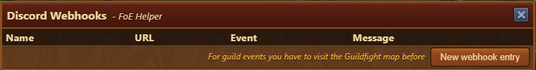

# Discord Webhooks

## Webhook im Discord anlegen


Für das Anlegen eines Webhooks benötigtes Du die passenden Rechte.


Ein Webhook kann für jeden Channel eines Discords erstellt werden. Dazu gehst Du wie folgt vor.

Klicke das Zahnrad neben dem Channel, in dem die Meldungen erscheinen sollen:

Dort klickst Du auf "Integrationen" > "WebHook erstellen":

Ändere den Namen in etwas Aussagekräftiges, damit Du später noch weißt, was das für ein WebHook ist. Den Namen des Bots, der die Meldung postet, hat hier nichts damit zu tun.

Klicke im Anschluss noch den Button "WebHook-URL kopieren" und schließe alle Fenster. Im Discord bist Du fertig.

## WebHook im Helfer einbinden


Falls Du mit Events aus den Gildengefechten arbeiten möchtest, musst Du diese vor dem neu anlegen, einmal besuchen.


Fülle die Felder aus, so wie angegeben.


**Icons** Du kannst alle Icons aus deinem Discord-Channel verwenden. Hover dafür im Channel über ein Icon und trage es mit _:name:_ in den Text ein.


Eine neue Zeile wird einfach mit der Enter-Taste (Zeilenumbruch) eingefügt.

Derzeit gibt es nur das Event "Guildfights" (erster Angriff) in Kombination mit einem Sektor. Das ist sozusagen ein BETA-Test.

Um einen Fließtext mit dem Provinznamen zu erhalten, kannst Du <mark style="color: #e83e8c;">#gg_province_name#</mark> benutzen. Es wird beim Versenden ersetzt.

## Benutzung eines Events

Da der FoE-Helfer bekanntermaßen keine Daten selbstständig abfragt, muss das Event im Spiel im eingeloggten Zustand ausgelöst werden.

Erläuterung: **Ein** einziger Spieler pro Gilde legt den Webhook an und muss dann die Gilden-Map geöffnet lassen. Mehr braucht es nicht. Diese Webhooks senden globale Events in einen Channel, heißt für private Zwecke würde das wenig Sinn machen.

Sobald dann im Hintergrund des Spieles die Information über einen Angriff kommt, wird der Trigger gesetzt und die Meldung dann automatisch 1x an Discord gesendet. Das können ja dann alle follower dieses Channels lesen.

## Weitere Events

Es fehlt ein Event oder Du hast noch eine Gute Idee?

Dann bitte einfach dieses Ticket vervollständigen: [https://github.com/mainIine/foe-helfer-extension/issues/2543](https://github.com/mainIine/foe-helfer-extension/issues/2543)