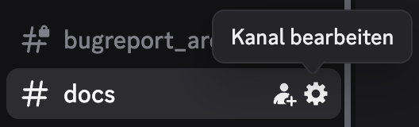
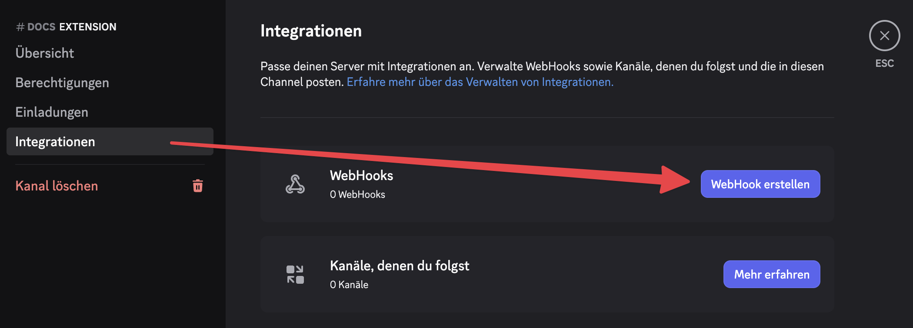
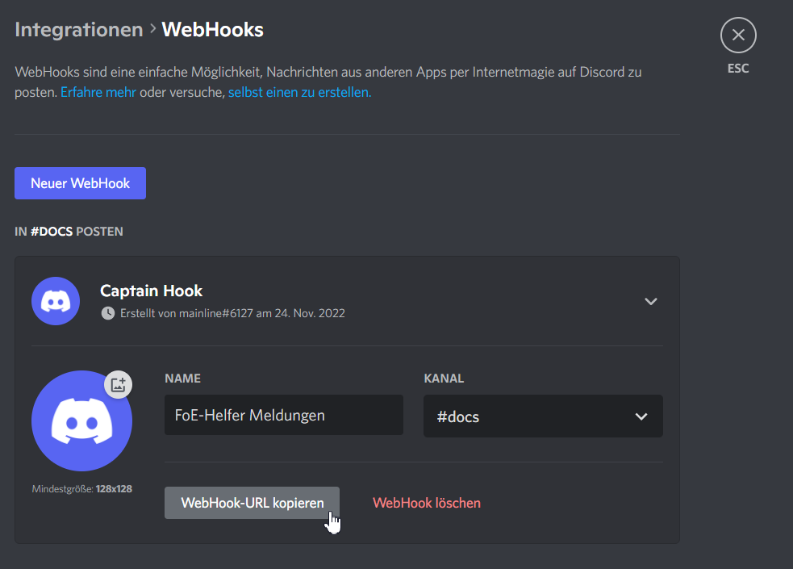
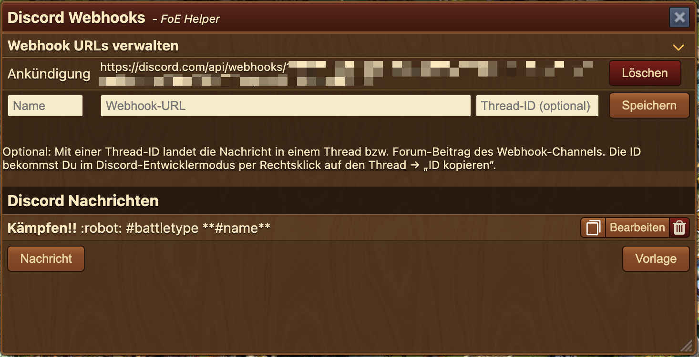
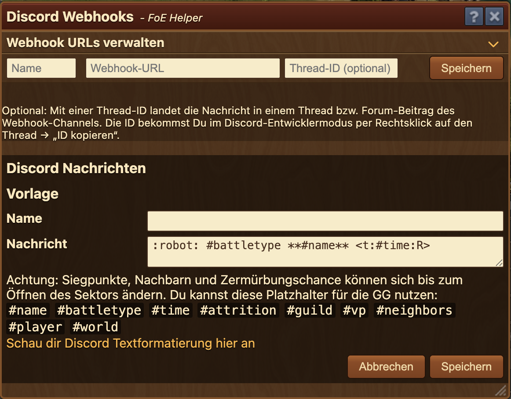
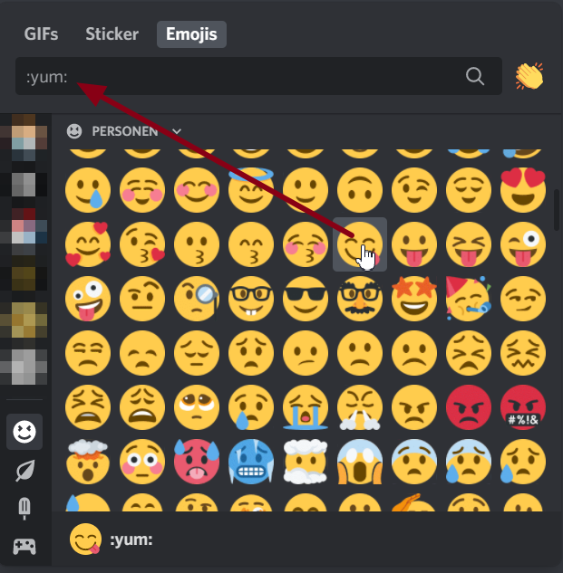

# Discord Webhooks

## Webhook im Discord anlegen


Für das Anlegen eines Webhooks benötigtes Du die passenden Rechte.


Ein Webhook kann für jeden Channel eines Discords erstellt werden. Dazu gehst Du wie folgt vor.

Klicke das Zahnrad neben dem Channel, in dem die Meldungen erscheinen sollen:

Dort klickst Du auf "Integrationen" > "WebHook erstellen":

Ändere den Namen in etwas Aussagekräftiges, damit Du später noch weißt, was das für ein WebHook ist. Den Namen des Bots, der die Meldung postet, hat hier nichts damit zu tun.

Klicke im Anschluss noch den Button "WebHook-URL kopieren" und schließe alle Fenster. Im Discord bist Du fertig.

## Bestimmten Channel oder Thread ansteuern

Ein Webhook ist bei Discord immer fest mit dem Channel verbunden, in dem er erstellt wurde — eine freie Channel-Auswahl pro Nachricht gibt die Discord-API nicht her. Möchtest Du verschiedene Channels bedienen, lege einfach pro Channel einen eigenen Webhook an und speichere jede URL mit einem aussagekräftigen Namen (z.B. dem Channel-Namen) im Helfer. Bei jeder Nachricht und in den Gildengefecht-Einstellungen wählst Du dann den passenden Webhook aus.

Zusätzlich kannst Du beim Speichern einer Webhook-URL optional eine **Thread-ID** angeben. Die Nachricht landet dann in einem bestimmten Thread bzw. Forum-Beitrag des Webhook-Channels. So kommst Du an die ID:

1. Aktiviere in Discord den Entwicklermodus (Benutzereinstellungen > Erweitert > Entwicklermodus).
2. Klicke mit rechts auf den Thread bzw. Forum-Beitrag und wähle "ID kopieren".
3. Trage die ID beim Anlegen der Webhook-URL in das Feld "Thread-ID (optional)" ein.

Der Helfer hängt die ID automatisch als `?thread_id=...` an die Webhook-URL an. Das funktioniert überall, wo der Webhook genutzt wird — auch bei den Discord-Buttons der Gildengefechte.

## WebHook im Helfer einbinden

Öffne im Helfer-Menü die Box "Discord Webhooks". Unter "Webhook URLs verwalten" speicherst Du die kopierte URL mit einem aussagekräftigen Namen — und optional der Thread-ID (siehe oben). Alle gespeicherten URLs stehen danach bei Nachrichten und in den Gildengefecht-Einstellungen zur Auswahl.

## Nachrichten

Mit dem Button "Nachricht" legst Du einen freien Text an: Webhook auswählen, Nachricht schreiben, dann direkt abschicken oder für später speichern. Gespeicherte Nachrichten erscheinen in der Liste und lassen sich jederzeit erneut senden, bearbeiten, kopieren oder löschen.

Eine neue Zeile wird einfach mit der Enter-Taste (Zeilenumbruch) eingefügt. Discord-Markdown (fett, kursiv, Zeitstempel usw.) wird unterstützt; jede Nachricht wird automatisch mit Deinem Spielernamen signiert.


**Icons** Du kannst alle Icons aus deinem Discord-Channel verwenden. Hover dafür im Channel über ein Icon und trage es mit _:name:_ in den Text ein.


## Vorlagen und Platzhalter

Mit dem Button "Vorlage" erstellst Du eine benannte Vorlage für die Gildengefechte. In ihrem Text kannst Du folgende Platzhalter verwenden, die beim Versenden durch die Daten des jeweiligen Sektors ersetzt werden:

| Platzhalter | Wert                                                                                     |
| --- |------------------------------------------------------------------------------------------|
| `#name` | Name des Sektors                                                                         |
| `#battletype` | 🔴 Angriff bzw. 🔵 Verteidigung                                                          |
| `#time` | Öffnungszeitpunkt als Unix-Zeitstempel — ideal für Discord-Zeitangaben wie `<t:#time:R>` |
| `#attrition` | Zermürbungschance in Prozent                                                             |
| `#guild` | Gilde, die den Sektor hält                                                               |
| `#vp` | Siegpunkte (inkl. Bonus)                                                                 |
| `#neighbors` | angrenzende Gilden                                                                       |
| `#player` | Dein Spielername                                                                         |
| `#world` | Deine Welt                                                                               |


Siegpunkte, Nachbarn und Zermürbungschance können sich bis zum Öffnen des Sektors noch ändern — die Werte entsprechen dem Stand zum Zeitpunkt des Sendens.


## Einsatz in den Gildengefechten

In den Einstellungen des Gildengefecht-Fensters (Zahnrad) wählst Du im Abschnitt "Discord Webhooks" den Ziel-Webhook sowie je eine Vorlage für einzelne Sektoren und für den Sammel-Versand aus. Ohne Vorlage wird eine Standard-Nachricht mit Sektorname und Öffnungszeitpunkt gesendet.

Danach erscheint neben jedem Sektor ein Discord-Button, der die Sektor-Daten mit einem Klick in Deinen Channel schickt; markierte Zeilen lassen sich gesammelt als eine Nachricht versenden.
