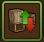
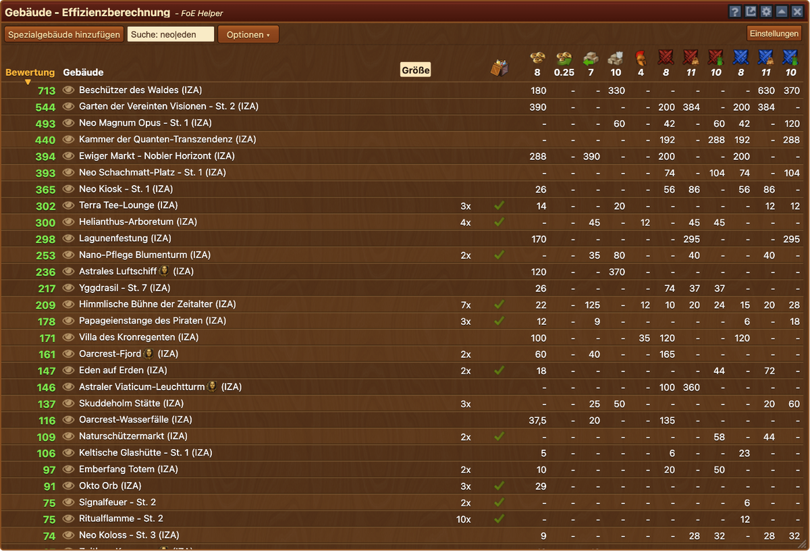
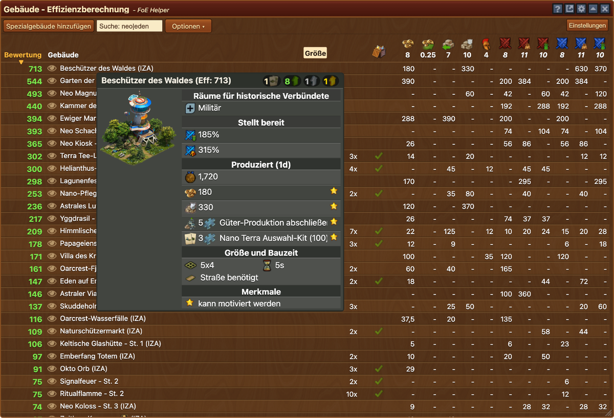
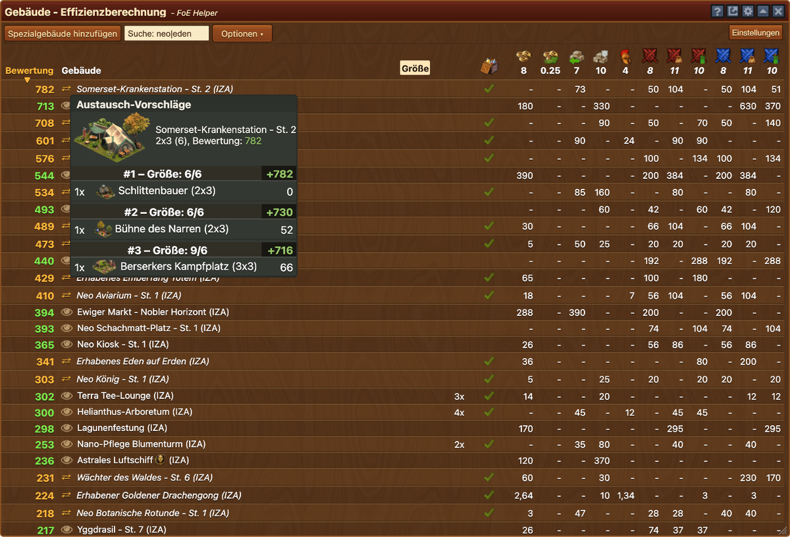
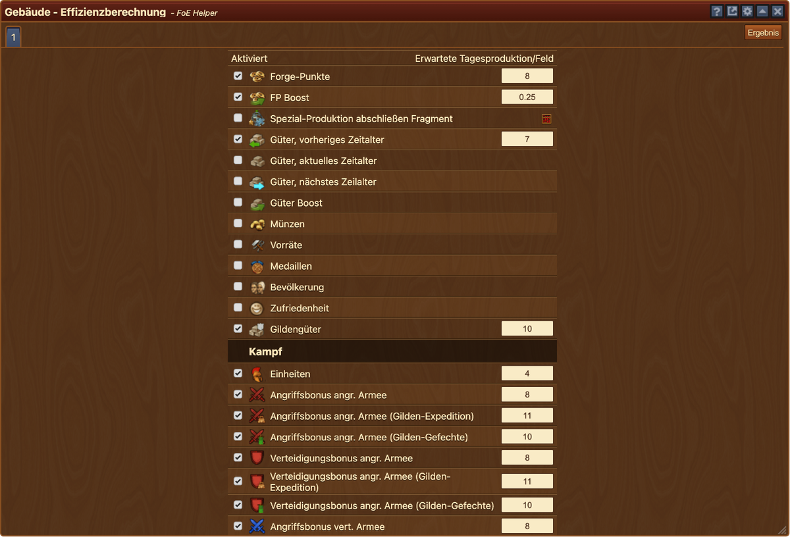

# Gebäude-Effizienzberechnung

Die Gebäude-Effizienzberechnung vergleicht Spezialgebäude anhand ihrer täglichen Produktion pro Feld – gewichtet nach deinen eigenen Erwartungen. So findest du schnell heraus, welche Gebäude in deiner Stadt am effizientesten sind, welche Inventar-Gebäude sich lohnen würden und welche Kandidaten ausgetauscht werden sollten.


Die Effizienzberechnung ist als Orientierungshilfe gedacht. Einige Ressourcentypen werden möglicherweise noch nicht vollständig unterstützt, wodurch einzelne Bewertungen unvollständig oder ungenau sein können.


## Gesamtansicht

Das Hauptfenster besteht aus folgenden Elementen:

- **Titelleiste** mit Fragezeichen (öffnet diese Anleitung), [Konfiguration](#konfiguration) (Zahnrad), Minimieren, Popout und Größenänderung.
- **Werkzeugleiste**:
    - **Einstellungen**: Wechselt zur Ansicht [Einstellungen](#einstellungen).
    - **Spezialgebäude hinzufügen**: Öffnet das Menü [Spezialgebäude hinzufügen](#spezialgebaude-hinzufugen), um beliebige Spezialgebäude in den Vergleich aufzunehmen.
    - **Suchfeld**: Hebt gesuchte Gebäude hervor und blendet alle anderen aus. Mehrere Begriffe können mit `|` kombiniert werden (z. B. `neo|eden`).
    - **Optionen**: Ein Aufklappmenü mit allen Anzeigeoptionen (siehe [Optionen](#optionen)).
- **Tabelle**: Listet alle bewerteten Gebäude zeilenweise auf, sortierbar über die Spaltenköpfe:
    - **Bewertung**: Effizienz-Score auf Basis deiner Erwartungswerte (siehe [Bewertungsmethode](#bewertungsmethode)).
    - **Gebäude**: Name, ggf. Stufe und Zeitalter des Gebäudes. Über das Auge-Symbol kann das Gebäude auf der Stadtkarte angezeigt werden. Im Spaltenkopf lässt sich zusätzlich nach **Gebäudegröße** (Anzahl Felder) filtern.
    - **Anzahl**: Wie oft das Gebäude in deiner Stadt steht. Bei mehreren Exemplaren wird nur das Gebäude mit dem höchsten Zeitalter bewertet.
    - **Inventar**: Zeigt ein ✔, wenn das Gebäude (oder ein Bausatz dafür) im Inventar liegt. Beim Überfahren erscheint ein Tooltip mit allen Kombinationsmöglichkeiten.
    - **Produktionsspalten**: Eine Spalte je aktivierter Ressource (FP, Münzen, Güter, Boosts, Fragmente, Einheiten u. v. m.) mit deinem Erwartungswert im Spaltenkopf. Über die Option **Werte pro Feld** wird zwischen Gesamtproduktion und Produktion pro Feld umgeschaltet.
    - **Items**: Zeigt Items, die das Gebäude produziert (über die Option **Zeige Item-Spalte** ein-/ausblendbar).

Die Farbe der Bewertung zeigt die Herkunft des Gebäudes:
  - **Grün**: Gebäude steht in deiner Stadt.
  - **Orange**: Gebäude liegt in deinem Inventar.
  - **Blau**: Gebäude wurde manuell über [Spezialgebäude hinzufügen](#spezialgebaude-hinzufugen) ergänzt.

### Optionen

Alle Anzeigeoptionen befinden sich im Aufklappmenü **Optionen** der Werkzeugleiste:

- **Werte pro Feld**: Zeigt statt der Gesamtproduktion die Produktion pro Feld an.
- **Nur markierte Gebäude**: Zeigt nur Gebäude aus der Suche, selbst hinzugefügte und von dir markierte Gebäude.
- **Zeige Legendäre Bauwerke**: Nimmt Legendäre Bauwerke mit in die Liste auf.
- **Inventar**: „Fügt Gebäude aus deinem Inventar, die nicht in der Stadt stehen, hinzu“ – die Inventar-Gebäude erscheinen mit orangefarbener Bewertung und kursivem Namen.
- **Minimal-Score**: Zeigt nur Inventar-Gebäude mit einer Bewertung von mindestens dem eingetragenen Wert.
- **Zeige erhabene/eingeschränkte Gebäude**: Blendet eingeschränkte (nicht wiederherstellbare) Gebäude ein oder aus.
- **Nur höchste Stufe einer Gebäudekette**: Zeigt von einer Gebäudekette nur die höchste erreichbare Stufe an.
- **Boosts der Verbündeten bewerten**: Bezieht die Boosts eingesetzter Verbündeter in die Bewertung ein.
- **Austausch-Vorschläge**: Blendet bei Inventar-Gebäuden das Tausch-Symbol ein (siehe [Austausch-Vorschläge](#austausch-vorschlage)).
- **Zeige Item-Spalte**: Blendet die Items-Spalte ein oder aus.

### Markieren von Gebäuden

- Ein Klick auf eine Zeile markiert das Gebäude dauerhaft – ideal, um mehrere Kandidaten direkt zu vergleichen.
- Treffer aus dem Suchfeld werden automatisch hervorgehoben.


Aktiviere **Nur markierte Gebäude**, um die Liste auf deine Auswahl zu reduzieren.


## Gebäude-Tooltip

Beim Überfahren eines Gebäudenamens öffnet sich ein Tooltip mit allen Details zum Gebäude:

- Bild und Name des Gebäudes inklusive Stufe und Zeitalter
- Größe (Felder) und ggf. Straßenanbindung
- Alle Produktionen und Boosts des Gebäudes im Überblick

So lässt sich jede Bewertung direkt nachvollziehen, ohne das Gebäude im Spiel suchen zu müssen.

## Austausch-Vorschläge

Ist die Option **Austausch-Vorschläge** aktiviert, erscheint vor Inventar-Gebäuden ein Tausch-Symbol. Beim Überfahren schlägt der FoE-Helfer vor, welche schlechter bewerteten Gebäude in der Stadt Platz für das neue Gebäude machen könnten:

- **Kopfbereich**: Bild, Name und Bewertung des Inventar-Gebäudes sowie dessen Platzbedarf.
- **Vorschlagsliste**: Bis zu drei Kombinationen aus Stadtgebäuden, die zusammen genügend Fläche freigeben. Zu jedem Vorschlag wird der **Bewertungs-Gewinn** durch den Austausch angezeigt.
- **Aufwerten statt tauschen**: Steht bereits eine niedrigere Stufe des Gebäudes in der Stadt und liegen die nötigen Kits im Inventar, empfiehlt der Tooltip stattdessen das Aufwerten – inklusive der benötigten Schritte.

Ein Austausch wird nur vorgeschlagen, wenn er sich lohnt: Die Gesamtbewertung der weichenden Gebäude bleibt immer unter der des neuen Gebäudes. Legendäre Bauwerke, das Rathaus und eingeschränkte Gebäude werden nie zum Abriss vorgeschlagen.

## Bewertungsmethode

Der Effizienz-Score vergleicht die tatsächliche Tagesproduktion eines Gebäudes mit deinem Erwartungswert pro Feld:

**Bewertung = (Produktion ÷ Erwartungswert) ÷ (Felder + 1 bei benötigter Straße) × 100** 
(Beispiel: 20 FP ÷ 10 FP erwartet ÷ 2 Felder = 1 × 100 = Bewertung: 100)


Kettengebäude werden als ein einziges Gebäude betrachtet (volle Verbindung vorausgesetzt). Bei Sets wird angenommen, dass alle Teile vollständig verbunden sind.


## Einstellungen

In den **Einstellungen** legst du fest, was deine Gebäude idealerweise pro Feld und Tag produzieren sollen. Diese Erwartungswerte sind die Grundlage für die gesamte Bewertung.

Der Aufbau der Ansicht:

- **Ergebnis**: Wechselt zurück zur [Gesamtansicht](#gesamtansicht).
- **Preset-Leiste**: Verwalte mehrere Einstellungs-Profile (siehe [Presets](#presets)).
- **Einstellungs-Tabelle** mit zwei Spalten:
  * **Aktiviert**: Häkchen, um eine Ressource in Bewertung und Tabelle aufzunehmen oder auszuschließen.
  * **Erwartete Tagesproduktion/Feld**: Zahlenfeld für deine gewünschte Produktion pro Feld und Tag.
- **Schaltflächen** unterhalb der Tabelle:
  * **Zurücksetzen**: Setzt das aktive Preset auf die Standardwerte zurück.
  * **Duplizieren**: Legt eine Kopie des aktiven Presets an.
  * **Löschen** (Mülleimer): Entfernt das aktive Preset.
  * **Presets exportieren / importieren**: Sichert alle Presets als JSON-Datei bzw. liest sie wieder ein.

### Einstellungs-Tabelle

Die Ressourcen und Boni sind gruppiert aufgelistet:

* **Ressourcen**: Forge-Punkte, FP Boost, „Spezial-Produktion abschließen“-Fragmente (inklusive [FSP-Rechner](#fsp-rechner)), Güter (vorheriges, aktuelles und nächstes Zeitalter), Güter Boost, Münzen, Vorräte, Medaillen, Bevölkerung, Zufriedenheit, Gildengüter
* **Kampf**: Einheiten sowie Angriffs- und Verteidigungsboni – jeweils getrennt nach Armee (angreifend/verteidigend) und Spielbereich (allgemein, Gilden-Expedition, Gilden-Gefechte, Quanten-Inkursion)
* **Quanten-Inkursion**: Aktionen


Die Balance zwischen den Werten bestimmt die Gewichtung: Trage für Ressourcen, die dir wichtig sind, niedrigere Erwartungswerte ein – Gebäude, die sie produzieren, erhalten dann höhere Bewertungen. Für unwichtigere Ressourcen wählst du entsprechend höhere Werte oder deaktivierst sie ganz.


### Presets

Über die Preset-Leiste am oberen Rand kannst du mehrere Einstellungs-Profile anlegen und blitzschnell wechseln – zum Beispiel ein Profil für FP-Farmen und eines für Kampf-Boosts:

- Jedes Preset erscheint als nummerierter Reiter; ein Klick aktiviert es, und Tabelle sowie Bewertungen werden sofort umgestellt.
- **Duplizieren** erstellt eine Kopie des aktiven Presets als neuen Reiter – der Ausgangspunkt für ein weiteres Profil.
- Mit **Löschen** (Mülleimer) und **Zurücksetzen** verwaltest du das aktive Preset.
- **Presets exportieren/importieren** überträgt deine Profile als JSON-Datei auf andere Geräte.

### FSP-Rechner

Ein Klick auf das Taschenrechner-Symbol 🧮 neben dem Fragment-Eintrag öffnet den FSP-Rechner. Er ermittelt den Erwartungswert für „Spezial-Produktion abschließen“-Fragmente (FSP): Trage ein, wie viel jede Ressource pro FSP-Kit wert ist – der Wert wird dann automatisch aus deinen Erwartungswerten der [Einstellungs-Tabelle](#einstellungs-tabelle) berechnet.

### Tooltip: Vergleichswerte

Beim Überfahren eines Eingabefelds zeigt ein Tooltip Vergleichswerte aus deiner eigenen Stadt:

* **Bestes**: höchste Produktion pro Feld in deiner Stadt.
* **Top 5**: Produktion pro Feld des fünftbesten Gebäudes.
* **Top 10 %**: niedrigste Produktion pro Feld innerhalb der besten 10 % deiner Gebäude.

### Vorgehen

1. **Aktiviere** nur die Ressourcen, die in die Bewertung einfließen sollen.
2. **Trage ein**, wie viel ein Gebäude davon pro Feld und Tag produzieren soll.
3. Klicke auf **Ergebnis**, um die Bewertung mit deinen Werten anzuzeigen.

## Spezialgebäude hinzufügen

Über **Spezialgebäude hinzufügen** kannst du Spezialgebäude, die du (noch) nicht besitzt, in den Vergleich aufnehmen – zum Beispiel, um vor einem Event zu prüfen, ob sich das Hauptgebäude lohnt.

Das Menü besteht aus:

* **Suchfeld**: Filtert die Liste nach Namen (z. B. zeigt „Neo“ alle Gebäude mit „Neo“ im Namen).
* **Gebäudeliste**: Scrollbare Liste aller verfügbaren Spezialgebäude; ein Klick wählt ein Gebäude aus bzw. ab. Beim Überfahren erscheint ein Vorschau-Tooltip mit Bild, Beschreibung, Produktionen und Größe.
* **Sichtbare Gebäude aus-/abwählen**: Kehrt die Auswahl aller aktuell angezeigten Gebäude um.
* **Ausgewählte Gebäude hinzufügen**: Übernimmt die Auswahl in die [Gesamtansicht](#gesamtansicht), wo sie blau hinterlegt einsortiert werden.

## Konfiguration

Über das Zahnrad in der Titelleiste lässt sich die komplette Tabelle als `CSV`- oder `JSON`-Datei exportieren – etwa zur weiteren Auswertung in einer Tabellenkalkulation.

## FAQ

**F: Was sagt der Effizienz-Score aus?** 
A: Er misst, wie gut ein Gebäude deine konfigurierten Erwartungen pro Feld erfüllt. 100 bedeutet: Das Gebäude erfüllt die Erwartung exakt.

**F: Warum sind manche Werte krumm (z. B. 4,5 FP)?** 
A: Das sind Durchschnittswerte über zufallsbasierte Produktionen.

**F: Kann ich Gebäude vergleichen, die ich noch nicht besitze?** 
A: Ja, über [Spezialgebäude hinzufügen](#spezialgebaude-hinzufugen).

**F: Ich möchte eine Ressource sehen, aber nicht bewerten – geht das?** 
A: Ja. Setze ihren Erwartungswert auf 0, dann erscheint sie in der Tabelle, fließt aber nicht in die Bewertung ein.

**F: Warum sehe ich keine Austausch-Vorschläge?** 
A: Aktiviere in den [Optionen](#optionen) sowohl **Inventar** als auch **Austausch-Vorschläge**. Das Symbol erscheint nur bei Gebäuden aus dem Inventar.
