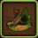
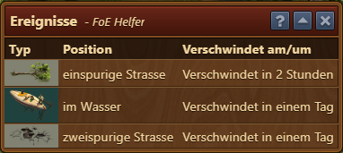
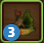

# Ereignisse

Dieses Modul zeigt an, welche Ereignisse es in deiner Stadt gibt, die du sammeln kannst.

## Aufbau

In der Tabelle sieht man welche Ereignisse es gibt, wo sie zu finden sind und für wie lange.

## Icon Badges

Auf dem Icon in der FoE-Helfer Symbolleiste zeigt eine überlagerte Zahl an, wie viele Ereignisse es aktuell in deiner Stadt gibt.  Wird keine Zahl angezeigt, sind aktuell keine Ereignisse in deiner Stadt, die man sammeln könnte.

## FAQ 

**Q: Kann man die exakte Position eines Ereignisses anzeigen?** 
A: Nein, leider nicht.  Die Position ist zufällig und ändert sich über die Zeit.

**Q: Kann man künftig erscheinende Ereignisse mit auflisten?** 
A: Nein, dieses Feature musste entfernt werden.