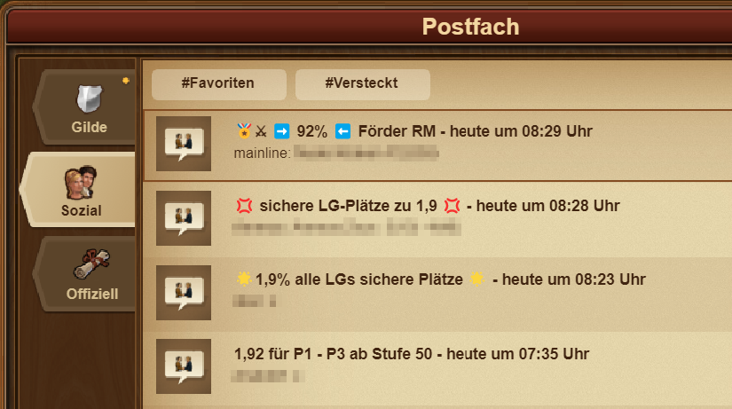
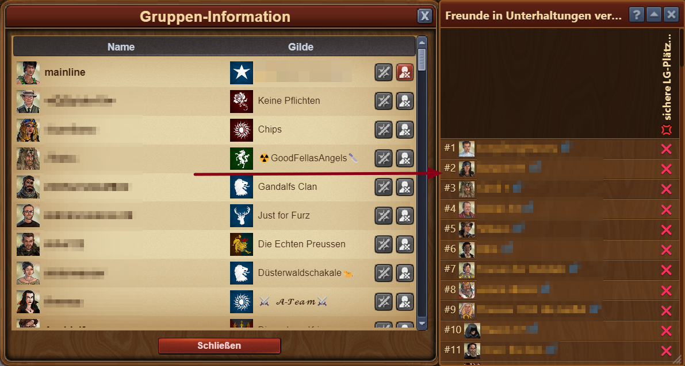

--- 
description: Freunde in Unterhaltungen 
--- 

# Freunde in Unterhaltungen finden/vergleichen

Um zu prüfen, mit welchen Freunden man im gleichen Thread ist um Platz zu schaffen, für neue Freunde.

Bei vielen Fördergruppen verliert man schnell den Überblick mit welchen Freunden in welchen Unterhaltungen zusammen eingezahlt wird. Dieses kleine Modul listet die Mitglieder übersichtlich auf, um zu sehen, welcher Freund:in keinen Überschneidungspunkt in einem eventuell gemeinsamen Thread hat.

## Bedienung des Moduls

### Freunde einlesen
Beim Öffnen des Moduls werden, wenn der Reiter unten gewählt, die Freunde angezeigt. Für den Fall das das nicht so sein sollte, weißt die Box darauf hin, diesen Reiter zu öffnen, damit das Spiel die aktuelle Liste übermittelt.

### Unterhaltung einlesen

Beginnen nun alle Unterhaltungen einzulesen in denen due die Mitglieder vergleichen möchtest.

Öffne eine soziale Unterhaltung:

Öffne die Gruppen-Info der Unterhaltung:

Nach dem Öffnen der Mitgliederübersicht liest das Modul automatisch alle Mitglieder ein:

---

Besuche nun alle anderen Unterhaltungen in denen Du Deine Freunde abgleichen möchtest. Am Ende könnte Deine Box etwa so aussehen:

### Aufräumen

Mit dieser geöffneten Box kannst Du nun kontrollieren mit welchen Freunden Du in keinem Thread bist, um diese ggf aus Deiner Freundesliste zu entfernen, damit Du Platz in Deiner FL schaffen kannst.

Entfernst Du einen Freund, wird die Liste sofort aktualisiert.


Dieser Vergleich wird nicht gespeichert und muss nach jedem erneuten einloggen / neu laden der Seiten neu erstellt werden.
