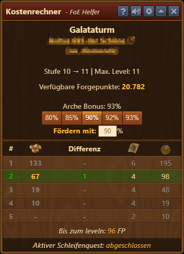
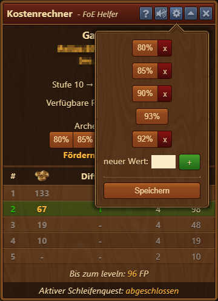
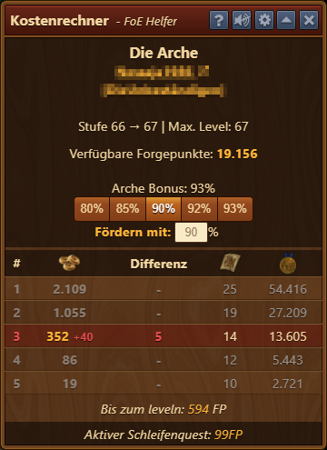
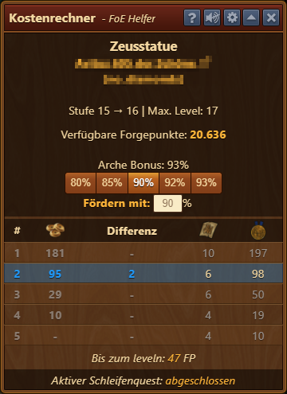
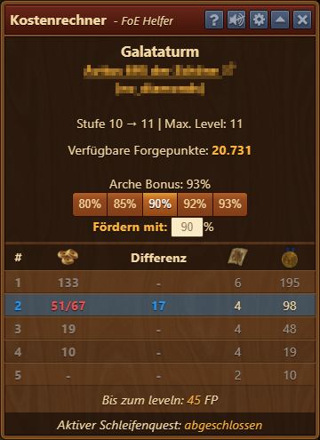
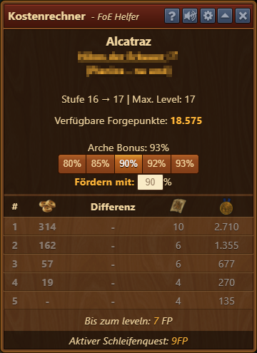
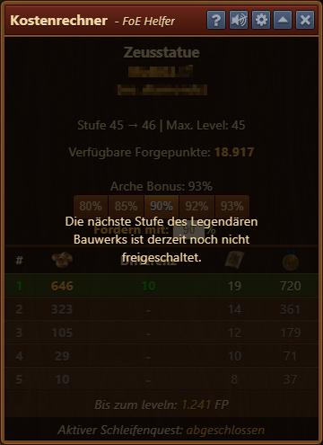
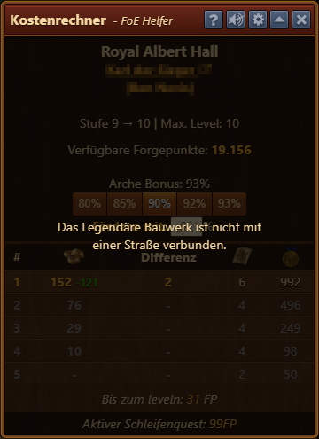

# Kostenrechner

 

Solltest du Spielern beim leveln, oder gar beim unfreiwilligen leveln helfen wollen, ist dieses Tool unverzichtbar. Es rechnet für dich alle relevanten Werte aus, und du kannst ihn nach Belieben einstellen.

## Aufbau

Der Kostenrechner ist wie folgt von oben nach unten strukturiert:

* Name des Bauwerks
* Besitzer inkl. Link zur https://foe.scoredb.io/ Seite des Spielers
* Gilde des Besitzers
* Stufe des Bauwerks und wie weit es ausgebaut werden kann
* **Verfügbare Forgepunkte:** Anzeige der verfügbaren FP in deinem Inventar
* **Arche Bonus:** der reelen Bonus deiner Arche (hier 93%)
* Buttons zum Umschalten der Prozente für das Einzahlen
* **Fördern mit:** hier kannst du selbst einen beliebigen Prozentsatz einstellen
* Tabelle:
  * Mäzenplatz-Nummer
  * Die Anzahl der FP, die pro Mäzenplatz eingezahlt werden.  Die Zahlen errechnen sich aufgrund des o.g. Prozentsatzes
  * Die Differenz zwischen der einzuzahlenden FPs und dem Archenbonus
  * Die Anzahl der BPs, die aufgrund des Archenbonus ausgezahlt werden
  * Die Anzahl der Medaillen, die aufgrund des Archenbonus ausgezahlt werden
* **Bis zum leveln:** die Anzahl der FPs, die noch benötigt werden, um das Bauwerk zu leveln.
* **Aktiver Schleifenquest:** zeigt an, ob ein wiederkehrender Quest abgeschlossen ist

## Konfiguration

Über das Zahnrad in der Titelleiste kann man einstellen, welche Prozentsatz-Buttons angezeigt werden.

## Verwendung

Die Zahlen in der Tabelle der Mäzenplätze können unterschiedliche Farben haben, die angeben, ob es sicher ist einzuzahlen oder nicht.

### Grün = Mäzenplatz sicher

Ist ein Platz sicher und kann nach deiner Investition nicht mehr überboten werden, ist die Zeile grün hinterlegt.

### Rot = Mäzenplatz unsicher

Ist ein Platz noch nicht sicher und kann überboten werden, erscheint die Zeile rot und zeigt an (rote Zahl dahinter) wie viele FP noch bis "sicher" fehlen.

### Blau = bereits eingezahlt

Hast du genau den "Einsatz" in das Bauwerk eingzahlt, wird die Zeile blau. Sie ist weiterhin blau, wenn du das Bauwerk später öffnest und deine Einzahlung erkannt wird.

Hast du nicht genau den errechneten Einsatz eingezahlt, wird die Zahl in Rot angezeigt (eingezahlt / errechneten Einsatz).

### Nicht belegbare Mäzenplätze

Mäzenplätze, die in Grau angezeigt werden, können nicht belegt werden.

Ist die nächste Stufe des Bauwerks nicht freigeschaltet, können Mäzenplätze nicht belegt werden.

Mäzenplätze können ebenfalls nicht belegt werden, wenn das Bauwerk nicht an eine Straße angeschlossen ist.

