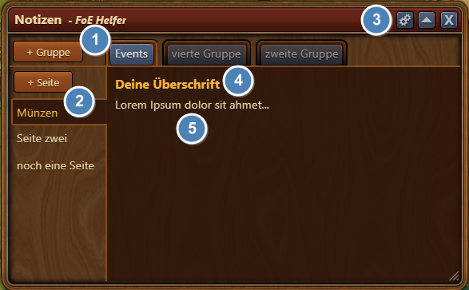
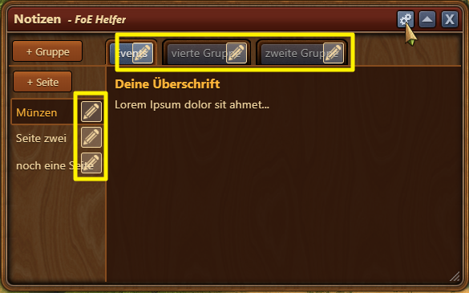
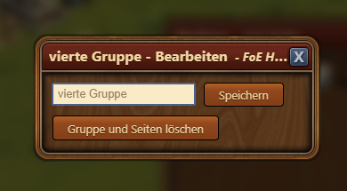
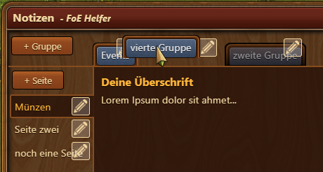

# Notizen

Notiere dir alles, was Du brauchst, sortiert in Gruppen und noch mal in Seiten. So behältst Du immer den Überblick, auch geräteübergreifend.

## Aufbau

1. "Gruppen" - vergleichbar mit einer Kategoriestruktur
2. "Seiten" - sind die Unterkategorien der Gruppen
3. "Einstellungen" - machen erst Sinn, wenn Gruppen und Seiten vorhanden sind
4. Jede Seite hat und braucht eine Überschrift
5. Contentbereich - einfach reinklicken und losschreiben

## Benutzung

### Start
Zu aller erst muss eine Gruppe angelegt werden. Ist diese vorhanden lassen sich darin beliebig viele Seiten anlegen.

### Schreiben
Um Text einzufügen musst Du nur in den entsprechenden Bereich mit der Maus klicken. Gespeichert wird automatisch, wenn du mit der Maus irgendwo außerhalb des Bereiches hinklickst. Das gilt für die Überschrift und den Content gleichermaßen.

### Ändern/Bearbeiten
Sollen Gruppen- oder Seitennamen geändert werden musst Du oben rechts auf das Zahnrad klicken. So aktivierst Du den "Bearbeitungsmodus":

Mit einem Klick auf einen Stift kannst Du entweder den Namen ändern oder das entsprechende Element löschen:

Löscht du eine Gruppe werden auch alle untergeordneten Seiten gelöscht!

Ist der "Bearbeitungsmodus" aktiv hast Du die Möglichkeit die Gruppen oder die Seiten via Drag&Drop untereinander neu zu sortieren:

