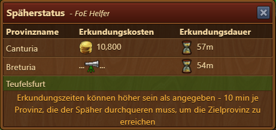

# Späherstatus

Dieses Modul zeigt dir beim Betreten der Karte den aktuellen Status deines Spähers - egal auf welcher Karte du und der Späher gerade sind. Die Bewirtschaftung deiner Erkundungsstätten (Ab ZA Mars) wird dich nicht mehr von der Erkundung ablenken.

## Aufbau

Der Späherstatus zeigt folgende Informationen an:

* Wieviel die Erkundung einer bestimmten Provinz kostet und wie lange diese dauern wird (Zeile Eins in obiger Tabelle)
* Zu welcher Provinz der Späher gerade unterwegs ist und wie lange dies noch dauert (Zeile Zwei in obiger Tabelle - aktualisiert nur beim Öffnen der Karte)
* Welche Provinzen aktuell erobert werden können (grün hinterlegt - z.B. Zeile Drei in obiger Tabelle)

## Konfiguration

In den Einstellungen der Erweiterung kann das Modul (de)aktiviert werden.