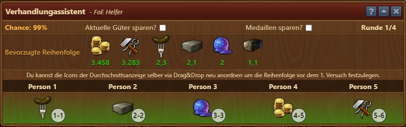
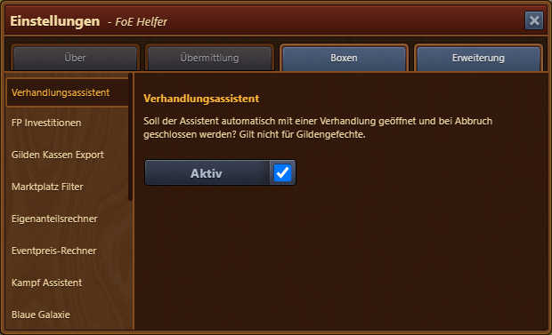
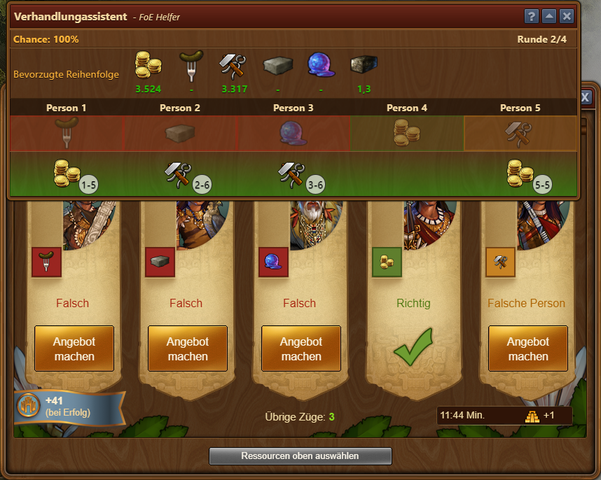
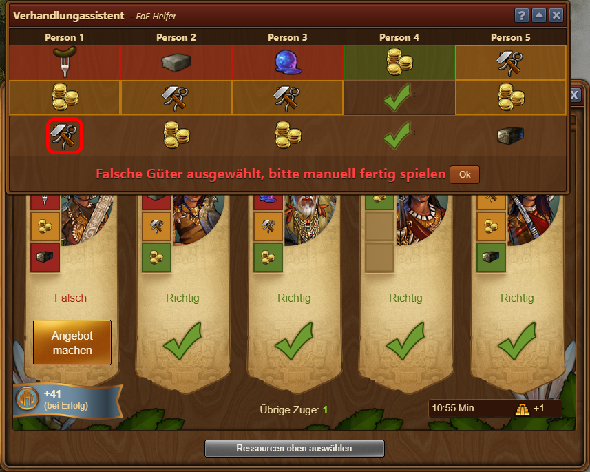

# Verhandlungsassistent

 

An vielen Stellen des Spieles müssen Verhandlungen geführt werden. Mal einfache, mal komplexe. Dieses Modul soll dir dabei helfen.

## Aufbau

Der Dialog bietet dir folgende Informationen und Optionen an:

* **Chance** - mit welcher Wahrscheinlichkeit diese Runde abgeschlossen werden kann
* **Aktuelle Güter sparen?** - hiermit gibst du an ob deine aktuellen Güter gleich viel für die Vorschläge verwendet werden sollen. Ansonsten werden immer erst die Güter aus dem Zeitalter davor getestet. 
* **Medaillen sparen?** - wenn gesetzt werden deine Medaillen gespart, bis du den Haken entfernst. Das macht sich besonders in den kleineren Zeitaltern sehr gut.  Das heißt erst nachdem alle Güter getestet wurden, kommen die Medaillien dran.
* **Runde** - wie viele Runden du noch spielen kannst. Hast du einen Tavernenboost aktiviert, erkennt das der Assistent und schreibt dir 1/4 hin.
* **Bevorzugte Reihenfolge** - die Güter die für diese Verhandlung zur Verfügung stehen.  Durch Drag & Drop kannst du vor der ersten Verhandlung die Reihenfolge der Güter verändern.

## Konfiguration

In den Einstellungen gibt es die Möglichkeit anzugeben, ob der Verhandlungsassistent automatisch starten soll, wenn eine Verhandlung gestartet wird.

## Verwendung

In der unteren Hälfte des Dialogs werden die Güter aufgezeigt, die das Programm zum Verhandeln vorschlägt. Hat man die Güter ausgewählt und auf **Bezahlen & Verhandeln** gedrückt, werden Vorschläge für die nächste Runde angezeigt:

In den kleinen Kreisen unter den Vorschlägen sind die Shortcut-Tasten aufgelistet, die verwendet werden können.  In der dritten Spalte im obigen Bild steht beispielsweise **3-6**.  Wenn man die **3** drückt, kann man ein Angebot für die dritte Person machen.  Drückt man dann auf **6**, wird das sechste Gut, hier Vorräte, ausgewählt.  Somit kann man recht schnell die Angebote abgeben.  Hat man alle Angebote ausgewählt, kann man auf die Leertaste drücken, um sie zu bezahlen.  Details zu den Shortcut-Tasten in Forge of Empires findest du unter https://de.wiki.forgeofempires.com/index.php?title=Tastaturbefehle.

Hat man einmal ein nicht vorgeschlagenes Gut ausgewählt und bezahlt, kommt eine Warnung, dass man ab dann ohne Unterstützung weitermachen muss:

## FAQ

**Q: Warum wird der Verhandlungsassistent nicht bei Verhandlungen in den Gildengefechten angezeigt?** 
A: Der Verhandlungshelfer ermöglicht es nicht nur besser zu verhandeln, sondern auch schneller. Da dies das Balancing der Gildengefechte beeinflusst, wurde die Funktion an dieser Stelle abgeschaltet. An anderen Stellen (Expedition, Quests, Feudales Japan) bleibt sie erhalten. Für Details, siehe https://discuss.foe-helper.com/d/355-anderungen-am-foe-helfer-changes-to-the-foe-helper
