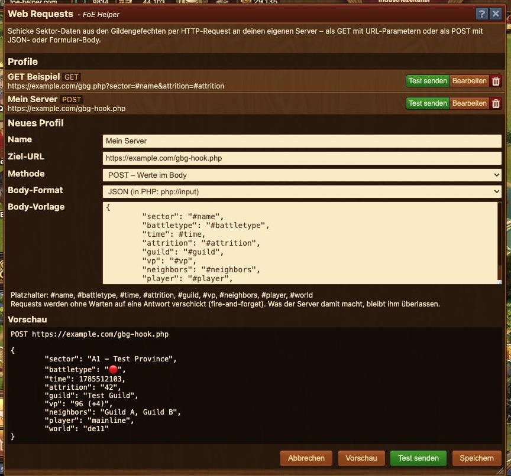

# Web Requests

Mit diesem Modul schickst Du Sektor-Daten aus den Gildengefechten per HTTP-Request an Deinen **eigenen Server** — ganz ohne Discord. Ideal für Bastler, die ihre Meldungen selbst weiterverarbeiten wollen (eigene Bots, Dashboards, Push-Dienste, Hausautomation, …).




Die Requests sind **fire-and-forget**: Der Helfer schickt den Request ab und wartet nicht auf eine Antwort. Was Dein Server mit den Daten macht, bleibt Dir überlassen.


## Profil anlegen

Öffne das Modul über das Menü und lege ein neues Profil an:

| Feld | Bedeutung |
| --- | --- |
| **Name** | Frei wählbar, taucht später in den Einstellungen der Gildengefechte auf |
| **Ziel-URL** | Deine Server-Adresse. Platzhalter sind direkt in der URL erlaubt |
| **Methode** | `GET` (Werte als URL-Parameter) oder `POST` (Werte im Body) |
| **Body-Format** | Nur bei POST: `JSON` oder `Formular` |
| **Body-Vorlage** | Nur bei POST: der Inhalt des Requests, mit Platzhaltern |

## Platzhalter

Beim Versand werden die Platzhalter durch die Daten des Sektors ersetzt:

| Platzhalter | Inhalt                                      |
| --- |---------------------------------------------|
| `#name` | Name des Sektors                            |
| `#battletype` | 🔴 Angriff / 🔵 Verteidigung                |
| `#time` | Unix-Zeitstempel der Entsperrung (Sekunden) |
| `#attrition` | Zermürbungschance in Prozent                |
| `#guild` | Besitzer-Gilde des Sektors                  |
| `#vp` | Siegpunkte (inkl. Bonus)                    |
| `#neighbors` | Angrenzende Gilden                          |
| `#player` | Dein Spielername                            |
| `#world` | Deine Spielwelt                             |

Bei `GET` werden die Werte automatisch URL-kodiert, bei `JSON` korrekt escaped — Du musst Dich um nichts kümmern.

## Vorschau und Test

Im Formular zeigt Dir die **Vorschau** den fertigen Request mit Beispieldaten — inklusive Warnung, falls Deine JSON-Vorlage kein gültiges JSON ergibt. Mit **Test senden** geht der Request mit den Beispieldaten sofort an Deinen Server, damit Du Dein Skript direkt debuggen kannst.

## Datenempfang auf dem eigenen Server

**GET — Werte als URL-Parameter:**

Ziel-URL: `https://example.com/gbg.php?sector=#name&attrition=#attrition`

```php
<?php
$sector    = $_GET['sector'] ?? '';
$attrition = $_GET['attrition'] ?? '';
```

**POST — Formular:**

Die Body-Vorlage enthält ein `key=value`-Paar pro Zeile und wird als `application/x-www-form-urlencoded` verschickt:

```php
<?php
$sector = $_POST['sector'] ?? '';
```

**POST — JSON:**

Der Body wird als Text verschickt und landet nicht in `$_POST`, sondern wird so gelesen:

```php
<?php
$data = json_decode(file_get_contents('php://input'), true);
$sector = $data['sector'] ?? '';
```

## Technische Hinweise

* Es sind nur `https://`-URLs möglich (oder `http://localhost` zum Entwickeln). Andere `http://`-Ziele blockiert der Browser als Mixed Content.
* Dein Server braucht **keine CORS-Konfiguration** — die Antwort wird nie ausgewertet.
* Eigene HTTP-Header (z. B. `Authorization`) sind technisch nicht möglich. Wenn Du eine Absicherung brauchst, übergib ein Geheimnis einfach als URL-Parameter oder Body-Feld, z. B. `&token=mein-geheimnis`.

## Gildengefechte

Wähle Dein Profil in den Einstellungen der GBG-Spieler-Übersicht aus (Zahnrad, Abschnitt „Web Requests"). Danach erscheint an jedem Sektor ein Sende-Button neben den Discord-Buttons, und über die Zeilen-Auswahl kannst Du mehrere Sektoren auf einmal verschicken — ein Request pro Sektor.
