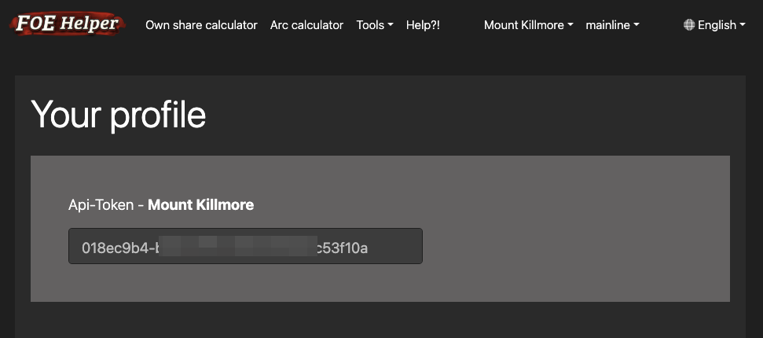
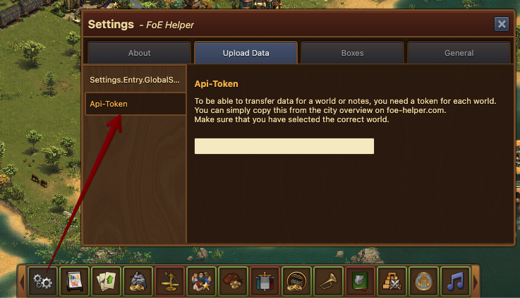

# Api Token

## Get a token
To be able to send data from the extension to foe-helper.com, you need a free API token.
You can simply copy this from your profile.

Please note, however, that each world requires its own token. So you need a separate token for en1, us5 or cz12.

## Enter the Token

You can now simply store the token copied from the profile in the extension, since version 3.6.4.0, in the appropriate world.

Again, pay attention to the selection of the right world!

