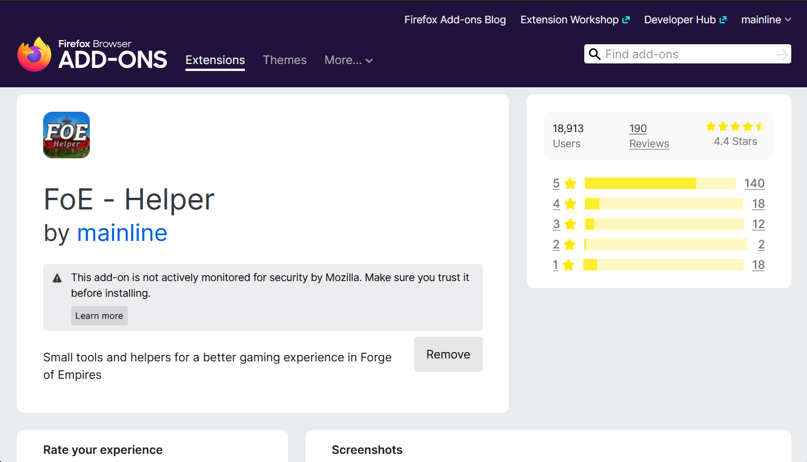

# FoE Helfer Extension

FoE Helper is a browser extension that "overlays" the game and can analyze the data sent from the game to your browser.

Since no data is manipulated, no actions are automated or other changes are made, this expansion is not officially approved by InnoGames, but it does not violate any game rules and is therefore tolerated.

It is not possible to install the helper on a mobile device.

## Installation of the FoE Helper

FoE Helper is suitable for all Chromium based browsers.

These are the most famous: [Google Chrome](https://www.google.com/chrome/), Microsoft Edge, [Opera](https://www.opera.com/) [(GX)](https://www.opera.com/de/gx), [Vivaldi](https://vivaldi.com/), [Brave](https://brave.com/), [Blisk](https://blisk.io/), [Colibri](https://colibri.opqr.co/), [Epic Browser](https://www.epicbrowser.com/), [Iron- oder SW Browser](https://www.srware.net/iron/), and much more...

Furthermore, Firefox is also supported as a non-chromium variant.

There is a store entry for Chrome, Microsoft and Firefox. For Opera and possibly other Chromium-based browsers there is a small workaround.

## Chrome Installation

Go to the Chrome Web Store: [Chrome Store](https://chrome.google.com/webstore/detail/foe-helper/bkagcmloachflbbkfmfiggipaelfamdf) and click the "Add" button at the top right.

The extension will be automatically added to your browser after your confirmation.

If the game is already open in one of your tabs you have to reload it!

After opening the game, an additional bar will appear in the bottom right corner.

## Microsoft Edge

The extension can no longer be selected from the Microsoft Store. Instead install it from the [Chrome Store](https://chrome.google.com/webstore/detail/foe-helper/bkagcmloachflbbkfmfiggipaelfamdf).

## Firefox Browser

The Firefox add-on can be downloaded directly from the store: [Firefox-Addon](https://addons.mozilla.org/en/firefox/addon/foe-helper/)

