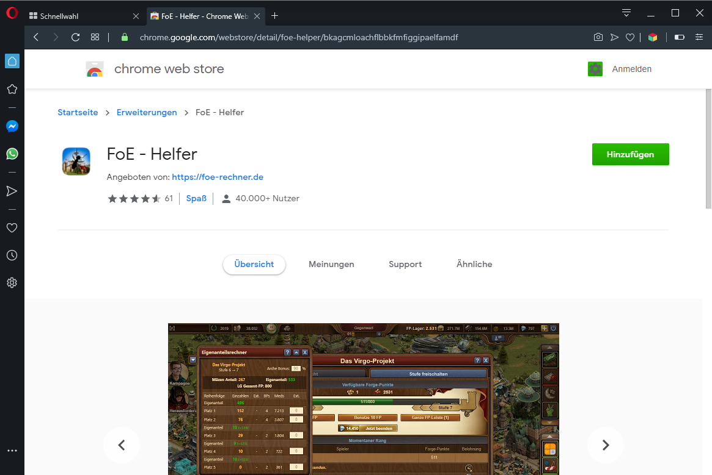
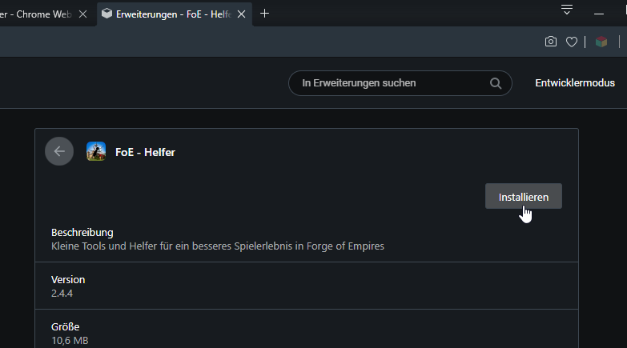

# FoE Helfer Extension

FoE Helper is a browser extension that "overlays" the game and can analyze the data sent from the game to your browser.

Since no data is manipulated, no actions are automated or other changes are made, this expansion is not officially approved by InnoGames, but it does not violate any game rules and is therefore tolerated.

## Installation of the FoE Helper

FoE Helper is suitable for all Chromium based browsers.

These are the most famous: [Google Chrome](https://www.google.com/chrome/), Microsoft Edge, [Opera](https://www.opera.com/) [(GX)](https://www.opera.com/de/gx), [Vivaldi](https://vivaldi.com/), [Brave](https://brave.com/), [Blisk](https://blisk.io/), [Colibri](https://colibri.opqr.co/), [Epic Browser](https://www.epicbrowser.com/), [Iron- oder SW Browser](https://www.srware.net/iron/), and much more...

Furthermore, Firefox is also supported as a non-chromium variant.

There is a store entry for Chrome, Microsoft and Firefox. For Opera and possibly other Chromium-based browsers there is a small workaround.

## Chrome Installation

Go to the Chrome Web Store: [Chrome Store](https://chrome.google.com/webstore/detail/foe-helper/bkagcmloachflbbkfmfiggipaelfamdf) and click the "Add" button at the top right.

The extension will be automatically added to your browser after your confirmation.

If you have already opened the game in one of your tabs you have to reload the window!

After opening the game, an additional bar will appear in the bottom right corner.

## Microsoft Edge

Similar to Chrome, here the extension can simply be selected from the [Microsoft Store](https://microsoftedge.microsoft.com/addons/detail/foe-helfer/cpmacpalonncbafboibpcjcpadloannb) downloaded and installed.

Installation from here on is the same as for Chrome.

## Opera Browser

With a small tool you can easily install any Chrome extension into an Opera browser. This can also be true for all other Chromium based browsers. It varies from case to case.

1. Open in your Opera Browser (PC) the [Opera Store](https://addons.opera.com/de/extensions/details/install-chrome-extensions/) and install it.
2. Restart your Opera.
3. Open the Chrome Webstore in your Opera and perform the following steps as described under "Chrome Installation". 
4. Confirm the compatibility mode: 
5. In the next step you will be offered to install the extension. Click "Install":  Confirm the permissions for the app.
6. Restart browser and enjoy the game with the helper.

