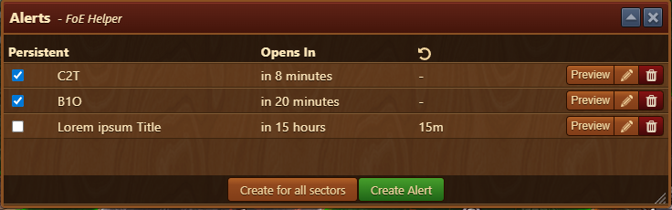
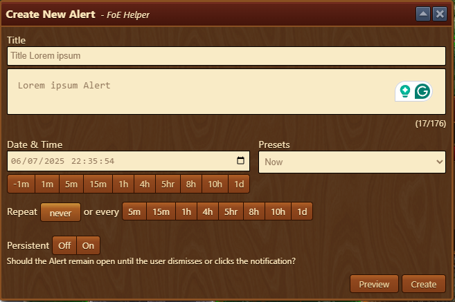
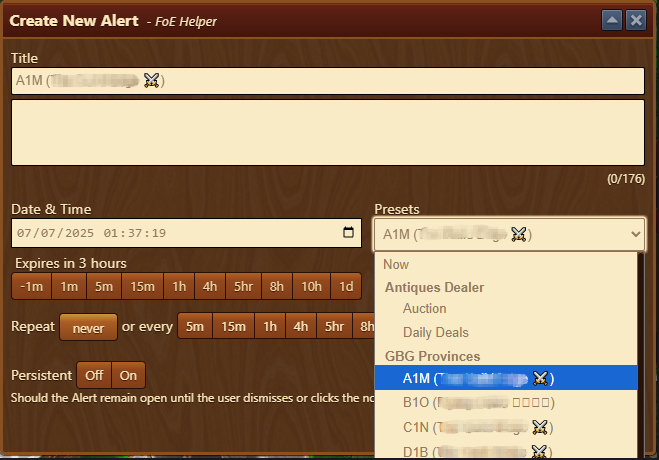

--- 
description: The Alerts module lets you create and manage custom reminders 
--- 

# Alerts

You can set alerts manually or auto-generate them for all Guild Battleground sectors or the Antiques Dealer.

## Menu Overview

The first screen displays an overview of already set alerts and buttons to add new alerts.

The alerts overview is structured as follows, from top to bottom:
- **The alerts display area**
  - **Persistent** - If selected, forces notification to remain open until the user dismisses or clicks on the notification window 
  - **Opens in** - Displays time remaining until the alert will be triggered
  - **Repeat** - Displays recurrence of that alert (eg. 15 min, which means that Alert will be repeated every 15 minutes)
    - **Preview** - Displays notification preview
    - **Edit** - Opens Alert Menu
    - **Delete** - Delete selected Alert
- **Create for all sectors** - Button to create an alarm for all sectors in GBG
- **Create Alert** - Button to create a custom alert

## Creating a New Alarm

You can create a custom alarm by opening the window, entering a title and helpful description, and setting the time delay before it triggers.

The Create Alerts Menu is structured as follows, from top to bottom:
- **Title** – A custom name for the alarm (displayed in Alerts Overview)
- **Description** – Optional field to explain the purpose or add a reminder note (displayed when notification is triggered).
- **Date & Time** – Specify exactly when the alert should trigger. (by clicking on the calendar icon, you can choose exact date and time)
- **Time Shortcuts** – Use preset buttons (e.g., `+5m`, `+1h`) to quickly adjust the alert time.
- **Presets** - Dropdown menu with available presets for Antiques Dealer or GBG
- **Repeat** – Choose how often the alarm repeats (e.g., never, every 15 min, hourly).
- **Persistence** – If enabled, the alarm will remain visible until you manually dismiss it.
- **Preview** – View how the alarm will look before creating it.
- **Create** – Finalize and activate your alarm.

### Presets

The Presets option displays a drop-down list that allows you to automatically set an alarm for the Antique Dealer or a specific sector in GBG.
By choosing a sector or Antique Dealer, the **Titles** and **date & time** field will be automatically populated.

