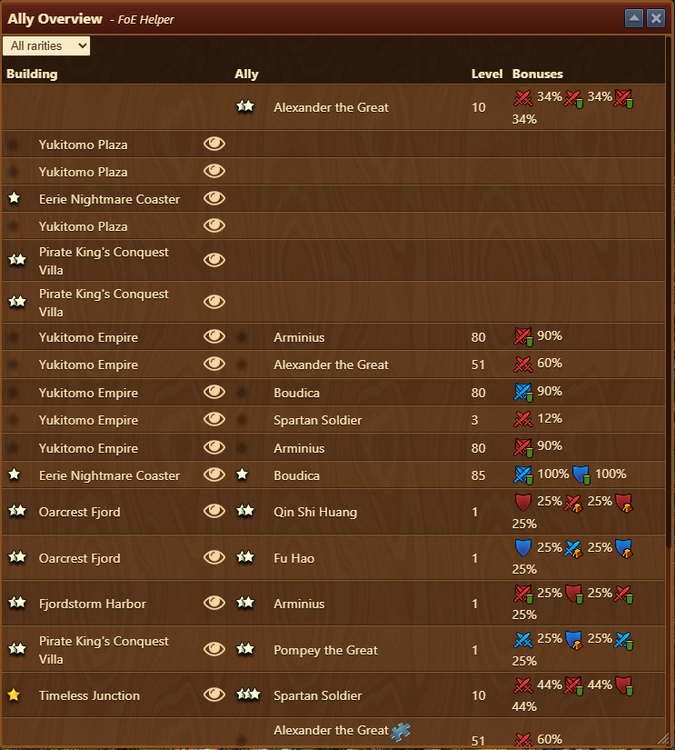

# Ally Overview


This module can be activated in [Settings](../settings/README.md#pop-ups-tab)


The **Ally Overview** module provides a centralized view of all allies currently assigned to your buildings, including their level, rarity, and the bonuses they provide to your city’s military strength.

## Menu Overview

The interface includes:

- **Filter Dropdown** (top left): Allows filtering buildings by ally room rarity (eg. Common, Rare, Epic).
- **Data Table** with the following columns:
  - **Building**: Name of the building having an Ally room.
  - **Rarity**: Rarity of an Ally building can hold. (★ for rarity)
  - **View**: Opens up [City Overview](../town/README.md#town-overview) highlighting the selected building.
  - **Rarity**: Rarity of an Ally. (★ for [rarity](#rarity-icons))
  - **Ally**: Name of the Ally (eg., Boudica, Alexander the Great).
  - **Level**: Indicates Ally’s current level of the ally.
  - **Bonuses**: Shows the bonus types and values provided.

### Rarity Icons

 - ☆ = Common
 - ★ = Uncommon
 - ★★ = Rare
 - ★★★ = Epic
 - ⭐ = Legendary


Timeless Junction can hold an Ally of any rarity.


## Usage

This view helps you:
- Track unassigned allies and unoccupied buildings
- Track all ally assignments across your city
- Quickly compare which allies give the strongest bonuses
- Swap or reassign allies for optimal benefit

## FAQ

**Q: How do I level up an ally?** 
A: Collect XP through gameplay.

**Q: Can I change which building an ally is assigned to?** 
A: Yes, use the in-game interface to move or reassign allies to different buildings.