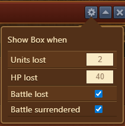

---
description:
---

# Army Advice

(Provide a brief description of the module and its purpose.)

## Structure

(Describe the components of the dialog, i.e. the meaning of all the numbers shown or any buttons or checkboxes that can be selected.)

## Configuration

(If the module offers a settings menu, describe the options available.)

## Usage

(Describe how to use or interpret the module.  Provide additional screenshots where necessary.)

## FAQ

(Include this section if there are any typical questions that are asked. Make sure the question is in bold and the answer not.  Also, make sure to include an HTML line break (&lt;br&gt;) at the end of the question so that the questions are rendered properly.)