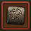
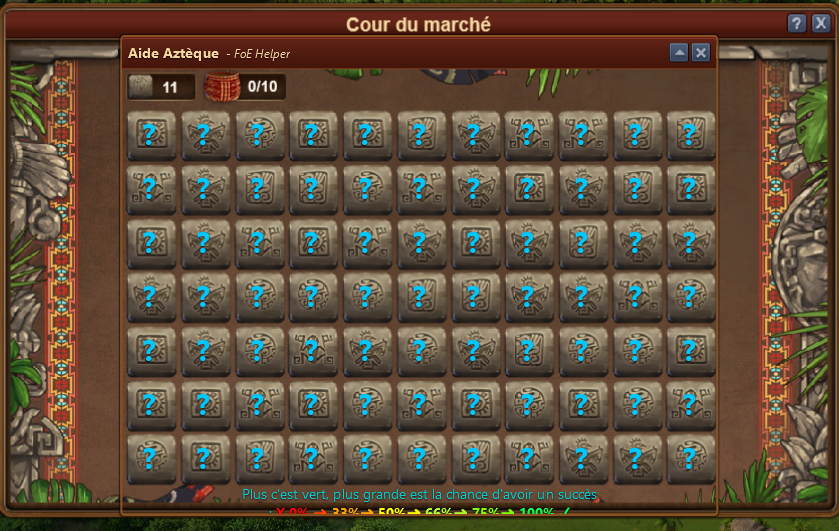
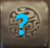
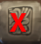
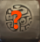
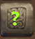
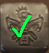
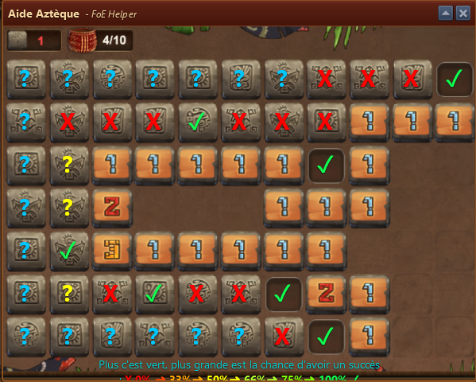
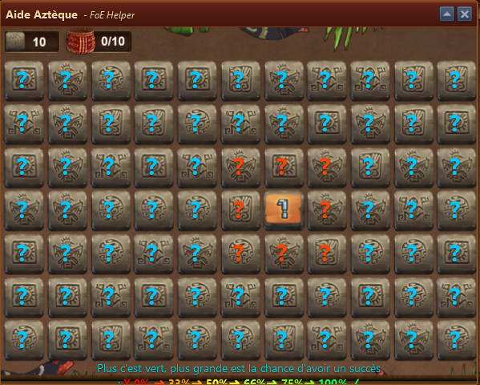
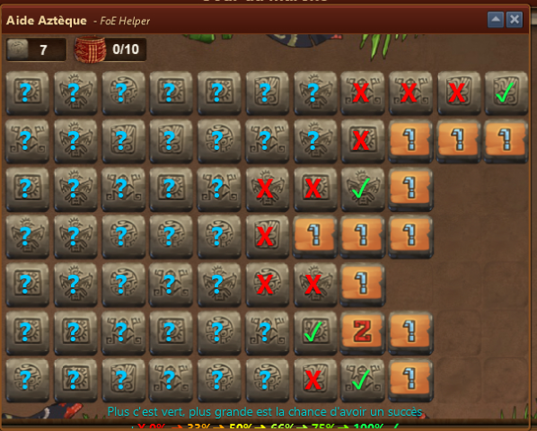

# Aztec Minigame Helper

The **Aztec Minigame Helper** overlays the Aztec minigame in Forge of Empires and shows the probability of finding a reward on each tile.

## Menu Overview

- At the beginning, all tiles are marked with **blue question marks**, indicating unknown probability.
- Once you click a tile, the **probabilities update** for adjacent tiles.

## Probability Indicators

Colored question marks represent the **chance of finding a reward** on a tile.


The **greener** the icon, the **higher the chance** of success.


| Color/Indicator | Meaning |
|-----------------|---------|
|  | Probability unknown |
|  | 0% chance of reward |
|  | Up to 33% chance |
|  | Up to 50% chance |
|  | Up to 75% chance |
|  | You found a reward! |

## Examples

Here are a few gameplay examples using the assistant:

## Usage Tips

- Use the color indicators to **maximize your chances** of uncovering rewards.
- The assistant updates **dynamically** with each tile click.
- If you're unsure where to click next, choose the **greenest adjacent tile**.