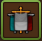
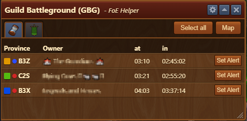
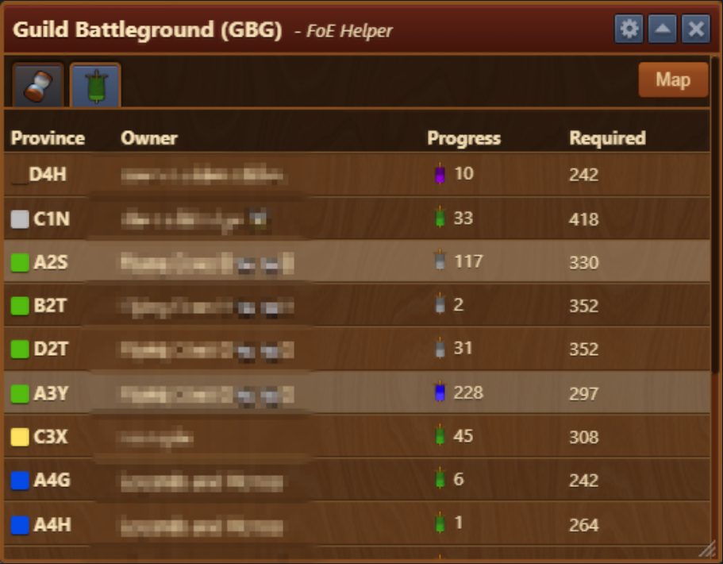
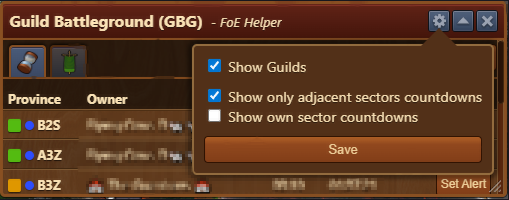

# Guild Battlegrounds

This feature monitors provinces, shows their unlock times, lets you set alerts, and create notes for easy sharing in guild chats.

## Menu Overview

The Guild Battleground interface is structured top-to-bottom as follows:
- **Ucoming sectors tab** - Tab displaying upcoming sectors
- **Sector Progress** - Tab displaying progress on sectors
- **Select all** - button to select all available provinces for copying to guild chats
- **Map** - Map view of sectors with names, progress, and boost color

## Upcoming sectors tab

Tab displaying Provinces and their unlocking times

The Upcoming sectors tab is structured top-to-bottom as follows:
- **Province** - Displaying sectors names
- **Owner** - Guild owning the province
- **at** - Time of unlock by timezone set on your PC
- **in** - Time remaining until unlocked
- **Set Alert** - Setting Alert for province unlock (more info in Alerts module)

## Sector progress tab

Tab displaying Provinces, their required and current progress

The Sector progress tab is structured top-to-bottom as follows:
- **Province** - Displaying sectors names
- **Owner** - Guild owning the province
- **Progress** - Current progress on sector
- **Required** - Progress required for sector capturing

## Configuration

The configuration menu enables changing the level of detail in the Guild Battleground menu

The Configuration is structured top-to-bottom as follows:
- **Show Guilds** - If selected, names of Guilds owning sectors are displayed in the menu
- **Show only adjacent sectors countdowns** - If selected, only adjacent sectors are displayed in the menu (selected by default)
- **Show own sectors countdowns** - If selected, own sectors are displayed in the menu with countdowns until unlock
