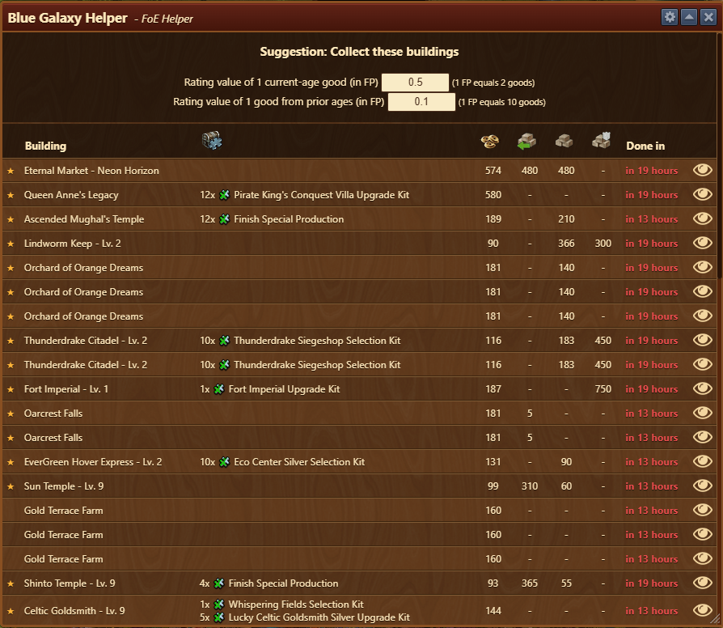
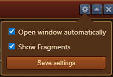

# Blue Galaxy Helper

The **Blue Galaxy Helper** shows you which buildings to collect first in order to maximize the 2x collection bonus granted by the Blue Galaxy Great Building.

## Menu Overview

The Blue Galaxy Helper is structured as follows:

- **Header bar** with a [Configuration](#configuration) menu
- **Rating Menu** used to rate worth of goods versus Forge Points
- **Building display overview**, listing which buildings are ready to collect

## Configuration

- Enable Auto-open to launch the Helper automatically when the Blue Galaxy is collected. This setting is also available under [Settings](../settings/README.md)
- Show fragments produced by buildings in the list

## Usage

When you collect from your Blue Galaxy, the Blue Galaxy Helper opens automatically and displays a list of buildings eligible for the 2x bonus, sorted by highest-valued buildings, based on their resource output.

- Buildings **ready to collect** are shown in **green**
- Others show a **countdown** until they become collectible (in minutes or hours)
- Clicking the **eye icon** next to a building will open the City Overview module and highlight the building’s location on your map by making it blink.
- To refresh the list, close and reopen the Blue Galaxy Helper


Unmotivated buildings may be deprioritized if they don’t produce resources.


### Auto-close

The Blue Galaxy Helper **automatically closes** once the last valid collection is used.

## FAQ

**Q: How can I refresh the collection timer for buildings?** 
A: Close and reopen the Blue Galaxy Helper using the icon in the top menu bar.

**Q: Why does the Blue Galaxy Helper not open automatically?** 
A: Make sure automatic opening is enabled in the configuration, and the Blue Galaxy collection has been triggered.

**Q: Can I turn this module off entirely?** 
A: Yes, go to [Application Settings](../settings/README.md) and disable the Blue Galaxy Helper.