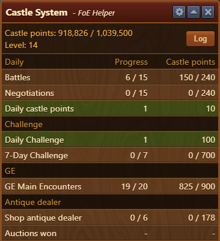
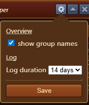
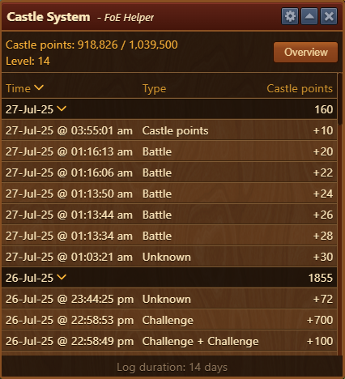

# Castle System

The **Castle System** module displays your current progress in acquiring Castle Points and leveling up the Castle feature in Forge of Empires.

## Menu Overview

The Castle System module is structured as follows:

- A title bar with the [Configuration menu](#configuration)
- **Castle Progress Display**: Shows your current Castle Points, the required points for the next level, and your current level.
- [**Log Button**](#log): Opens a detailed view of point gains.
- [**Castle Point Overview**](#usage): Breakdown of point sources and progress bars.

## Configuration

- Enable or disable the display of **group names** in the main window for better clarity.
- Set how long the **gain logs** should be kept.

## Usage

The module categorizes Castle Point gains into 4 main **groups**, each showing a progress bar toward their respective point caps.

Use the **log button** to view detailed gain history, including what activity generated Castle Points and when.

### Log

- Use the **Overview** button to go back to the main overview screen.

## Tips

- Monitor this module regularly to identify which group needs more activity to optimize your Castle Point income.
- Adjust configuration to match your data retention preferences.