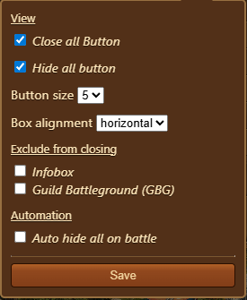

---
description:
---

# Close All Windows


This module can be activated in [Settings](../settings/README.md#pop-ups-tab)


The **Close All** module provides a convenient set of controls to quickly close or hide multiple FOE Helper interface elements (pop-up boxes), streamlining the user’s workspace and improving navigation efficiency.

## Menu Overview

The **Close All** module will be displayed as a small box window, which can be positioned as per player's liking, and is structured as follows:

- **Hide All Button**: A large green button featuring an eye icon to hide all modules including FOE Helper Menu.
- **Close All Button**: A contrasting button with an 'X' icon to close all modules.
- [**Configuration**](#configuration): Opens configuration options for customizing button behavior and appearance. (Available while hovering over button)

## Configuration

Interface includes the following options, arranged top-to-bottom:

- **View**
  - **Close all Button**: Enable or disable the "Close all" button visibility.
  - **Hide all button**: Enable or disable the "Hide all" button visibility.
- **Button size**: Dropdown selector to adjust the button size (e.g., values 1 to 5).
- **Box alignment**: Dropdown selector to choose button alignment orientation (horizontal or vertical).
- **Exclude from closing**: Checkboxes to exclude specific elements from being closed:
  - [Infobox](../infobox/README.md)
  - [Guild Battleground (GBG)](../battleground/README.md)
- **Automation**
  - **Auto hide all on battle**: Automatically hide all boxes when a battle menu is open.
- **Save**: Button to save configuration changes.

## Usage

- Access to Close All control from the interface to quickly close or hide open modules.
- Use the **Hide all** button to hide all modules without closing them completely.
- Use the **Close all** button to entirely close all eligible modules.
- Adjust configurations via the settings gear to customize which boxes are affected and the visual layout.
- Enable automatic hiding on battle to clear the screen immediately during combat.

## Use Cases

- Keep the UI clean by hiding multiple pop-ups with a single action.
- Prevent clutter during critical game moments by auto-hiding interface elements.
- Customize which pop-ups remain visible for uninterrupted monitoring.

## FAQ

**Q: What is the difference between "Close all" and "Hide all"?** 
A: "Hide all" hides all menu's including FOE Helper menu bar so they can be re-shown easily, while "Close all" fully closes eligible ones, requiring reopening.

**Q: Can I exclude specific pop-ups from being closed?** 
A: Yes, use the configuration checkboxes to exclude items like the Infobox or Guild Battleground windows.

**Q: Does the module automatically affect any pop-ups during battle?** 
A: If enabled, the module will auto-hide all pop-ups when battle begins to reduce clutter.

**Q: Can I change the button size and alignment?** 
A: Yes, these are customizable in the Configuration settings.