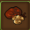
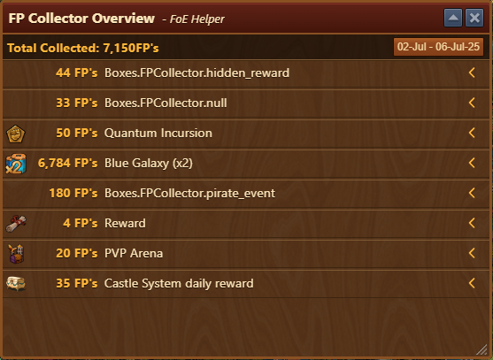
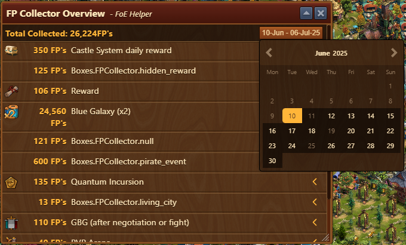

# FP Collector Overview

## Menu Overview

This feature displays all details of collected FPs sorted by source of collection, date, and amount.

The FP Collector interface is structured from top to bottom as follows:
- **Total Collected** - The total PF collected for the selected period
- **Calendar** - Button displaying the period, but also opening a calendar for period selection
- **The harvest detail display area:**
  - Amount - amount collected through specific source
  - Source of collection - eg. Blue Galaxy, Castle system...
  - Chevron  - By clicking on the chevron on the right, you can see the details of each harvest for a given type of source.
 
## Calendar

By clicking on the calendar, you can choose a single date or a range between two dates for which you want to display the collections.
The start and end dates will be highlighted in light yellow.

