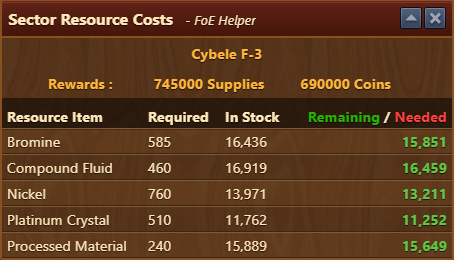

--- 
description: Continent Map Overview 
--- 

# Continent Map Overview

This module displays the resources received and required to acquire sector provinces on the campaign map.


To open this module, the sector on the game's campaign map window must be opened first.


## Menu Overview

The campaign map overview is structured as follows:

 - Sector name - name of sector currently open
 - Rewards - Rewards received by acquiring sector
 - Resource requirement table:
   - Resource item - type of goods needed for sector acquiring
   - Required - column shows how much of each good is needed to negotiate for the province.
   - In Stock - column shows how much of that resource the player currently owns.
   - Remaining / Needed - column represent the difference between "In Stock" and "Required"


Resources you are missing are shown in red. Surplus resources are shown in green.

