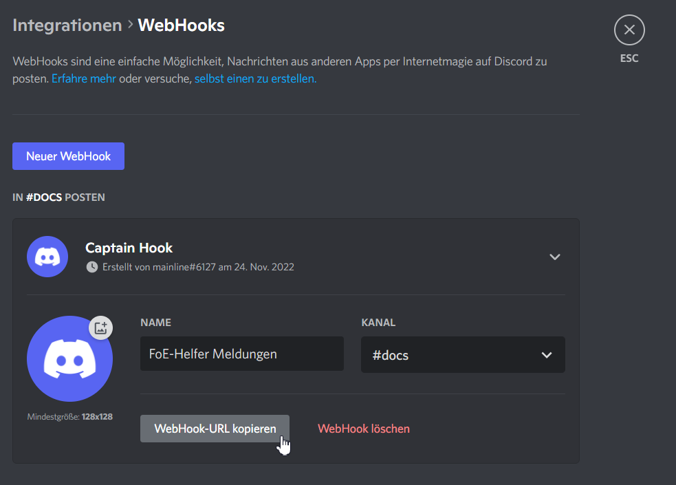

# Discord Webhooks

## Create webhook in Discord


For the creation of a webhook you need the appropriate rights


A webhook can be created for each channel of a discord. To do this, proceed as follows.

Click the cogwheel next to the channel in which you want the messages to appear:

There you click on "Integrations" > "Create WebHook":

Change the name to something meaningful so that you know later what kind of WebHook it is. The name of the bot that posts the message has nothing to do with it here.

Then click on the button "Copy WebHook URL" and close all windows. You are finished in Discord.

## Include WebHook in the Helper


If you want to work with events from the guild battles, you must visit them once before creating a new one.


Fill in the fields as indicated.


**Icons** You can use all icons from your Discord channel. Hover over an icon in the channel and enter it in the text with _:name:_.


A new line is simply inserted with the Enter key (line break).

At the moment there is only the event "Guildfights" (first attack) in combination with a sector. This is a BETA test, so to speak.

To get a continuous text with the province name, you can use <mark style="color: #e83e8c;">#gg_province_name#</mark>. It will be replaced when sent.

## Use of an event

Since the FoE helper is known not to request data independently, the event must be triggered in the game in the logged-in state.

Explanation: **Only** one player per guild creates the webhook and then has to leave the guild map open. That's all it takes. These webhooks send global events to a channel, which means that this would make little sense for private purposes.

As soon as the information about an attack comes in the background of the game, the trigger is set and the message is then automatically sent 1x to Discord. All followers of this channel can then read this.

## Further events

Are you missing an event or do you have a good idea?

Then please just complete this ticket: [https://github.com/mainIine/foe-helfer-extension/issues/2543](https://github.com/mainIine/foe-helfer-extension/issues/2543)