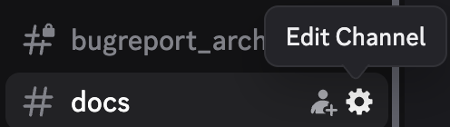
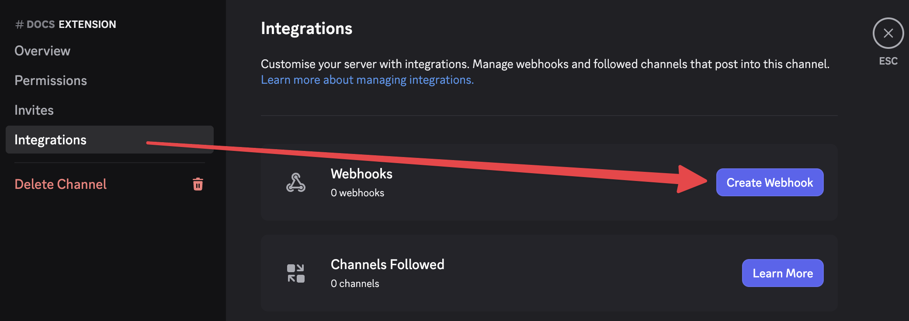
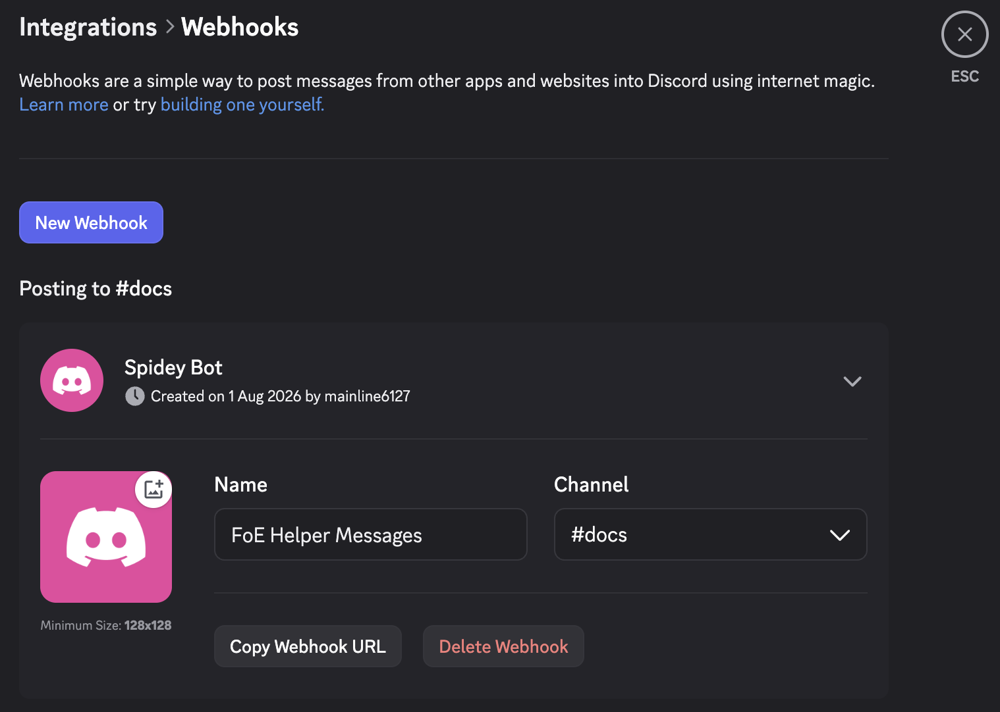
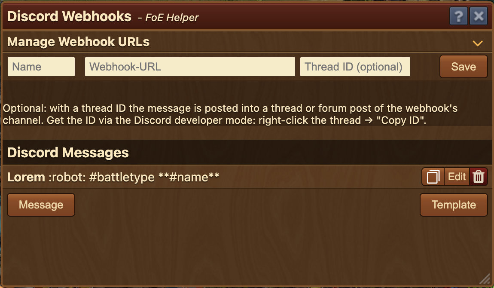
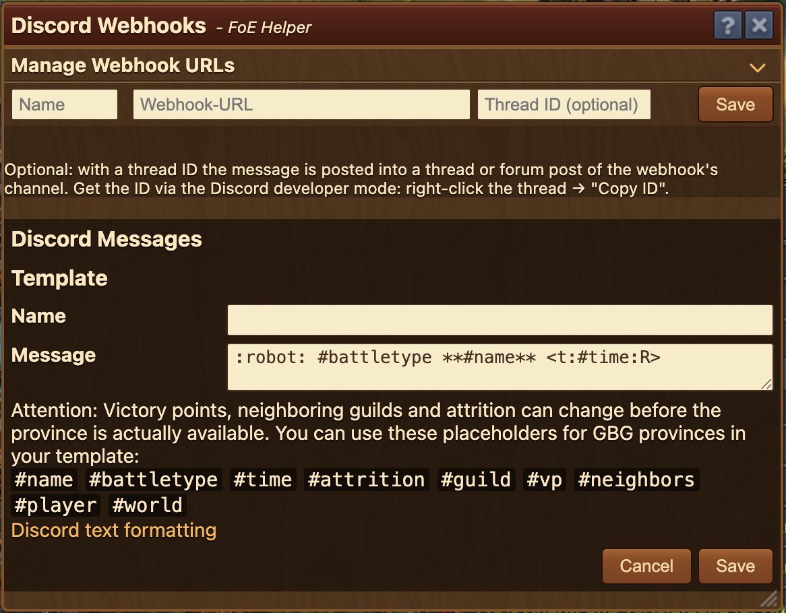

# Discord Webhooks

## Create webhook in Discord


For the creation of a webhook you need the appropriate rights


A webhook can be created for each channel of a discord. To do this, proceed as follows.

Click the cogwheel next to the channel in which you want the messages to appear:

There you click on "Integrations" > "Create WebHook":

Change the name to something meaningful so that you know later what kind of WebHook it is. The name of the bot that posts the message has nothing to do with it here.

Then click on the button "Copy WebHook URL" and close all windows. You are finished in Discord.

## Targeting a specific channel or thread

A Discord webhook is always tied to the channel it was created in — the Discord API does not allow picking a channel per message. If you want to serve several channels, simply create one webhook per channel and save each URL in the helper with a meaningful name (e.g. the channel name). You then pick the matching webhook for every message and in the Guild Battlegrounds settings.

Additionally, you can enter an optional **thread ID** when saving a webhook URL. The message is then posted into a specific thread or forum post of the webhook's channel. This is how you get the ID:

1. Enable the developer mode in Discord (User Settings > Advanced > Developer Mode).
2. Right-click the thread or forum post and choose "Copy ID".
3. Enter the ID into the "Thread ID (optional)" field when saving the webhook URL.

The helper automatically appends the ID to the webhook URL as `?thread_id=...`. This works everywhere the webhook is used — including the Discord buttons of the Guild Battlegrounds.

## Include WebHook in the Helper

Open the "Discord Webhooks" box from the helper menu. Under "Manage Webhook URLs" you save the copied URL with a meaningful name — and optionally the thread ID (see above). All saved URLs are then available for messages and in the Guild Battlegrounds settings.

## Messages

The "Message" button creates a free text: pick a webhook, write the message, then send it right away or save it for later. Saved messages appear in the list and can be sent again, edited, copied or deleted at any time.

A new line is simply inserted with the Enter key (line break). Discord markdown (bold, italic, timestamps etc.) is supported; every message is automatically signed with your player name.


**Icons** You can use all icons from your Discord channel. Hover over an icon in the channel and enter it in the text with _:name:_.


## Templates and placeholders

The "Template" button creates a named template for the Guild Battlegrounds. Its text can contain the following placeholders, which are replaced with the data of the respective sector when sending:

| Placeholder | Value                                                                           |
| --- |---------------------------------------------------------------------------------|
| `#name` | name of the sector                                                              |
| `#battletype` | 🔴 attack or 🔵 defend                                                          |
| `#time` | unlock time as Unix timestamp — ideal for Discord timestamps like `<t:#time:R>` |
| `#attrition` | attrition chance in percent                                                     |
| `#guild` | guild holding the sector                                                        |
| `#vp` | victory points (incl. bonus)                                                    |
| `#neighbors` | neighboring guilds                                                              |
| `#player` | your player name                                                                |
| `#world` | your world                                                                      |


Victory points, neighbors and attrition chance can still change until the sector opens — the values reflect the state at the time of sending.


## Use in the Guild Battlegrounds

In the settings of the Guild Battlegrounds window (cogwheel), the "Discord Webhooks" section lets you pick the target webhook plus one template for single sectors and one for bulk sending. Without a template a default message with sector name and unlock time is sent.

Afterwards a Discord button appears next to each sector, sending its data to your channel with one click; selected rows can be sent together as a single message.
