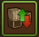
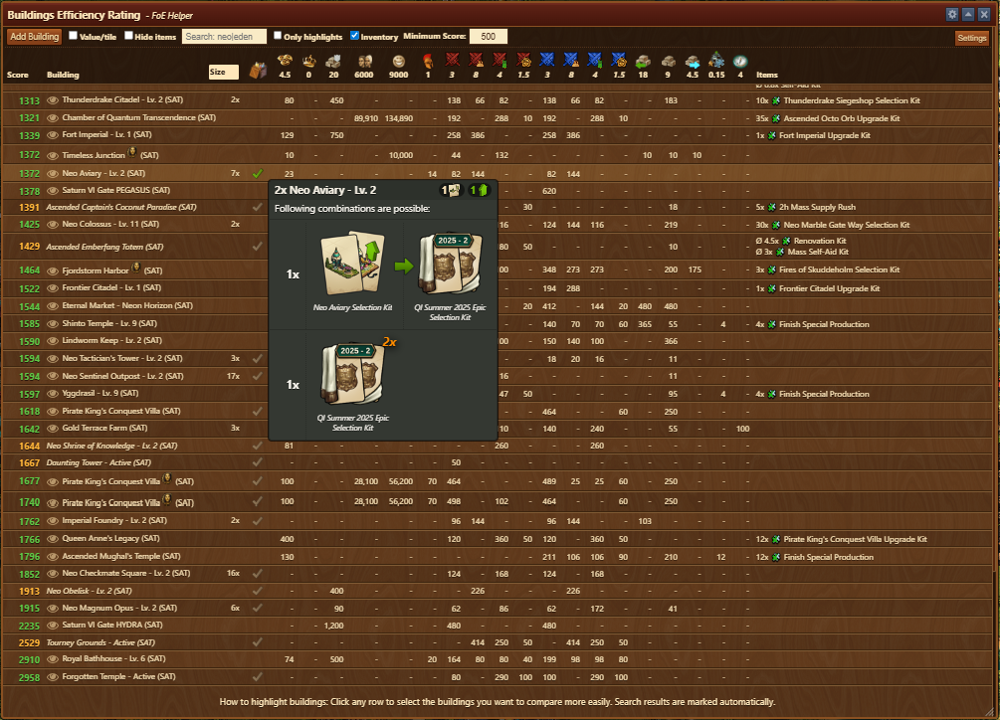
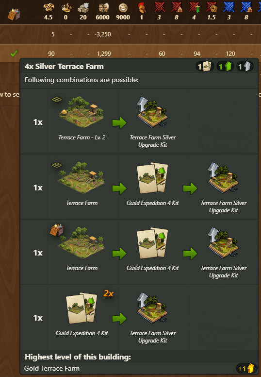
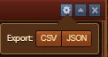
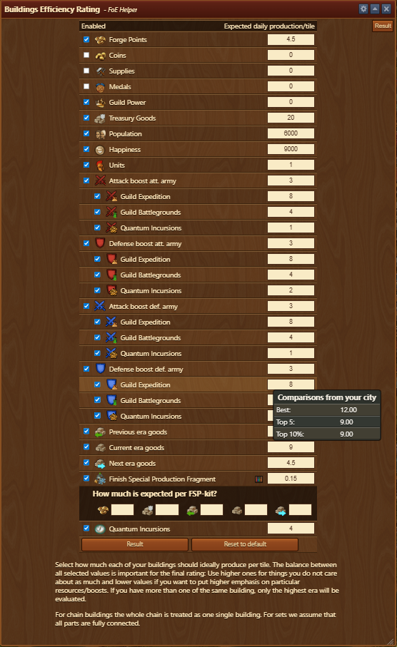
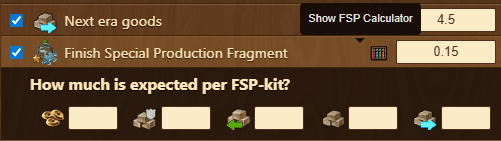
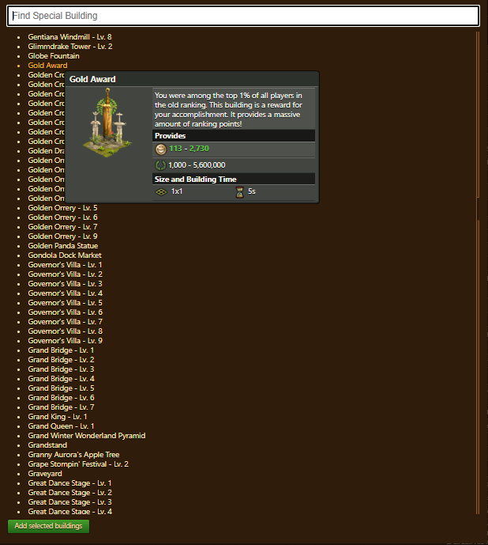

# Buildings Efficiency Rating

 

Compare special buildings based on daily output per tile, using your own priorities and expectations. This tool helps you determine which buildings are most efficient for your city layout and strategic goals.


The Building Efficiency Rating tool is intended as a guidance aid. Some resource types may not yet be fully supported, which can result in incomplete or inaccurate building evaluations. 


## Menu Overview

 

The main screen is composed of the following elements:

- **Title bar** with a [Configuration](#configuration) menu
- **Toolbar**:
    - **Add Building**: Opens the [building selection menu](#add-building).
    - **Value/tile**: Toggle between **Value/tile** and **Summarized Productions** views.
    - **Hide items**: Toggle to show/hide building reward **Items** column from the **Table view**.
    - **Search field**: Highlight searched buildings by name.
    - **Only highlights**: Toggle to filter only highlighted buildings. (explained under [Highlighting and Selection](#highlighting-and-selection)).
    - **Inventory**: Toggle to include buildings available in inventory in **Table view**.
    - **Minimum Score**: Includes only inventory buildings scoring above a set threshold in the list.
    - **Settings**: Opens the configuration panel (explained under [Settings](#settings)).

- **Table View**: Displays all evaluated buildings in rows, with sortable columns:
    - **Score**: Efficiency score based on user expectations.
      - Green: Score for buildings available in city.
      - Orange: Score for buildings available in inventory.
      - Blue: Score for buildings added from [building selection menu](#add-building) menu.
    - **Building Name, level and Era** of the building. For multiple buildings, only one era is displayed. Check [City Map](../town/README.md#main-city-side-menu) for details.
    - **Size**: Filters buildings by selected sizes.
    - **Amount**: Number of buildings placed in your city.
    - **Inventory**: Displays ✔ if building is available in inventory. (explained under [Inventory Building Tooltip](#inventory-building-tooltip)).
    - **Production Columns**: Columns represent each enabled resource type with their weight values:
        - FP, coins, goods, boosts, fragments, units, and more.
        - Production values are calculated per tile, and matched against your expectations. (explained under [Evaluation Method](#evaluation-method)).
    - **Items**: Displays items produced by the building.

### Highlighting and Selection

Buildings are highlighted/selected in table overview by:
  - Clicking on a row highlights that building.
  - Buildings searched in **Search bar** are automatically highlighted with 🔎.
  - Multiple buildings can be highlighted simultaneously for easier comparison


Enable Only highlights to narrow the list to only matching buildings.


### Inventory Building Tooltip

Tooltip is visible while hovering over "✔" in inventory column, displaying combinations available for building selected building.

The tooltip includes:
  - **Header bar**:
    - Displaying total number of selected building that can be assembled (eg. 4x Silver Terrace Farm)
    - Items needed to assemble one building (eg. 1 kit + 1 upgrade + 1 silver upgrade)
  - **Combination table** displaying all combinations and number of buildings that can be assembled with that combination. eg. 4x Silver Terrace Farms from example above can be assembled in following way:
    - 1x from: **Terrace Farm Lv.2** with **Terrace Farm Silver Upgrade Kit**
    - 1x from: **Terrace Farm** `from city` with **Guild Expedition 4 Kit** and **Terrace Farm Silver Upgrade Kit**
    - 1x from: **Terrace Farm** `from inventory` with **Guild Expedition 4 Kit** and **Terrace Farm Silver Upgrade Kit**
    - 1x from: **Guild Expedition 4 Kit** `2x` and **Terrace Farm Silver Upgrade Kit**


Buildings already in city will be marked with grid icon, while Buildings in inventory will have inventory icon. 

  - **Footer bar**:
    - Displaying highest level for selected building (eg. Gold Terrace Farm)
    -  Items missing to assemble highest level (eg. 1 gold upgrade)

## Configuration

The Configuration interface allows you to export data to `CSV` or `JSON` for archiving

## Usage

- Define your expected values for each resource or boost in the [Settings](#settings).
- Use [Add Building](#add-building) to select buildings you wish to compare.
- View the Score and resource breakdowns for each building.
- Use sorting to easily identify least efficient buildings.
- Use filters to narrow down by building name.
- Hover over any row to inspect building details and associated items.

## Evaluation Method

The efficiency score is calculated by comparing each building's actual output against your expected daily value per tile.

**Score = (Output ÷ Expected value) ÷ (Tiles + 1 where road is required) × 100** 
(e.g., 20 FP ÷ 10 FP expected ÷ 2 tiles = 1 × 100 = Score: 100)


Chain buildings are treated as one single entity assuming full connection. Sets are considered as if all parts are fully connected.


## Settings

The **Settings** panel allows you to define what you expect your buildings to produce. These values are essential for calculating the efficiency score for each building.

The settings menu is structured as follows: 
- **Title bar** with a [Configuration](#configuration) menu
- [**Settings Table**](#settings-table) with two columns:
  * **Enabled**: A checkbox that includes or excludes the resource from the efficiency calculation and overview.
  * **Expected daily production/tile**: A numeric field that defines your desired production rate per tile, per day.
- **Buttons**: At the bottom of the panel
  * **Result**: Apply the configured expectations and return to the comparison view.
  * **Reset to default**: Clears your custom values and reverts to default settings.

### Settings Table

Each resource or bonus is grouped and listed individually:

* **Standard Resources**:

  * Forge Points
  * Coins
  * Supplies
  * Medals
  * Guild Power
  * Treasury Goods
  * Population
  * Happiness
  * Units

* **Attack & Defense Boosts**:

  * Divided by army type (attacking/defending) and context:

    * Guild Expedition
    * Guild Battlegrounds
    * Quantum Incursions

* **Goods**:

  * Previous Era
  * Current Era
  * Next Era

* **Fragments**:

  * Finish Special Production Fragments (including [FSP calculator](#fsp-kit-calculator))

* **Quantum Incursions**:

  * Actions

### FSP-Kit Calculator

By clicking the icon next to input field, FSP Calculator which is used for determining the production/tile value for "finish special production" fragments will open.
To calculate value of FSP fragments, input how much of each resource is expected per FSP Kit, and value will be calculated based on your inputs for those resources in [**Settings Table**](#settings-table).

### Tooltip: Comparison Range

Hovering on the input field will now provide a tooltip with comparison values from your city:

* **Best**: Highest production per tile from your city.
* **5th Best**: Production per tile of the 5th most producing building.
* **Top 10%**: Lowest production per tile among the top 10% of buildings.

### Settings Usage

1. **Enable** Check only the resources you want to include in [ranking table](#menu-overview).
2. **Input** how much you expect buildings to generate per tile daily.
3. Click **Result** to apply your settings and return to the [ranking table](#menu-overview).


Use lower expected values for resources you consider more valuable, this gives higher scores to buildings producing them.


## Add Building

This menu allows you to **search, preview, and select special buildings**, you don't have, to include in the Buildings Efficiency Rating comparison.

### Add Building Menu Overview

The Add Building menu is structured as follows: 

* **Search bar**: Located at the top of the window, it filters the list of buildings based on name. (eg. Typing "Neo" will display all buildings with "Neo" in the name)

* **Building List**: A scrollable list displaying all available special buildings. Each entry includes:

  * Building name
  * Level (if applicable)

* **Building Tooltip**: Hovering over a building opens a **preview popup** that includes:
  * Building image
  * Short description (e.g., “Top 1% reward…”)
  * Resource output ranges
  * Building size (tiles) and construction time

* **Add selected buildings**
  A green button at the bottom to confirm your selection. After clicking, selected buildings will be added to the [ranking table](#menu-overview).

### Add Building Usage

1. Use the **search bar** to locate desired buildings quickly.
2. Hover to view **resource output and size**.
3. Click entries to select (they will be highlighted).
4. Click **Add selected buildings** to add them to the main comparison screen.


Tip: You can select multiple buildings at once. This is especially useful for evaluating event buildings you haven't yet placed or upgraded.


## FAQ

**Q: What does the efficiency score represent?** 
A: It quantifies how well a building meets your configured expectations per tile.

**Q: Why are some values fractional (e.g., 4.5 FP)?** 
A: These represent average daily production across chance-based outcomes.

**Q: Can I compare buildings I don’t have yet?** 
A: Yes, use the Add Building button to select from a full list of special buildings.

**Q: Can I set zero for a resource I don’t care about?** 
A: Yes. You can set its expected value to 0 to include it in [ranking table](#menu-overview) but exclude it from the scoring.

**Q: What’s the “FSP Calculator”?** 
A: This defines the value of FSP kits, helping estimate the worth of FSP kit fragment.

**Q: Can I search by partial name?** 
A: Yes. The search bar supports partial matching.

**Q: Will buildings I add affect the main score table?** 
A: Yes. Once added, they are listed and scored in the main ranking view using your current expectations.