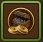
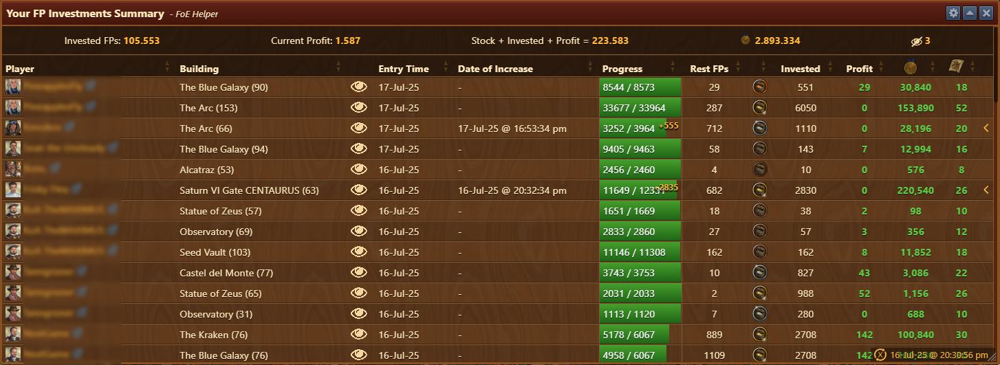
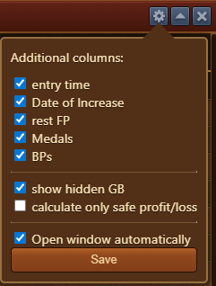

--- 
description: Monitoring your external investments 
--- 

# FP Investments 

 

The "FP Investments Summary" module provides an overview of Forge Points (FPs) invested in other players' Great Buildings (GBs). It's a powerful tool for monitoring your external investments, profits, and total amount of Forge Points.

## Structure

### Top Panel (Summary Stats)

 - Invested FPs (105.553): Total Forge Points you've invested across all Great Buildings in this table.
 - Current Profit (1.587): Profit already secured from investments (calculated as extra rewards after accounting for FPs spent).
 - Stock + Invested + Profit (223.583): Summarized value of Forge Points you have in stock, plus those invested, plus expected profit.
 - Medals (2.893.334):	Total medals profit from investments.
 - Hidden GB's (3): Shows the number of Great Buildings currently marked as hidden. Click to toggle the visibility of hidden buildings in the list.

### Table Columns Explanation
 - Player:	Name of the player whose building you’ve invested in. Clickable for viewing the player's page on https://foe.scoredb.io/.
 - Building:	Name and level of the Great Building you invested in (e.g., The Blue Galaxy (90)).
 - : Click to toggle the visibility of the Great Building. By marking a specific GB as hidden, Summary stats will exclude that investment.
 - Entry Time:	Date and time you invested in a specific Great Building.
 - Date of Increase:	Timestamp of the last progress increase, useful for tracking movement on invested building.
 - Progress:	GB's current Forge Points status (e.g., 8544 / 8573 = nearly complete). Yellow numbers (like +555) show recent increase.
 - Rest FPs:	Remaining Forge Points needed to complete the GB. Useful for estimating when the building will be level.
 - Rank: Position you're currently on, for a specific building.
 - Invested:	How many FP's you invested in that GB.
 - Profit:	Estimated Forge Point profit if rewards are secured.
 - Medals: Estimated value of medals.
 - Blueprints: Estimated value of blueprints you'll earn.


The color of numbers indicates if your spot is "locked" (i.e., safe from being overtaken by other contributors). If green, you're guaranteed a reward.

 - Chevron: Expands the menu to display a detailed overview of progress on that Great Building

### Last Refresh time

In the bottom right corner of the menu, the list last refresh time stamp (eg. 16-Jul-25 @20:30:56 pm) is displayed and marked with the appropriate icon:
-  - The investments list requires update, last time was updated more than 30 minutes ago 
-  - The investments list was updated less than 30 minutes ago 

## Configuration

This Config menu is used for enhancing the data displayed for Forge Point investment tracking. It allows fine-tuning of what info is visible and how conservative the profit/loss calculations should be, improving user control and clarity during GB donation tracking.

The following configurations are possible:
 - entry time – When enabled, displays when the investment entry was made.
 - Date of Increase – When enabled, displays when the GB progress increased.
 - rest FP – When enabled, displays remaining Forge Points needed to level the GB.
 - Medals – When enabled, displays medals reward amount.
 - BPs – When enabled, displays Blueprint reward amount.
Other Display Options:
 - show hidden GB – When enabled, displays GBs that are marked as hidden.
 - calculate only safe profit/loss – When enabled, restricts profit/loss calculations to positions that are "locked" (safe from being sniped).
 - Open window automatically – When enabled, automatically opens this module when "Current contributions to Great Buildings" is opened in the game.

## Usage

This module is ideal for  tracking external investments and ensuring your investment is secured on high-value reward spots.
To update all investments in this module player should open **Town Hall > News > Current contributions to Great Buildings** menu

## FAQ
