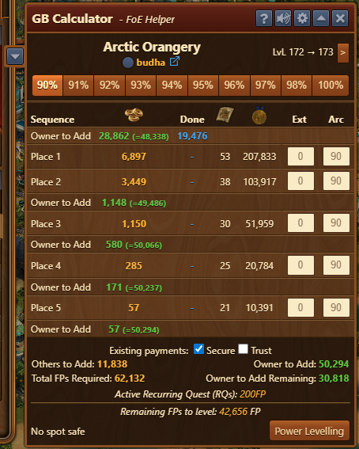
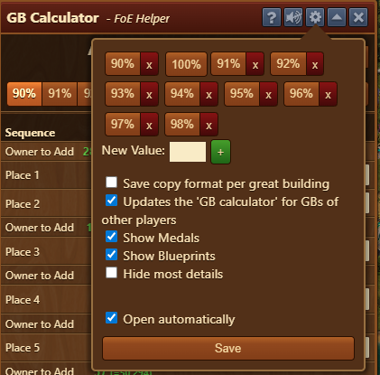
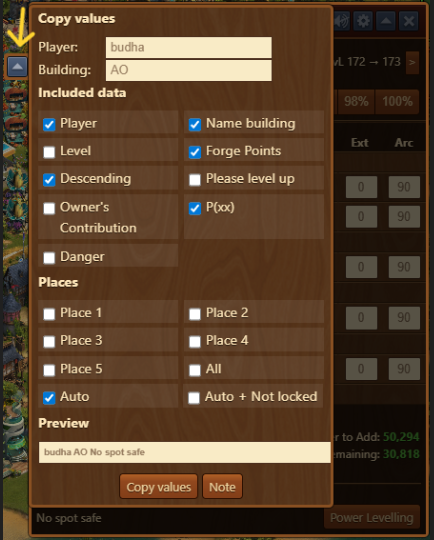
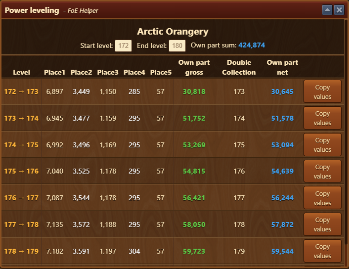
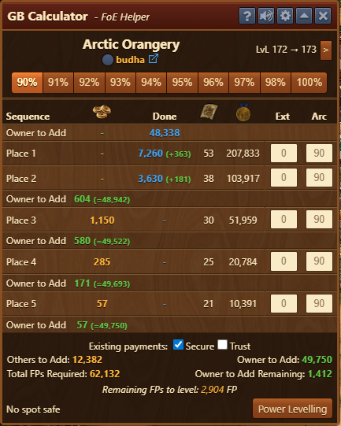
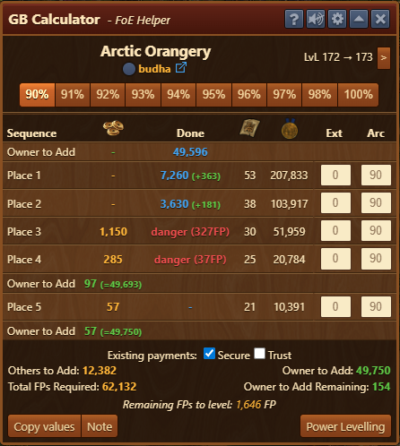

# GB Calculator

It calculates how many Forge Points (FPs) you need to invest to secure supporter spots, allows you to copy contribution values to the clipboard for sharing in chat, and checks if supporters have contributed correctly. 

## Menu Overview

The Self-Contribution Calculator interface is structured top-to-bottom as follows:

### Header menu
  - **Building name**
  - **Owner info** including a link to the player's page on [foe.scoredb.io](https://foe.scoredb.io/)
  - **Current level & target level** – Use the arrow to simulate future levels
  - **Buttons to toggle reward percentages**

### Table breakdown:
  - **Sequence** – Who contributes when; e.g., owner starts with 28,862 FP to secure 1st and 2nd places
  - **FPs** – Required contribution
  - **Done** – Already contributed amount
  - **Blueprints** – Received from contribution with current Arc bonus
  - **Medals** – Received from contribution with current Arc bonus
  - **Ext** – Detects externally filled positions and arranges them
  - **Arc** – Arc bonus percentage per spot, editable per spot (eg. 1st and 2nd to be set as 2.0 contribution)

### Key values:
  - **Existing Contributions**
    - **Secure** – Contributions from others will be assigned to the matching position and secured automatically (default setting)
    - **Trust** – Assumes other contributors won’t overtake each other or new supporters (use cautiously)
  - **Others to Add** – Total FPs to be contributed by supporters
  - **Owner to Add** – Total FPs you need to contribute
  - **Total FPs Required** – Combined supporter + self-contribution needed fo selected level
  - **Owner to Add Remaining** – Remaining FPs you need to add to secure spots

### Other features:
  - **Active Recurring Quest (RQs)** indicator of active RQ, with amount needed for RQ to be completed
  - **Remaining FPs to level** – FPs still needed to level the GB
  - **Copy Values** - Allows you to copy contribution values to the clipboard for sharing in chat

**No spot safe** If there are no secured spots, info is shown instead of **Copy Values** button

  - **Powerleveling** – Opens the Powerleveling dialog (explained below)

## Configuration

Configure which buttons appear at the top of the main dialog.

The Configuration interface is structured top-to-bottom as follows:
- **Percentage Buttons** (Top Row) - A series of pre-set contribution percentages (e.g. 90%, 100%, etc.) used for GB reward calculations.


Each button has an X to remove it.


- **New Value** - Allows you to input a custom percentage manually. The green “+” button adds your custom percentage to the list above.
- **Save copy format per great building** - When enabled, your copy settings (e.g., what's included in share text) are remembered per GB individually. This is off by default.
- **Updates the 'GB calculator' for GBs of other players** - Keeps GB data updated even when you view GBs that belong to others.
- **Show Medals** - Displays medal rewards in the FP breakdown.
- **Show Blueprints** - Displays blueprint rewards in the FP breakdown.
- **Hide most details** - Simplifies the interface by hiding detailed data.
- **Open automatically** - Automatically opens the calculator window when you click on a GB.
- **Save Button** - Applies and saves all the above settings.

## Copy Function

### Simple Leveling

Click the arrow next to the title bar to open the dialog for customization of the copy function per specific GB.

The Copy Function interface is structured top-to-bottom as follows:

- **Player** – Name of the GB owner; you can shorten it if needed
- **Building** – Name of the GB; editable (e.g., shorten "Arctic Orangery" to "AO")
- **Included Data** – Choose what’s included in the copied message:
  - Player name
  - GB name
  - Level (Current→target)
  - Forge Points (per spot)
  - Descending (P1→P5 or reversed)
  - “Please level up” phrase
  - Owner's Contribution (OC amount)
  - P(xx) (if selected, adds "P" in front of spot number)
  - Danger (if selected, adds Prefix or Suffix to copied text)
  

Preview of all above settings is available at bottom of menu


  
- **Places** – Select which spots to announce:
  - Individual checkboxes for P1–P5
  - **All** – Selects all P1–P5 spots, regardless of status
  - **Auto** – Selects only secure and unoccupied spots
  - **Auto + Not locked** – Selects all unoccupied spots (even if not secure)
- **Preview** – Shows a preview of the generated text
- **Copy Values** – Copies the text to the clipboard for chat
- **Note** – Collect multiple entries from various GBs to paste together

## Powerleveling

Click **Powerleveling** button in the main dialog to open a view showing FP costs for upcoming levels.

Features:
- GB Name
- **Start Level** – Lowest level to include in the list
- **End Level** – Highest level to include in the list
- **Own part sum** – FPs you must invest to reach Max Level
- Table includes:
  - **Level** – Level range
  - **P1–P5** – FPs required from donors (based on selected bonus %)
  - **Own part gross** – Before profit (Arc not included)
  - **Double Collection** – Profit from recurring quests/GB effects
  - **Own part net** – Gross minus double collection
  - **Copy Values** – Allows you to copy rows to chat

## Usage

As soon as you start investing Forge Points into your GB, the calculator will recognize it.  
Once you've contributed some FPs, they will appear under **Done**. 
For example, after contributing 19,476 FP, continue until the value under **FPs** in the first row reaches 0 (to be added by owner 28,862 FPs)
After the contribution of the remaining value, P1 and P2 will be secure and can be filled by others.

Next, continue with the next row (e.g., 604 FP). Always go in order — top to bottom — to ensure the GB remains secure from sniping:


If a Donator overpays or your GB is in the "push zone" (roughly levels 30–60), where no self-contribution is required to secure places, Donator spots may be vulnerable.


A sniping attacker could claim a spot by contributing less than the required amount and still not be overtaken.

In that case, a red warning message appears:  
**danger (xxFP)** – showing how much profit a sniper would gain.

In the example below, a sniper could profit **327 FP**. You would need to contribute those yourself to secure the spot:

