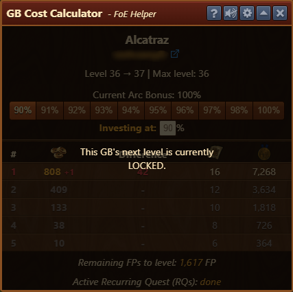

# GB Cost Calculator

If you want to help others level their Great Buildings — whether voluntarily or by accident — this tool is essential.  
It calculates all relevant values for you and can be customized to your needs.

## Menu Overview

The Cost Calculator interface is structured from top to bottom as follows:

- **Building name**
- **Owner information**, including a link to the player’s [foe.scoredb.io](https://foe.scoredb.io/) profile
- **Owner's guild**
- **Current level** of the building and its maximum level
- **Arc Bonus** – your current Arc bonus (e.g., 100%)
- Buttons to switch between predefined investment percentages
- **Investing at:** – set a custom percentage manually
- **Table columns:**
  - Supporter place number (P1–P5)
  - Required FP investment per spot (based on the chosen percentage)
  - FP difference (how much is profit or overpaid based on your Arc bonus)
  - Blueprints earned (based on Arc bonus)
  - Medals earned (based on Arc bonus)

Additional info:
- **Remaining FPs to level:** FPs still needed to reach the next level
- **Active recurring quest:** shows if a recurring quest has been completed

## Configuration

Click the **gear icon** in the title bar to open the Configuration menu.

The Configuration interface is structured top-to-bottom as follows:
- **Percentage Buttons** - A series of pre-set contribution percentages (e.g. 90%, 91%, 100%, etc.) used for GB reward calculations.


Each button has an X to remove it, except your Arc bonus %. 


- **New Value** - Allows you to input a custom percentage manually. The green “+” button adds your custom percentage to the list above.
- **Save donation factor per Conversation** - When enabled, your default investment % factor is defined by % you used last time in that conversation (thread).
- **Save Button** - Applies and saves all the above settings.

## Usage

The FP values in the supporter table are color-coded to show whether a spot is safe to invest in:

### Green = Safe Contribution Spot

If the spot is secure and cannot be overtaken after your investment, the row is highlighted in green.

### Red = Not Secured Contribution Spot

If the spot is still vulnerable and can be overtaken, the row turns red and shows (in red text eg.+123) how many FPs are missing to secure it.

### Blue = Already Invested

If you’ve already contributed exactly the calculated amount, the row turns blue.  
It will remain blue the next time you open the building, provided your investment is recognized.

If your contribution differs from the calculated value, the row is highlighted blue with numbers shown in red: [invested FP] / [expected FP].
(eg. chosen investment 100% which is 30 FPs, invested 29 FPs, showing 29/30)

### Gray = Unavailable Spots

If there are no donor spots available, all rows are displayed in gray.

### Shaded = GB Level locked

If the building’s next level is locked, donor spots are unavailable.

### Shaded = GB not connected to road

If the building is not connected to the road, donor spots are unavailable.

