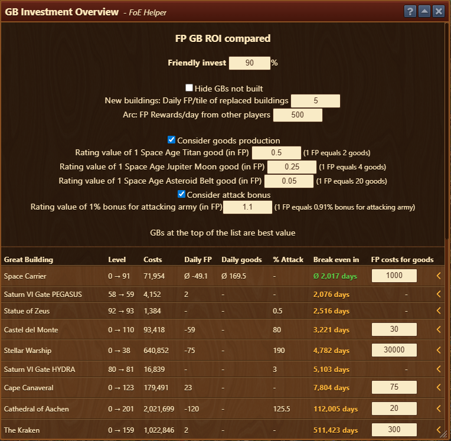

# Menu Overview

The GB Investment overview is structured as follows:

## Settings & Inputs (Top Section)
 - **Friendly Invest (90%)**: This is used for calculating self-investment value. 90% return from supporters assuming a 1.9 thread is used. 
 - **Hide GBs Not Built**: If unchecked displays all GBs regardless of whether you’ve constructed them.
 - **New Buildings: Daily FP/tile of replaced buildings Value (5)**: Estimates FP loss due to replacing buildings that generated 5 FP/tile/day.
 - **Arc FP Rewards/day from other players (500)**: Your current assumed income from investing, used for calculating the profitability of investing in Arc.
 - **Consider goods production**: If enabled, evaluates GBs that produce goods as contributing to ROI by converting goods into Forge Points for comparison:
   - **Titan goods (0.5)**: Rate for conversion of SAT goods to FP's.
   - **Jupiter Moon goods (0.25)**: Rate for conversion of SAJM goods to FP's.
   - **Asteroid Belt goods (0.05)**: Rate for conversion of SAAB goods to FP's.
 - **Consider attack bonus**: If enabled, ROI also values attack boosts.
   - **Attack bonus**: Rate for converting attack boosts to FP's.

By inputting a value, conversion in parentheses will update eg. 0.5 FP per good (2 goods = 1 FP).


## Main GB ROI Table (Bottom Section)
 - **Great Building**: Name of the GB being analyzed
 - **Level**: Displays current and target level for profitable ROI
 - **Costs**: Total Forge Points needed to reach the targeted level
 - **Daily FP**: Net daily FP return (negative = FP cost eg. loss from replaced buildings)
 - **Daily Goods**: Daily goods generated
 - **% Attack**: Total % attack bonus provided by the GB
 - **Break even in**: Time required to break even on FP investment
 - **FP Costs for goods**: Manual input: total FP value of goods needed to level the GB
 - **Chevron**: Displays a detailed breakdown of levels above the targeted level.

# Usage

The **GB Investment Overview** tool is designed to compare the ROI of GBs and helps prioritize which GBs to level first, based on efficiency. The GBs are ranked by break-even time, with the best value ones at the top. GBs that produce goods or increase attack are evaluated in FP terms for ROI.
