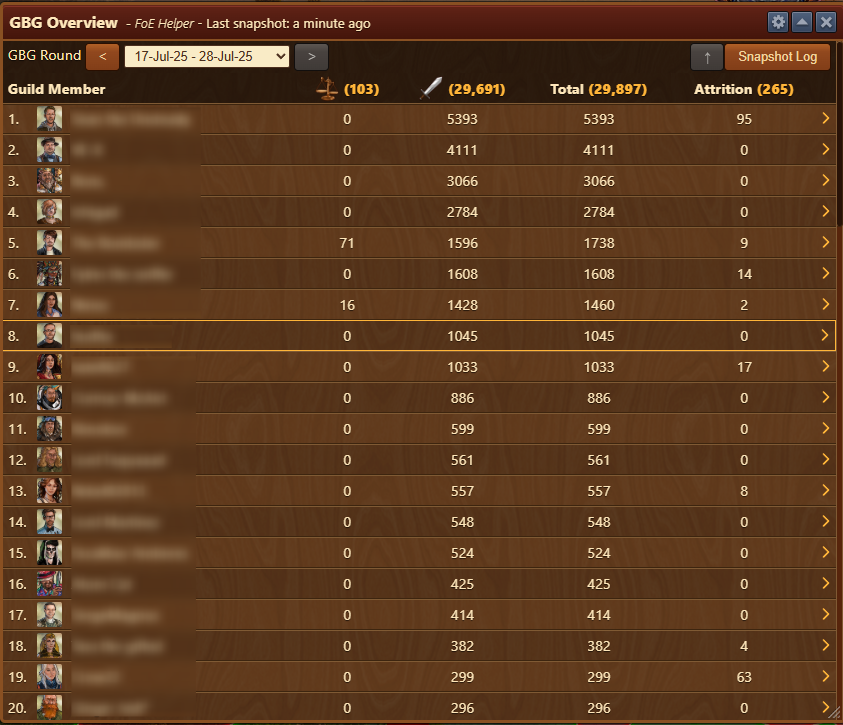
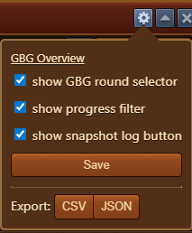
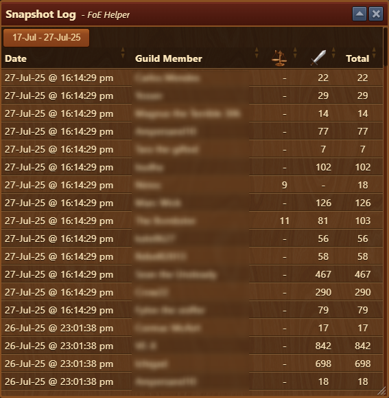

# GBG Overview


This module can be activated in [Settings](/en/module/settings/README.md#pop-ups-tab)


This module provides a clear summary of your guild’s performance in Guild Battlegrounds (GBG), showing how many actions each member has contributed, separated by fights and negotiations, including attrition and snapshot logging.

## Menu Overview

The module interface contains:

- **Title Bar** with [Configuration](#configuration) menu
- **Date Range Selector**: Allows filtering by GBG round (e.g. 17-Jul-25 to 28-Jul-25).
- **⬆**: Progress filter button filters the list to display only players that had activity since last snapshot.
- [**Snapshot Log**](#snapshot-log): Opens the historical log of GBG snapshots for comparison.
- **Table Columns**:
  - **Guild Member**: Displays ranked list with player avatars and names.
  - **Negotiations**: Count of negotiations done during the selected period.
  - **Fights**: Count of battles fought.
  - **Total**: Sum of negotiations and fights.
  - **Attrition**: Displays the current attrition level for the player.
  - **Chevron Button (›)**: Expands player detail view for deeper insights.


Green highlighted rows indicate increases in activity since last snapshot


## Configuration

The Configuration interface is structured top-to-bottom as follows:
- **Show GBG round selector**: Displays GBG round selector in [Menu Overview](#menu-overview)
- **Show progress filter**: Displays **⬆** button in [Menu Overview](#menu-overview)
- **Show snapshot log button**: Displays snapshot log button in [Menu Overview](#menu-overview)
- **Save**: button for saving checkbox configurations
- **Export**: Allowing you to export data to `CSV` or `JSON` for archiving

## Snapshot Log

The **Snapshot Log** provides a historical record of GBG activity at specific timestamps.

The module interface contains:

- **Date & Time**: Displays exact moment of data capture.
- **Guild Member**: Player name.
- **Negotiations**, **Fights**, and **Total**: Actions performed by the player at that timestamp.
- **Sorting**: Columns are sortable to analyze who contributed most at each snapshot.

Snapshots are taken automatically each time in-game gbg ranking was opened and represent how many GBG actions were recorded up to that moment. This allows tracking changes over time, such as progress made between two points.

## Usage

1. Open the GBG Overview during an active or past GBG round.
2. Use the **GBG Round dropdown** to select the desired date range.
3. View member contributions in real time or via the **Snapshot Log**.
4. Click the **chevron (›)** next to a player to expand their contribution details.
5. Data automatically updates at each snapshot.

## Use Cases

- Compare activity levels across the guild
- Identify top contributors
- Encourage less active members
- Plan rewards or guild rankings based on participation

## FAQ

- **What does the snapshot log do?** 
  It allows you to track changes over time by comparing past contributions with current data.

- **Does it include non-guild members?** 
  No, the overview includes only your current guild members.

- **What does attrition indicate?** 
  It shows how much attrition the player has accumulated in GBG during the selected period.

- **Can I sort the columns?** 
  Yes, simply click on the column headers to sort by fights, negotiations, or total.

- **What does the arrow next to a player do?** 
  It opens filtered snapshot log to show a more detailed breakdown of that player's GBG activity.