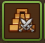
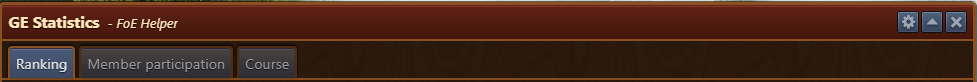
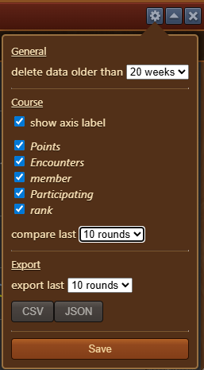
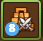
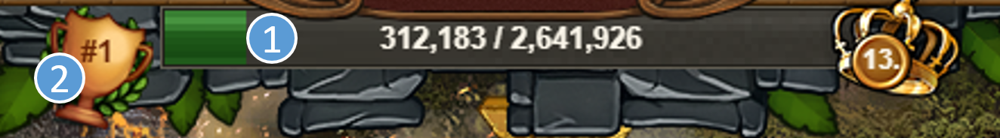
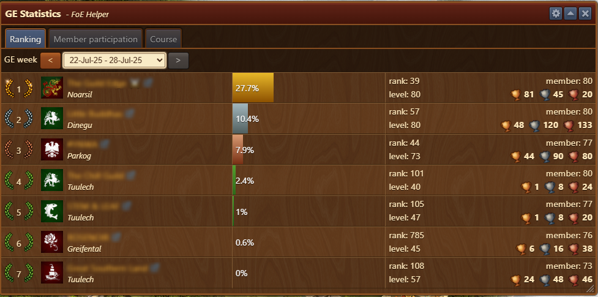
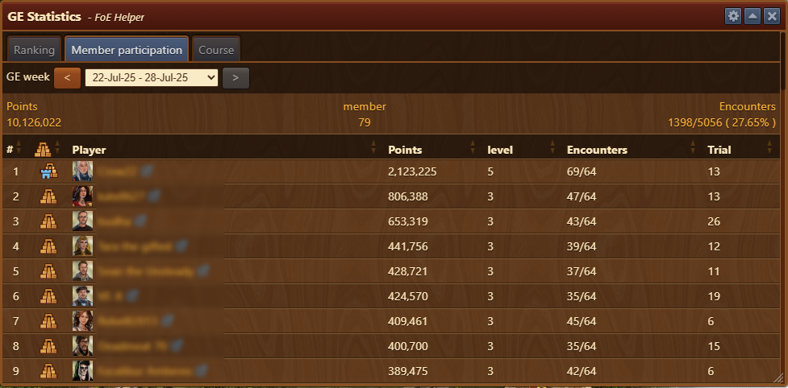
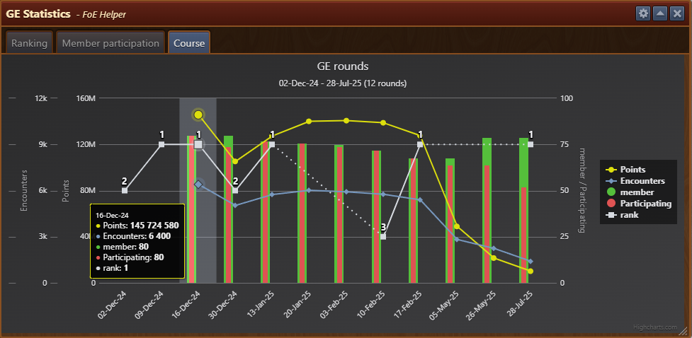

# GE Results

This module displays your guild's Guild Expedition (GE) results and allows you to review previous weeks’ performance data.


To display up-to-date results, you must visit the Guild Expedition and open the member contribution window.


## Structure

The window is divided into 3 tabs and a configuration menu:

- **Title Bar** with a [Configuration](#configuration) menu on the right
- [**Ranking Tab**](#ranking-tab) – Shows guilds ranking
- [**Member Participation Tab**](#member-participation-tab) – Displays detailed overview by  guild members
- [**Course Tab**](#course-tab) – Shows a graphical comparison of GE seasons and participation in each season

## Configuration

The configuration menu allows you to:

- General:
    - **delete data older than** Set data retention duration for how long results are stored
- [Course](#course-tab)
    - **show axis label** If selected, displays "y" axis on chart
    - **Adjust graph axes** If selected, specific metrics will be displayed on chart
        - Points: Total number of points guild achieved
        - Encounters: Total number of encounters guild performed
        - member: Total number of guild members
        - Participating: Total number of guild members participated in season
        - rank: Guild rank in specific season
    - **compare last** Chose how many GE seasons to be displayed on chart
- Export:
    - **Export last** Chose how many GE seasons to be exported in CSV or JSON format

## Usage

### Icon Badge

Menu icon will display a badge with number of GE attempts available (if any)

### Recording data

In order for this module to function and capture detailed data you must visit the Guild Expedition and open the member contribution window (1) and Guild Championship overview (2).


To capture data for all seasons, you could setup a reminder in [Alerts module](/en/module/alerts/README.md)


### Ranking Tab

You can browse past GE weeks using the navigation arrows or dropdown menu.

Detailed table includes:

- Guild’s ranking
- Guild emblem
- Guild name with a link to [Scoredb.io](https://foe.scoredb.io) and its world
- Expedition completion percentage
- Guild server rank and level
- Number of members and earned GE trophies (Gold / Silver / Bronze)

### Member Participation Tab

You can browse past GE weeks using the navigation arrows or dropdown menu.

Displayed information includes:

- Total points earned in season
- Total number of guild members
- Number and percentage of completed encounters
- Each player's results:
    - Rank in that season
    - Players name with a link to profile on [Scoredb.io](https://foe.scoredb.io)
    - Points
    - Level reached
    - Number of encounters
    - Trial chosen in that season

### Course Tab

Depending on the [Configuration](#configuration), the chart displays guilds performance across seasons. 

Legend (Chart data):
- Points earned by members
- Total number of encounters completed
- Total number of guild members 
- Number of participating members
- Guild’s rank

Interactive UI:
- Hovering with cursor over specific season, pop-up will display values for that season
- Hovering with cursor over specific metric in legend, same will be highlighted on chart
- Clicking on specific metric in legend, you can temporarily include/exclude it from chart

If data is missing (e.g., the results window wasn't opened), the rank and points will be shown with dashed lines. Member participation bars will not be shown for that week.

## FAQ

**Q: Why are some weeks missing data or showing incomplete graphs?** 
A: You must visit the GE result window during that week to save the data. Otherwise, the module cannot record it.

**Q: How many weeks can I export or compare?** 
A: You can configure how many weeks to export or compare in the configuration settings under “export last”.