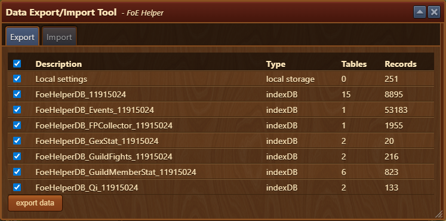
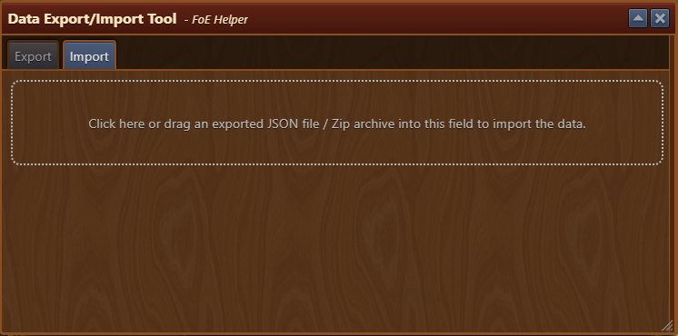

# Data Export/Import Tool

The **Data Export/Import Tool** module allows you to back up your FoE Helper data and restore it on another device. This is especially useful when migrating systems or syncing setups between environments.

This module is acesses via [Settings Menu](/en/module/settings/README.md#other-tab).

## Menu Overview

The window is composed of the following elements:

- Tabs:
    - [**Export**](#export-data-table): Displays a list of data that can be exported from your current session.
    - [**Import**](#import-data): Provides the interface to restore previously exported data.

## Export Data Table

Each entry in the table includes:

- **Description**: Short label explaining the data block
- **Type**: Storage method used (e.g. Local Storage, IndexedDB)
- **Tables**: Number of internal tables associated with the entry
- **Records**: Count of saved data records
- **Export data**: Button for exporting data to local device.

## Import Data

Import Data tab is used for importing previously saved data by clicking on import field or draging `.zip` archive directly into import field.

## Usage

- To **export**, navigate to the **Export** tab and click the export button.
  - A `.zip` file containing your saved data will be generated and saved to your **Downloads** folder.
- To **import**, switch to the **Import** tab and select a previously exported `.zip` file.
  - This restores your saved data, useful for setting up FoE Helper on a new computer.


Restoring data will overwrite your current data. Only import trusted backups.


## FAQ

**Q: What does the `.zip` file contain?** 
A: It contains exported tables from your Local Storage and IndexedDB, bundled together for recovery.

**Q: Can I use this to sync between two devices?** 
A: Yes, export from one device and import into another to replicate your settings and saved data.

**Q: Is the exported data human-readable?** 
A: No, it’s structured for re-import by the FoE Helper tool and not meant for manual editing.

**Q: Can this restore my settings or module data?** 
A: Yes, most module-specific configurations and caches are included in the export.