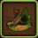
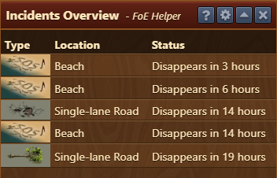
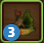

## Menu Overview

The table displays which incidents are present, where they are located, and how much time remains before they disappear.

## Icon Badges

On the FOE Helper toolbar icon, an overlaid number shows how many incidents are currently available in your city.  
If no number is displayed, there are currently no collectable incidents in your city.

## FAQ

**Q: Can the exact position of an incident be shown?**  
A: No, unfortunately not. The position is random and changes over time.

**Q: Can future incidents (not yet appeared) also be listed?**  
A: No, this feature had to be removed.
