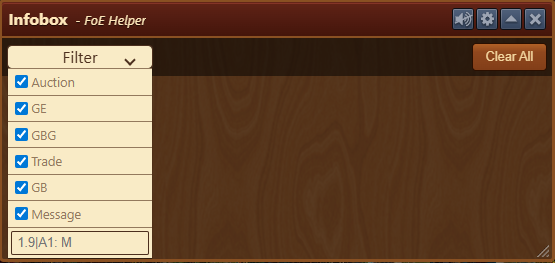
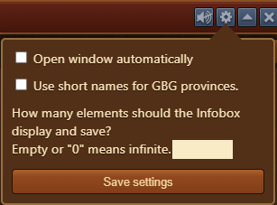
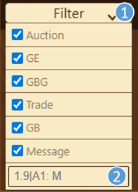

# Info Box

The System Info window displays all technical messages generated by the game and provides filtering tools to help you view specific types of messages.


Infobox window must remain open in order to record messages


## Structure

The window is organized from top to bottom as follows:

- **Menu bar** with a [Configuration](#configuration) button
- [**Dropdown filter menu**](#filter-menu) to filter message types
- **Clear all messages** button
- **Message display area** for displaying results

## Configuration

The configuration menu allows you to:

- Automatically open the Info Box window when the game loads (duplicate of the setting under [General Settings](../settings/README.md))
- Use short names for GBG provinces in messages displayed
- Set how many lines to display in the message window (`0` = unlimited, which is also the default)

## Usage

### Filter Menu

1. You can select which categories of messages to display using checkboxes.
2. At the bottom of the filter window, there is a free text field where you can create a **custom filter** — for example, to show only messages containing a specific word.


Use the vertical bar `|` symbol to search for multiple words.


## FAQ

**Q: I don't see any messages. Why?** 
A: Make sure the correct filters are selected and that your message limit is not too restrictive in the configuration.

**Q: Can I save the messages shown here?** 
A: This module is primarily for real-time viewing and debugging. For saving, consider copying the content manually or using browser tools.