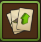
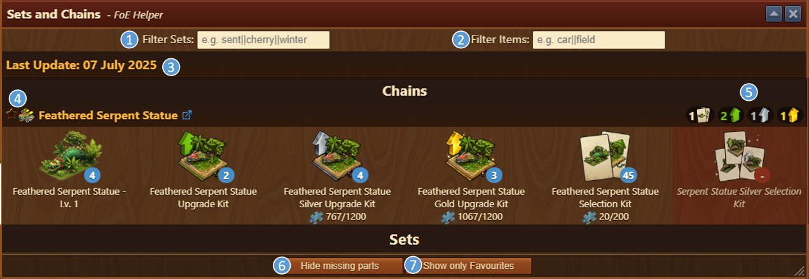
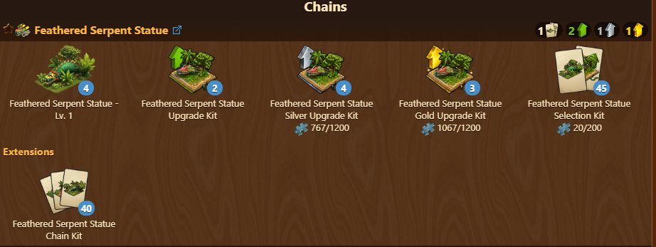
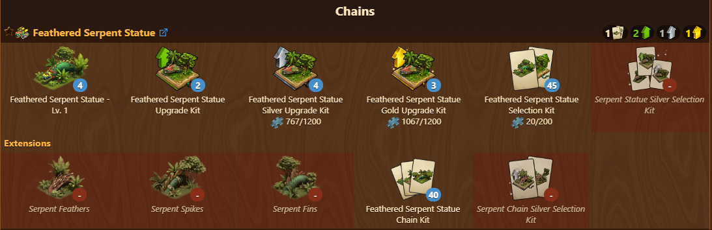
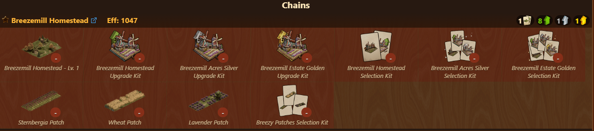

# Sets and Chains

The Sets and Chains module displays the chain buildings and upgrades currently available in your inventory.

## Menu Overview

The window displays all available chain buildings along with the quantity you own for each item.

The module ss structured as follows:
1. **Filter Sets** Input field for filtering specific Set or Chain
2. **Filter Items** Input field for filtering specific item from set or chain
3. **Last Update date** of sets and chains
4. **Star** Marking specific Chain or set as favorite
5. **Items needed** Overview of items needed for max level of chain and sets
6. **Hide missing parts** Toggle button to change views
    - [Hide missing parts](#hide-missing-parts)
    - [Show missing parts](#show-missing-parts)
    - [Show all parts](#show-all-parts)
7. **Show only Favourites** By selecting view is filtered to sets and chains marked as favourite

## Configuration

If you have enabled the **“Show links”** option in the [settings](../settings/README.md), the name of each chain becomes a clickable link to its corresponding page on the English Forge of Empires Wiki (forgeofempires.fandom.com).

## Usage

Module is used for review of chain and sets available in your inventory, and insights regarding all items needed to fully level the specific set or chain

Items you do **not** currently own are displayed with a red background for easier identification.

### Hide missing parts

This view displays only items available in your inventory and number of those items.

### Show missing parts

This view displays items available in your inventory and number of those items, as well as unavailable items of observed chain or set.


Items you do **not** currently own are displayed with a red background for easier identification.

### Show all parts

This view displays all sets and chains, including those for which there is no items available in inventory.


Items you do **not** currently own are displayed with a red background for easier identification.


## FAQ

**Q: How can I open a link to the wiki page for a specific pack?** 
A: Enable the “active link” setting in the FOE Helper Assistant settings under the Link section. This turns item names into clickable links.

**Q: What does the red background mean?** 
A: It indicates items or upgrades that are currently unavailable in your inventory.