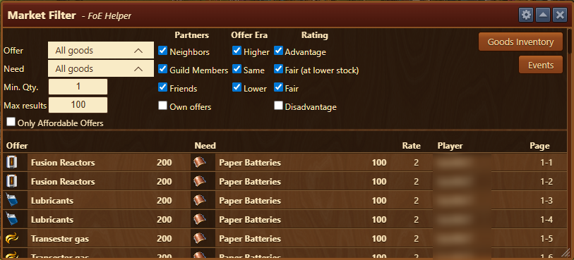
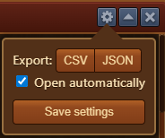
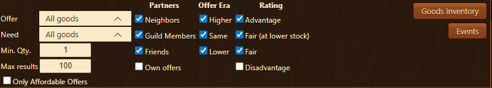
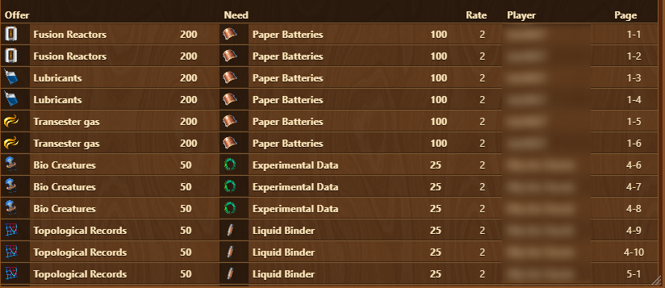
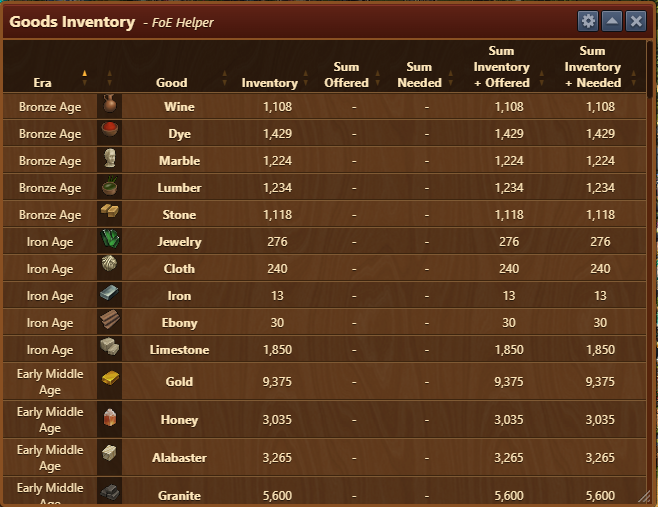

# Market Filter

The Market Filter Assistant helps you find exactly which **page and row** in the Market contains the trade offer you're looking for.

## Menu Overview

The Market Filter Assistant is structured from top to bottom as follows:

- **Title bar** with a [Configuration](#configuration) menu
- [**Filter area**](#filter-area) to refine search criteria
- [**Goods Inventory**](#goods-inventory) 
- [**Events**](#events) 
- [**Offer display area**](#offer-display-area) that shows the filtered results

## Configuration

The configuration menu allows you to:

- **Export** the list of market offers in CSV or JSON format
- **Automatically open** the assistant whenever you open the market window  
  (This duplicates the option found under [Settings](../settings/README.md))

## Filter Area

The filter area allows you to narrow down the list of trade offers to only the most relevant ones, according to your criteria.

Filtered area is structured as follows:

- **Offer**: Dropdown to choose which good or era you want to offer (default: All goods).
- **Need**: Dropdown to choose which good or era you want in return (default: All goods).
- **Min. Qty.**: Minimum quantity for displayed offers (e.g., 1).
- **Max results**: Maximum number of offers to show (e.g., 100).
- **Only Affordable Offers**: Show only trades you can afford based on your current inventory.
- **Partners**:
    - **Neighbors**: Show offers from neighbors.
    - **Guild Members**: Show offers from guildmates.
    - **Friends**: Show offers from friends.
    - **Own offers**: Include your own offers (unchecked by default).
- **Offer Era**:
    - **Higher**: Include goods offers from higher eras.
    - **Same**: Include goods offers from same era.
    - **Lower**: Include goods offers from lower era.
- **Rating**:
    - **Advantage**: Show trades where ratio is better than fair
    - **Fair (at lower stock)**: Show fair trades where your stock is lower.
    - **Fair**: Show fair trades. (eg. 1:1 same era, 1:2 for higher era, 2:1 for lower era trades)
    - **Disadvantage**: Show trades where ratio is worse than fair(unchecked by default).

## Offer Display Area

Each result line includes the **exact page and row** number where the offer appears in the in-game market, so you can quickly find and trade.

## Goods Inventory

The Goods Inventory overview provides a complete overview of all goods you currently possess. It includes real-time tracking of inventory, trade offers, and goods needed.

### Goods Inventory Structure

- **Title bar** with a Configuration menu which menu allows you to export the list CSV or JSON format
- **The overview window** which is organized as a sortable table with the following columns:
    - **Era** The era to which the good belongs (e.g., Bronze Age, Iron Age, etc.).
    - **Good** Name of the good (e.g., Wine, Marble, Iron).
    - **Inventory** Total amount of the good currently in your inventory.
    - **Sum Offered** Quantity of the good you’ve currently offered in trades.
    - **Sum Needed** Amount of the good requested in trades.
    - **Sum Inventory + Offered** Inventory plus offered — useful for evaluating surplus.
    - **Sum Inventory + Needed** Inventory plus needed — helps assess total demand coverage.

## Events

The Trade Events menu tracks your accepted and expired trades in a detailed table. It allows you to review your trading history with timestamps, traded goods, partners, and trade values.


To keep the trade history updated, manually scroll through all new entries in the in-game **Town Hall > News > Event History** tab.


The menu contains two main tabs:

- **Accepted Trades** – Displays successful trade deals with full details.
- **Expired Trades** – Shows trade offers that expired without being accepted.

## FAQ

**Q: Can I export the market offers?** 
A: Yes, the configuration menu includes options to export in both CSV and JSON formats.

**Q: Why use this instead of just browsing the market manually?** 
A: It saves time by showing exactly where desired offers are, especially when there are many irrelevant trades to scroll through.