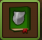
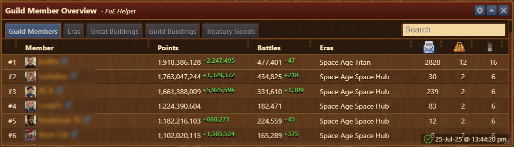
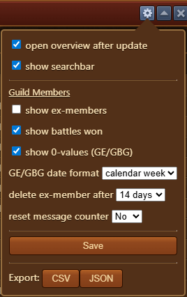
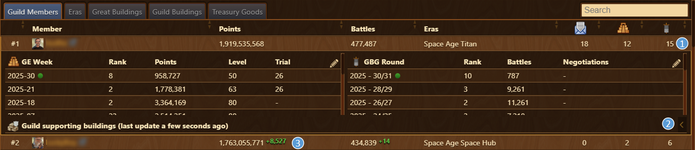
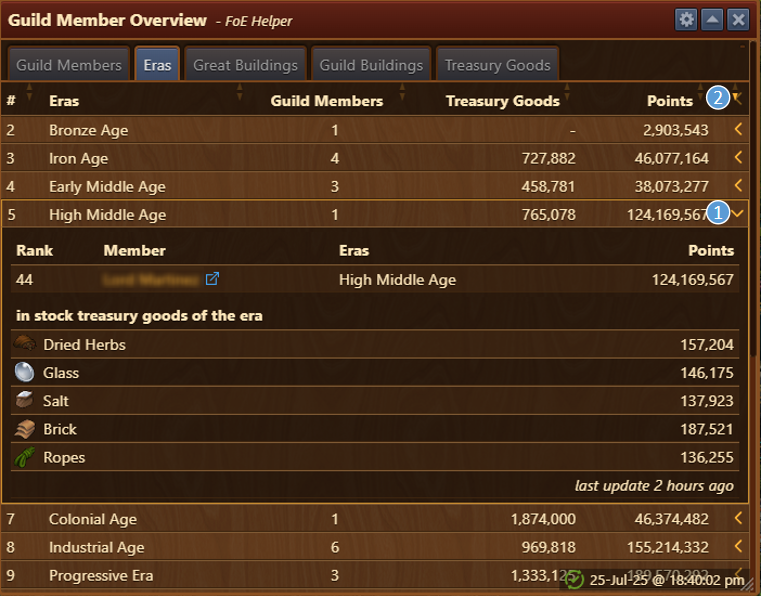
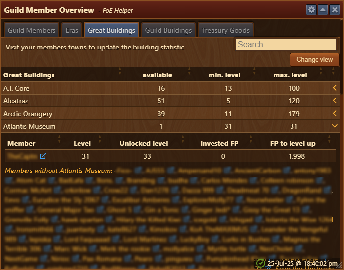
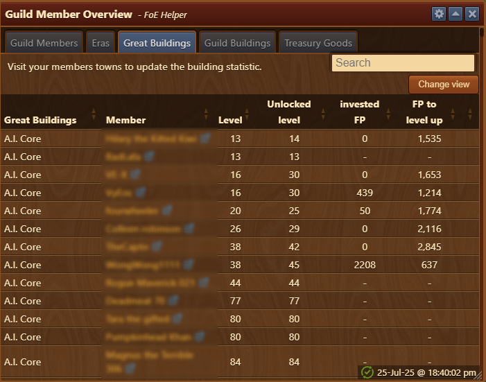
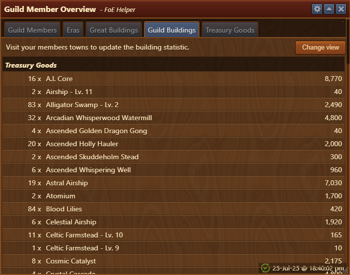
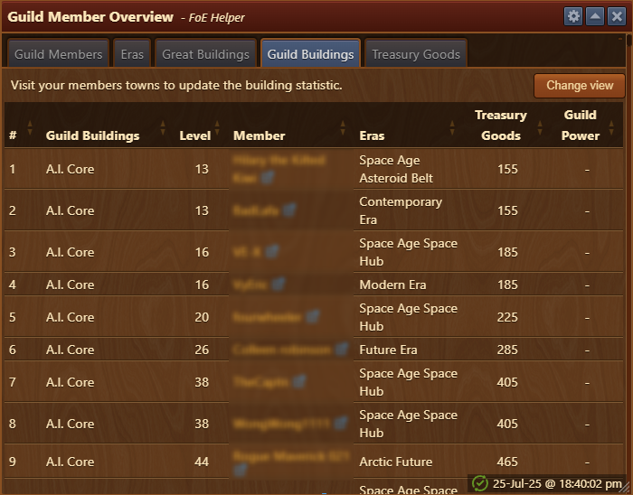

# Guild Member Overview

The Guild Member Overview module displays detailed information about your guildmates, including their Great Buildings, guild buildings, treasury resources, collection potential per day, and their current era.

## Menu Overview

The interface includes:

- **Title Bar** with [Configuration](#configuration) menu
- A **search bar** (can be toggled in [Configuration](#configuration))
- [**Tabs**](#tabs) for switching between views
- A **content area** displaying tab-specific data
- **Last updated timestamp** in bottom right corner

## Configuration

The configuration menu allows you to:

- **open overview after update** automatically open this window when you open "Your Guild" in the general menu
- **show searchbar** toggles searbar on tabs
- **show ex-members**
- **show 0-values (GE/GBG)** highlight players with 0 values in both
- **GE/GBG date format** choose display format
- **delete ex-member after**
- **reset message counter**
- **export data** export file name includes the tab name (in English), current date, and time.


The Export button (CSV or JSON) exports only the data shown in the currently active tab.


## Usage

- Sort any column by clicking on its header.
- Data is refreshed when:
  - You open in-game Guild Menu (shortcut "G"), tab Member Overview 
  - You open in-game Guild Menu (shortcut "G"), tab Guild Treasury
  - You visit a guildmate's city (eg. Great)
  - You enter the [Guild Expedition](../gex/README.md#recording-data) screen
  - You open Guild Battlegrounds screen
- Changes are based on your last local update on the same computer.

## Tabs

Available tabs:
- [Guild Members](#guild-members)
- [Eras](#eras)
- [Great Buildings](#great-buildings)
- [Guild Buildings](#guild-buildings)
- [Treasury Goods](#treasury-goods)

### Guild Members

Members Overview displays following:
- Points: Increases in player points since the last update are shown in green; decreases in red. (3)
- Battles: Increases in player points since the last update are shown in green; decreases in red. (3)
- Era: Players era
- GE/GBG Participation:
  - Click the **chevron** on a member’s row to expand their participation details. (1)
  - Data covers all retained history on your PC.
  - A pencil icon allows you to delete a week's result.
- Buildings producing Guild goods: Click the **chevron** to expand list(2)


Departed members appear with strikethrough and without rank number.


### Eras

Displays the number of members per era, total points, and treasury resources by era. 

Expanding to detailed overview displays which players are in specific era, and amount of each goods in treasury for that era. That can be achieved by:
1. Clicking the chevron for detailed view for specific era.
2. Clicking the chevron in header to expand to detailed view for all eras.

### Great Buildings

Displays the overview of Great Buildings available, players and levels range.

#### GB Summary Overview

Displays for each Great Building:

- **(Available)**: Number of players with the GB
- **(Min Level)**: Lowest level found
- **(Max Level)**: Highest level found

Use the chevron to expand to detail view for each GB displaying following data:

- **Player**: Name of players having GB
- **(Level)**: Current level
- **(Unlocked to)**: Max level unlocked
- **(FP Invested)**: FP already placed
- **(FP Needed)**: Remaining FP to complete level  
- **list**: Players which **don’t own** this GB.

#### GB Detailed View

By clicking on **Change view** button, detailed view is displayed. 

  

Lists every GB available in the guild with full details:

- Level
- Unlocked to
- FP Invested
- FP Needed


Clicking the **Change view** button returns to the previous GB view.


### Guild Buildings

Displays the overview of Guild Goods producing buildings available.

#### Guild Building Summary

Displays:

- Number of each guild goods producing building
- Resources produced (if motivated/collected by players)

#### Guild Building Detail

By clicking on **Change view** button, detailed view is displayed.

Displays for each building:

- Owner
- Era of member or building
- Collected amount of resources
- Guild power (if colected)


Clicking the **Change view** button returns to the previous GB view.


### Treasury Goods

Displays:

- Resources generated per day by all guild buildings
- Number of guild members in that era
- Total stock of guild treasury  


Daily production is a theoretical max and depends on members collection.
