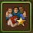
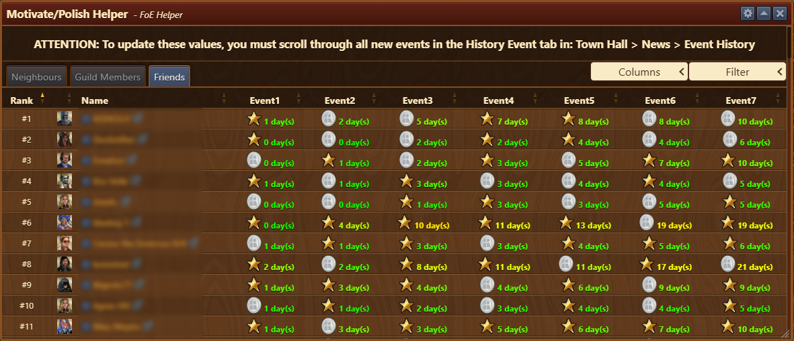
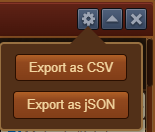
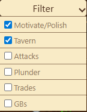
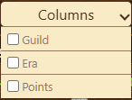
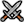
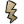
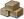
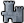

# Motivate / Polish Helper

This module tracks who has interacted with you recently—whether by motivating, polishing, attacking, sitting in your tavern, accepting your market offers, or donating to your Great Buildings.


To keep the information current, you must review the Event History tab in your Town Hall.


## Menu Overview

The window is structured as follows:

- **Title bar** with a [Configuration](#configuration) menu
- **Tabs**:
    - Neighbours
    - Guild Members
    - Friends
- [**Columns**](#columns) Dropdown menu to choose which columns to include in overview
- [**Filter**](#filter) Dropdown menu to choose which interactions to include in overview
- **Display area** listing players which interacted with you

## Configuration

The configuration menu allows you to:

- Export interaction data as a CSV or JSON file  

## Usage

Use the tabs to choose which group’s interactions to view: **Neighbors**, **Guild Members**, or **Friends**.  
The module shows the **7 most recent interactions** with each player.

- Day coloring reflects how recently someone interacted with you:
  - **Green** = recent
  - **Red** = long time ago

- If a player has **never** interacted with you, the word **"Never"** is shown under the event column.


If you haven't reviewed your **Town Hall > Event History** recently, the colors may appear inaccurate.


### Filter

Filter dropdown enables you to choose which interactions to include/exclude in current overview.

### Columns

Columns dropdown enables you to choose which additional columns to include/exclude in current overview.
 
### Glossary

-  next to the day indicates that the player motivated or polished one of your buildings.
-  means the player sat at your tavern on that day.
-  indicate the player attacked your city on that day.
-  Shows the **last time you were plundered**.
-  appears when a player accepts one of your market offers.  

Multiple trades from the same player on the same day will be shown as **separate events**.

-  means the player donated Forge Points to one of your Great Buildings.

