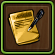
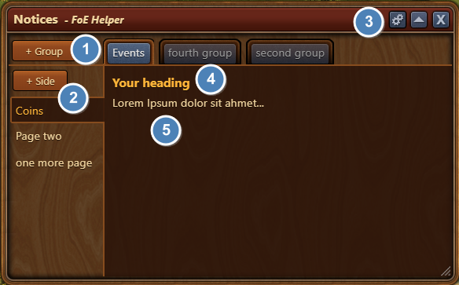
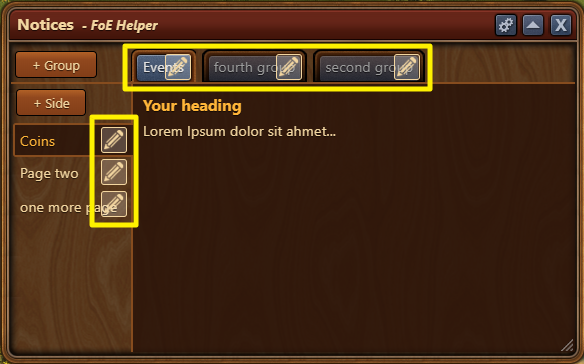
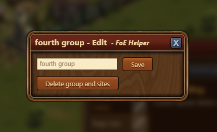
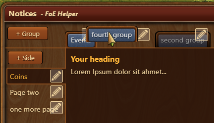
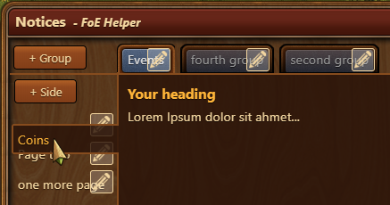

# Notizen

Write down everything you need, sorted in groups and again in pages. This way you can document your game play, even across devices.

## Aufbau

1. "Groups" - comparable with a category structure
2. "Pages" - are the subcategories of the groups
3. "Settings" - only make sense if groups and pages are available
4. Every page has and needs a heading
5. Content area - just click and start writing

## Usage

### Start
First of all a group must be created. If this group is available, you can create as many pages as you like.

### Writing
To insert text you only have to click with the mouse in the corresponding area. Saving is done automatically when you click with the mouse anywhere outside the area. This applies to both the headline and the content.

### Change/Edit
If you want to change group or page names you have to click on the gear wheel in the upper right corner. This activates the "Edit Mode":

With a click on a pen you can either change the name or delete the corresponding element:

If you delete a group all subordinated pages will be deleted!

If the "Edit Mode" is active, you have the possibility to re-sort the groups or the pages via Drag&Drop:

