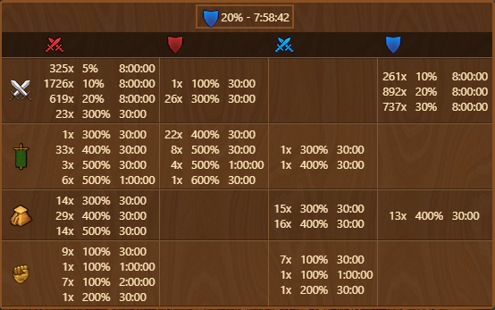

# Battle Potions


This module can be activated in [Settings](../settings/README.md#other-tab)


This module shows an icon in the top right corner displaying the shortest currently active potion and a clear summary list of potions available in inventory upon hover on icon.

## Menu Overview

Menu Overview is structured as follows:
- Header with currently activated boost and its remaining duration

## Usage

When boost is activated, Icon will update and display type of currently active boost and its remaining duration:

Upon hovering over icon [Menu Overview](#menu-overview) will be displayed