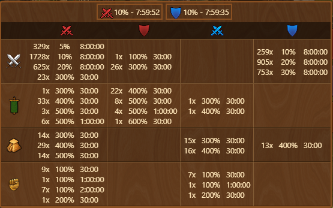
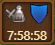

# Battle Potions


This module can be activated in [Settings](../settings/README.md#other-tab)


The **Battle Potions** module shows an icon in the top-right corner of the screen. When a potion effect is active it displays the **shortest remaining active boost** and, when hovered over, shows a **summary of all potions in your inventory**.

## Menu Overview

The menu is structured as follows:

- **Effect Preview**: Shows the current effect type (e.g., Red for attack), bonus percentage (e.g., 10%), and remaining time (e.g., 7:59:52).
- **Potion Inventory Table**: Lists potions by type, showing:
  - Number of potions available
  - Effect strength (%)
  - Duration of each potion type

## Usage

Once a potion is activated:
- The icon will update to reflect the **active boost type** and **remaining duration**.

- Hovering over the icon will open the [Menu Overview](#menu-overview), displaying detailed inventory and status information.

## FAQ

**Q: What do the three values shown next to each potion mean?** 
A: They indicate the number of potions available in inventory, the percentage effect provided, and the remaining time for that effect (e.g., 329x 5% 8:00:00).

**Q: Can I see multiple potions simultaneously?** 
A: No, the icon will show only the **shortest remaining active boost**.