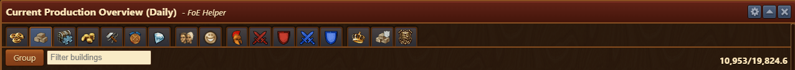
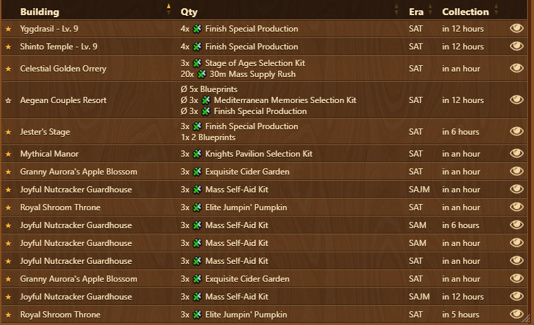
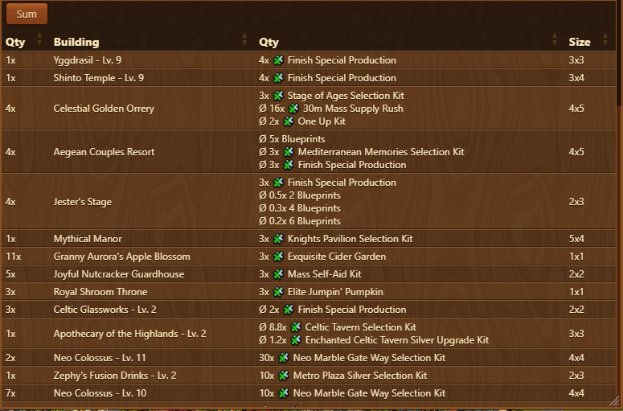
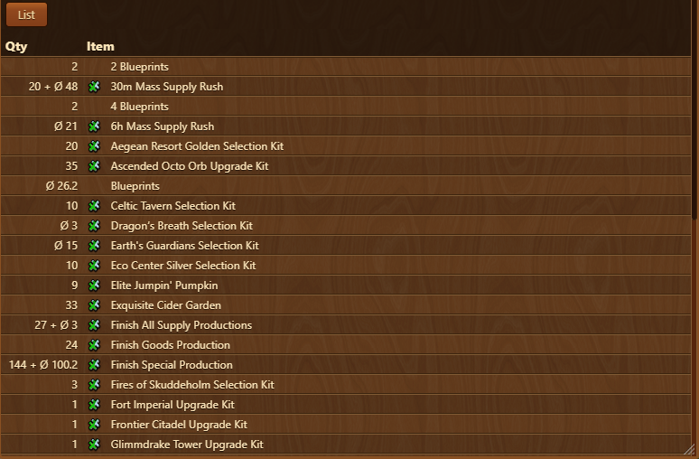
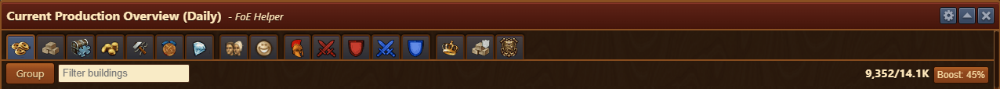
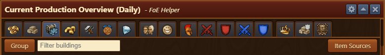
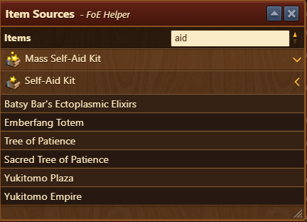

# Production Overview

## Menu Overview

The window features multiple tabs, each dedicated to a specific production or category, showing the details for each production.

The Production overview is structured as follows, from top to bottom:
- **Title bar** with a [Configuration](#configuration) menu
- **Tabs** - One tab per resource type:
  

<i>click to colapse list</i>

  - FP Production
  - Goods Production
  - Fragment Production
  - Coins
  - Supplies
  - Medals
  - Diamonds
  - Population
  - Happiness
  - Units
  - Attack (Attacking Army)
  - Defense (Attacking Army)
  - Attack (Defending Army)
  - Defense (Defending Army)
  - Guild Power
  - Guild Goods
  - QI Resources

  

- **Group** - Button to change table view on specific tab:
  - [List view](#list-view) (default)
  - [Group view](#group-view)
  - [Sum view](#summarized-view)
- **Filter** - Input field that filters any column (eg. filter specific buildings, era, fragments)
- **Current production/Max Production:**
   - **Current production** - Currently produced resources based on motivation status
   - **Estimated max production** - Theoretical max production considering that all buildings are motivated, and the average value of production on buildings producing that resource by chance (eg. Building that has 20% chance of producing 100 FPs, will be calculated as ∅20 FPs production)

## Usage

Each tab displays the current production based on the motivation status of buildings, along with the estimated maximum production.

 - A star outline in front of a building's name indicates that it is still not motivated or polished.
 - The symbol ∅ represents the average collection value of a specific building ( [production value] x [chance of producing that resource] ).

## List View

This is the default view available on all tabs. It displays detailed information for each individual building, including:
- Motivation status (a star outline indicates unmotivated)
- Amount produced
- Era and production time
-  icon, which opens the [Town Overview](../town/README.md) with the building highlighted

## Group View

This view summarizes production by building type. It shows:
- Number of buildings placed
- Total production across those buildings
- Footprint (size)

**Note:** On the *Fragments* tab, the quantity is shown per building rather than summarized.

## Summarized view

Available on *Fragments* and *Army Overview* tabs. This view displays a summary of total production:
- By fragment type (e.g., 30m Mass Supply Rush, 6h Mass Supply Rush)
- By troop type (for army production)

Useful for quickly evaluating which fragments or units are being generated.

## Boost Percentage View

This toggle button appears in the top-right of the *FP*, *Coins*, and *Supplies* tabs. When enabled, it filters the table to only show buildings that contribute percentage-based boosts to the selected resource type (e.g., +5% FP production).

It helps identify support buildings that enhance your city's output.

## Item Sources Menu

This menu is available on the *Fragments* and *QI Resources* tabs. 

Useful for tracking down where rare items are being generated.

This module allows you to quickly search for buildings that produce a specific type of fragment or QI resource.

## Configuration

Configuration menu allows users to customize how time is displayed throughout the Production Overview interface. 

Available options include:
- **Relative Time** - e.g., "in 5 minutes" or "in 12 hours"
- **12 hour clock** - Fixed Time format (e.g., "2:30 PM")
- **24 hour clock** - Fixed Time format (e.g., "14:30")

This setting enhances readability and user preference by letting each user choose the format that best suits their habits or regional standards.

## FAQ

**Q: Why are some buildings showing a star icon?** 
A: It means they are motivated or polished.

**Q: What does ∅ mean in production?** 
A: It shows the average yield for buildings with a chance-based production.

**Q: Can I filter by specific eras or building names?** 
A: Yes, use the filter input above the table to search any column.