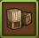
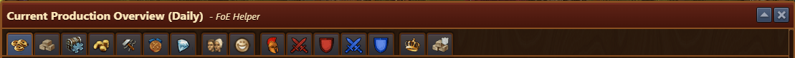
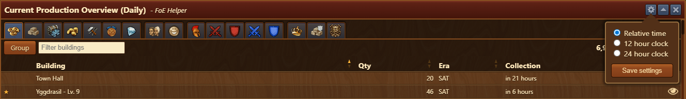

# Production Overview

## Menu Overview

The window features multiple [tabs](#tabs), each dedicated to a specific production or category, showing the details for each production.

The Production overview is structured as follows, from top to bottom:
- **[Tabs](#tabs)** - Tabs per resource
- **Group** - Button to change view on specific tab
  - Display each building with motivation status, production time, era, and produced value
  - Display a summary per building with the number of buildings placed, their sizes, and summarized productions
- **Filter** - Filter input field which works on all collumns (eg. filter specific buildings, era, fragments)
- **Current production/Max Production:**
   - **Current production** - Currently produced resources based on motivation status
   - **Max production** - Theoretical max production considering that all buildings are motivated, and the average value of production on buildings producing that resource by chance (eg. Building producing 100 FPs in 20% of occasions, will be calculated as ∅20 FPs production)
- **Boost%** - Currently available only on FP production tab, displaying the amount of FP production % boost (by clicking on it, the display will change to a filtered view of buildings producing FP production boosts %)

## Usage

Each tab displays the current production based on the motivation status of buildings, along with the total production.

 - A star outline in front of a building's name indicates that it is still not motivated or polished.
 - The symbol ∅ represents the average collection value of a specific building ( [production value] x [chance of producing that resource] ).

## Tabs

### FP's production overview
### Goods production overview
### Fragments production overview
### Coins production overview
### Supplies Defensive
### Medals production overview
### Diamonds collection overview
### Population overview
### Happiness overview
### Units production collection overview
### Attack for Attacking armies boosts overview
### Defense for Attacking armies boosts overview
### Attack for Defensive armies boosts overview
### Defense for Defensive armies boosts overview
### Guild Power production overview
### Guild Goods production overview
### QI resources production overview

## Config

Config menu allows users to customize how time is displayed throughout the Production Overview interface. 

Available options include:
- **Relative Time** - e.g., "in 5 minutes" or "in 12 hours"
- **12 hour clock** - Fixed Time format (e.g., "2:30 PM")
- **24 hour clock** - Fixed Time format (e.g., "14:30")

This setting enhances readability and user preference by letting each user choose the format that best suits their habits or regional standards.
