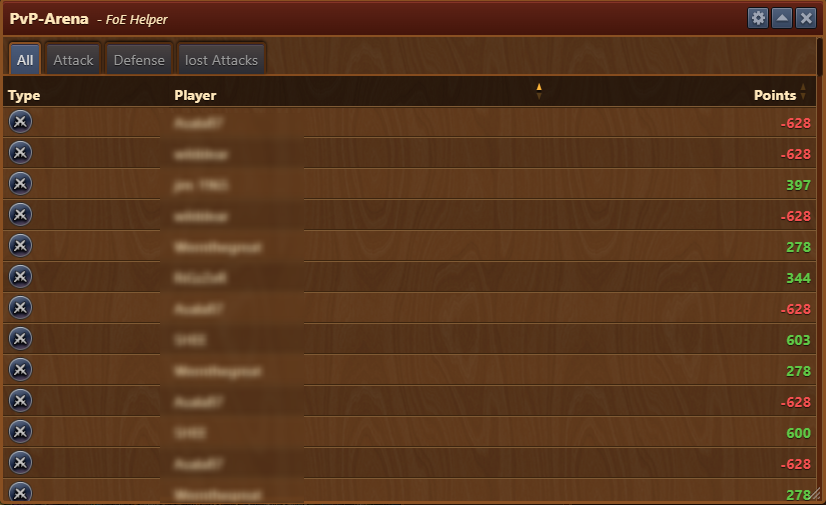
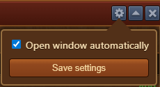

# PvP Arena


This module can be activated in [Settings](/en/module/settings/README.md#pop-ups-tab)


The **PvP Arena** module allows you to track your performance in the Player versus Player Arena. It logs your attacks, defenses, lost battles, and point changes in an easy-to-read list.

## Menu Overview

The window is structured as follows:

- **Title Bar** with [Configuration](#configuration) menu
- **Filter Tabs**:
  - **All**: Displays all recorded encounters
  - **Attack**: Shows only your initiated battles
  - **Defense**: Lists incoming attacks from other players
  - **Lost Attacks**: Highlights only the attacks you've lost
- **Battle Log Table**:
  - **Type**: Attack or Defense (shown with icons)
  - **Opponent**: Name of the opposing player
  - **Points**: Points gained (green) or lost (red)

## Configuration

The Configuration interface is structured as follows:
- **Open window automatically**: If enabled it will open this module automatically whenever in-game pvp arena is entered.

## Usage

- Enter the in-game pvp arena.
- PvP Arena module will automatically open if enabled in [Settings](/en/module/settings/README.md#pop-ups-tab).
- Use the tab filters to narrow down the list to specific battle types.
- Analyze your point gains/losses to improve your strategy and identify trends.
- Point changes help you understand which battles impacted your PvP ranking most.

## Notes

- A red point value (e.g., `-628`) indicates a **loss of points**.
- A green point value (e.g., `+603`) indicates a **gain of points**.
- The list updates automatically with each new battle result.
- The module supports only PvP Arena data, not regular neighborhood attacks.

## FAQ

**Q: What do the icons in the "Type" column represent?** 
A: They indicate whether the entry is an attack, a defense, or a lost attack.

**Q: Can I see who attacked me?** 
A: Yes, defensive entries will show the attacker’s name and the point change.

**Q: Why are some entries in red?** 
A: Red values indicate battles where you lost points, often due to a defeat.

**Q: How often is this list updated?** 
A: It updates automatically when in-game pvp arena is entered.

**Q: When I open pvp arena this module is not available?** 
A: You can enable it in [Settings](/en/module/settings/README.md#pop-ups-tab).